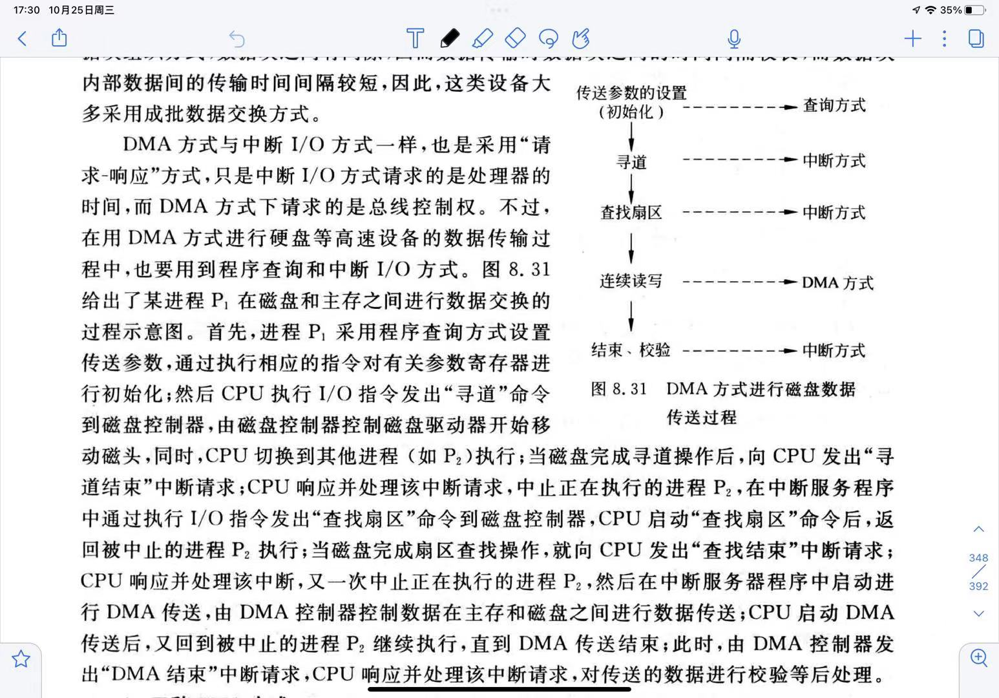
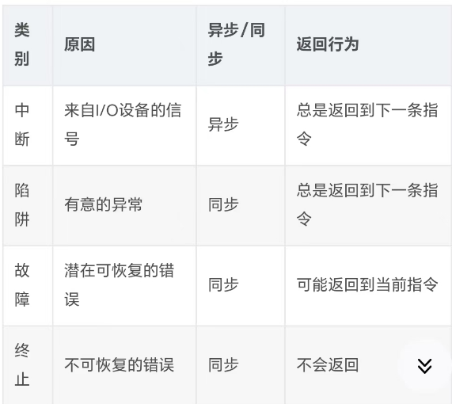
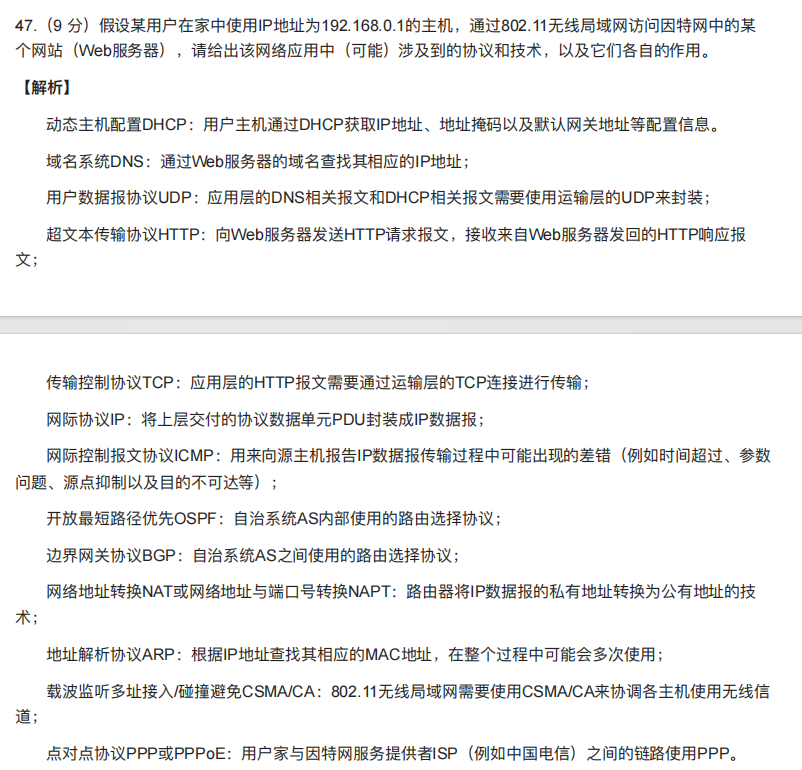

### 数据结构

- B树只支持随机搜索，B+ 树支持随机和顺序搜索。

- 败者树是一棵完全二叉树，归并段的个数(路数)就是叶子结点的数目。

- 就平均查找长度而言，折半查找最小，分块查找次之，顺序查找最大。

- 适用于压缩存储稀疏矩阵的两种存储结构是三元组表和十字链表。

- 

  

  

- 

  错误，例如对于序列[4，3，2，1]（反序）和[3，4，2，1]（非反序），使用简单选择排序，前者需要交换元素2次，后者需要交换元素3次。

- 邻接矩阵占用的存储空间大小只跟图的顶点有关，邻接表既和顶点有关也和边有关。

- 顺序栈和链栈都会出现栈空的情况。但链栈是动态分配存储空间的，只要还有剩余的存储空间可分配，就不会出现栈满的情况。

- 散列表的逻辑结构是非线性结构。

- 基数排序中，元素的移动次数与关键字的初始序列无关。

- 并查集是双亲表示法存储的树。

  为了提高并查集的查找效率，在进行union操作时，可以让结点更少的树作为结点更多的树的子树。

  为了提高并查集的查找效率，可以采用压缩路径的方式优化find操作。

  并查集**可以**用于实现克鲁斯卡尔算法求最小生成树

  并查集**可以**用于判断无向图的连通性。

  并查集**可以**用于判断无向图中是否有环。

  并查集**不可以**用于迪杰斯特拉算法求最短路径。
  
- 红黑树和AVL树的查找、插入、删除的时间复杂度都是$O(log_2n)$,但关键字一样时，红黑树更高，一般红黑树比AVL树查找速度慢。任何一棵红黑树都等价于一棵4阶B数。

  在插入和删除是红黑树比AVL树更快，旋转次数比AVL树少。

- 有n个结点的二叉树具有最小路径长度时，该二叉树是完全二叉树。

  

  B

- 直接插入排序是输入敏感的排序算法，元素移动次数与初始序列中**逆序对的个数**正相关；注意：直接插入排序的第一趟是从第二个元素开始的，已经假设首元素是一个有序表了。

- 折半查找所对应的判定树一定是一颗**平衡二叉树**。

### 计组

- 常用的溢出判断方法主要有三种：采用一个符号位、采用进位位和双符号位。

  采用一个符号位的溢出条件为，结果的符号位与操作数符号位不同。

  采用进位位的溢出条件为：结果的符号位和最高数位不同时产生进位。

  采用双符号位的溢出条件为：运算结果的两个符号位不同。

- cache的功能全由硬件实现，对程序员透明。

- 流水段中每个功能部件在每条指令中都只被使用一次，同一个功能部件只能在一个流水段中使用，否则会发生资源冲突。

- 

  模４补码具有模２补码的全部优点而且容易**检查加减运算**中的溢出问题。存储每个模４的补码时，只要存一个符号位，因为任何一个正确的数值，其模４补码的两个符号位总是相同的。只在把两个模４补码的数送往算术与逻辑部件完成加减计算时，才把每个数的符号位的值同时送到算术与逻辑部件的两位符号位，即只在算术与逻辑部件中采用双符号位。

- 在用原码加、减交替法运算时，商的符号位是由除数和被除数的符号位异或来决定的，商的数值是由除数、被除数的绝对值通过加、减交替运算得的。由于除数、被除数取的都是绝对值，那么最终的余数应是正数。如果最后一步余数为负、则应将该余数加上除数，将余数恢复为正数，称为恢复余数。

- 存储周期：连续启动两次读或写操作所需最小的间隔时间。

  存取时间：指的是CPU读或写内存内数据的过程时间。

  存储时间：属于存取时间的存操作数据的过程时间。

  访问周期：存储器进行一次“读”或“写”操作所需的时间间隔。

- 在并行微程序控制器中，执行现行微指令的操作与取下一条微指令的操作在**时间上是并行**的。

- 微型机系统中，主机和高速硬盘进行数据交换一般采用直接存储器存取(DMA)方式；大、中型机系统中，主机和高速硬盘进行数据交换一般采用通道控制方式。

- 计算机"运算速度”指标的含义是指每秒能执行多少条指令。

- 决定计算机计算精度的主要技术指标是计算机的字长。

- 原码规格化后，正数为0.1×…×的形式，负数为1.1×…×的形式。

  补码规格化后，正数为0.1×…×的形式，负数为1.0×…×的形式。

- 在中断响应中，保护断点和状态寄存器的工作是由CPU自动完成的，而保护其他现场的工作是用户编程完成。

- 用户不能通过指令直接指定标志寄存器的编号或者修改它。

- 

- 

  

- 数据总线是双向传输的；地址总线是单向传输的；任一控制线而言，传输是单向的，对控制总线总体来说，传输是双向的。

- 采用数据/地址总线复用技术，总线中保留数据线，**不会设置地址线**，地址经过数据线传输。

- DMA 预处理阶段的工作主要是 CPU 为 DMA 设置内存地址和传输的数据量，此工作由 DMA 驱动程序执行，所以预处理阶段的参数设置由**软件**（设备驱动程序）完成。

- 冯诺依曼机区分指令和数据的部件是**控制器。**

- | 存储器 | 对比                                                         |
  | :----- | ------------------------------------------------------------ |
  | SRAM   | 非破坏性读出，不需要刷新。断电信息即丢失，属易失性存储器。存取速度快，但集成度低，功耗较大，常用于Cache |
  | DRAM   | 破坏性读出，需要定期刷新。断电信息即丢失，属易失性存储器。集成度高、位价低、容量大和功耗低。存取速度比SRAM慢，常用于大容量的主存系统。 |

- 通道的基本工作过程（以一次数据传送为例子）：

  - 在用户程序中使用访管指令进入操作系统管理程序，由CPU通过管理程序组织一个通道程序，并使用I/O指令启动通道（此后CPU并行运行应用程序）。
  - 通道处理器执行CPU为其组织的通道程序，完成指定的数据的输入/输出工作。
  - 通道程序结束后，向CPU发出中断请求。CPU响应此中断请求后，第二次进入操作系统，调用管理程序对I/O中断进行处理。

- 计算机系统的多层次结构中，第一级是微程序机器层，第二层是传统机器语言层，第三层是操作系统层，第四层是汇编语言层，第五层是高级语言层。实机器是指由硬件或固件实现的机器，第一级和第二级属于实机器层次。虚机器是指由软件或以软件为主实现的机器，第三级到第五级属于虚机器层次。**操作系统层**是软硬件的分界面。

- 当使用补码表示时，若符号位相同，则数值越大，码值越大。

- 串行乘法运算是通过多次累加、右移来完成的；串行除法运算是通过多次加减法、左移来完成的。

- 浮点数的溢出是由阶码决定的。下溢时，按机器零处理；上溢时，需做中断处理。

- 

- 相联存储器又称为按内容寻址存储器，既可以按地址寻址，又可以按内容寻址。

- 组相联映射是对直接映射和全相联映射的一种折中方法，命中率高且电路实现简单。

- 数据通路包括ALU、通用寄存器、状态寄存器、Cache、浮点运算逻辑、异常和中断处理逻辑等。

- 总线的主设备是指获得总线控制权的设备，总线的从设备是指被主设备访问的设备，它只能响应从主设备发来的各种总线指令。

- USB是串行总线，是设备和设备控制器之间互连的接口标准。

- 只有具有DMA接口的外设才能产生DMA请求。

- RISC的主要设计目标是减少指令数，降低软硬件开销。

- 

  

- 当执行完公共的取指令微操作（送至指令寄存器IR）后，由**机器指令的操作码字段**形成其对应微程序的入口地址。

- 在速度不同的设备之间进行数据传送，应选用异步控制，虽然采用同步控制也可以进行数据的传送，但是不能发挥快速设备的高速性能，因为速度快的设备总是要等待速度慢的设备。

- 

  存储器的主要功能是存放被运算的数据和程序，只要不停电，不写入新的内容，其内容就保持不变。

- 将允许中断触发器置0实现关中断：在中断响应是由中断隐指令实现，在OS内核或者实现临界区保护是由关中断指令实现，汇编指令是cli。

- DMA方式接口电路中有程序中断部件，其作用包括向CPU提出传输结束和报告传输是否出错。检验数据是否出错是在中断服务程序执行过程中。

  

- 相对寻址和基址寻址都利用程序浮动。相对寻址是基于PC的浮动，是一段代码在在单个程序内部的浮动。基址寻址是基于BR的浮动，是多个程序之间的浮动。

- 寄存器堆栈（硬堆栈）不需要栈指针SP。

- 

- 指令流水线中

  - 正常数据冒险，需插入3个nop，如果采用wb前半段写后半段读只需2个。
  - loaduse数据冒险，使用转发技术，相邻指令需插入一个nop，将ID隔到前一条load指令的MEM后，转发硬件路线由mem送到IF/ID流水线寄存器组；不使用转发技术，需要插入3个nop，同样wb分前后两段读写则只需2个nop。也可以采用编译器将load指令调整到合适的位置解除冒险。
  - 分支控制冒险，如用插入技术，插入3个nop，把后一条IF隔到前一条MEM后，因为转移指令（无论条件还是非条件）都是在MEM修改pc。
  - 最后一个小坑是类似循环指令最后转移指令前若有写数据，则要分析最开始的几条指令也可能出现数据冒险。
  
- 一条指令执行结束进行中断请求的检测。中断请求响应的三个条件①开中断②未被屏蔽的中断请求信号③指令执行结束。

  拓展

  - 一条指令执行结束有中断请求必然响应（错，可能处于关中断）
  - 操作系统使用开中断指令进行开中断，可以在任何时候响应中断请求（错，不满足一条指令执行结束，CPU不会检测）
  - 某个中断请求在一条指令执行结束后如果处于开中断必然会被响应（错，此中断请求可能会被高优先级的屏蔽）
  - 指令执行结束和指令结束要注意区分。总结就是分为三个条件①开中断②检测（对应指令执行结束）③有中断请求。
  
- 

- 在总线上，**数据信息是双向传输；地址、控制和状态信息都是单向传输。**

- 存取速度从快到慢依次为寄存器组、高速缓存、主存、活动头硬磁盘、软磁盘、磁带。

- 串行传输只需要一根数据线，线路的成本低，适合远距离的数据传输。

- 若请求分页模式下，页表项的装入位置字段为12345678H，若页表项的有效位为1，则代表该页在主存中的基地址为12345678H，若有效位为0，则代表该页在磁盘中的基地址为12345678H。

  页表中，页表项的有效位为1，表示该页一定在内存，且存放位置字段指向分配的页框起始地址。有效位为0，存放位置为null代表这个页啥也没有，**不为null才指向磁盘**。

- 

  存取周期和刷新周期相等都是0.5微秒，刷新周期为2ms，死时间率为：64×0.5/2000=1.6%。
  
- 五段式流水线中可能修改PC的阶段

  EX（无条件转移指令）和M（条件转移指令）。

- ALU不包括psw，运算器包括psw。

- 

- DRAM的刷新由存储器独立完成，不需要CPU控制。

- 

- 引起流水线阻塞的原因除了三种冒险外还有cache缺失、TLB缺失、异常和中断等。

  **流水线一定会延长一条指令的执行时间**，因为流水段个数和每个流水段的时间都是以最复杂指令执行过程所需的流水线个数和最长时间。此外，流水段信息的缓存和传递也增加额外执行时间。

  - 流水段中控制信号既可以作用在执行部件上，也可以作用在流水段寄存器上，如ID阻塞时候控制信号作用在IF/ID上。
  - 时钟信号既可以作用流水段寄存器也可以作用在PC或其他功能部件上，如实现寄存器前半段写后半段读。
  - 取指阶段和指令译码阶段不需要控制信号的控制。

  

  B

- 单周期数据通路中

  - 所有控制信号同时形成并发出，一直有效，因此每个部件只能被用一次
  - 不需要指令寄存器存放取出的指令，因为有存必有取，有取必有控制信号，而单周期信号不可能变化，所以不需要存指令。同理，PC在单周期数据通路中不需要写使能控制信号
  - 一条指令的执行结果总是在下一个时钟周期开始写入状态元件，执行过程中没有任何状态元件被写入信息
  - ALU的两个输入都来自寄存器堆（袁书解答册133t13.14.15.16.17建议做做
  
- 执行指令时，指令中的寄存器编号被送到一个地址译码器进行译码，选中某个寄存器进行写入，读出时寄存器编号作为控制信号来控制一个多路选择器，选择相应的寄存器读出。实质上它是 CPU 中暂时存放数据的地方,里面保存着那些等待处理的数据或已经处理过的数据，CPU 访问寄存器所用的时间要比访问内存的时间短。

  寄存器读字段送多路选择器，写字段送译码器。

- 

- 在冯·诺依曼计算机中，**数据流是由指令流来驱动**的。

- 指令寄存器IR和标志寄存器PSW的输出信号连接到控制单元CU的输入端。

- 中断处理方式下，隐指令中关中断采用硬件实现，中断服务程序中开中断和关中断通过开/关中断内核指令实现。

- 

- 存储保护是通过**硬件和软件**实现的。

### 操作系统

- 进程在操作系统**内核程序临界区**中不能进行调度与切换，在普通临界区可以。

- 磁盘传输错不属于异常。

- 

  多线程可以提高CPU利用率，不能提高内存利用率。

- 并发执行的各进程独占了一个逻辑上的处理器。

- 中断向量表的构建由**操作系统的初始化程序**来完成。

- 进程间通信的三种方式：

  - 共享存储：让不同进程的地址空间指向同一块物理内存来实现内存信息之间的一个共享，在建立这种共享映射关系的时候，需要通过**系统调用**，让内核来实现这个功能。而在建立这种映射关系之后，继续进行共享内存访问的时候，只需要普通的内存访问就可以了。

    共享内存方式下不需要内核参与每一次消息的传递。

  - 消息传递：在内核中构建一个邮箱，操作系统维护进程与邮箱之间的消息传递，**每一个消息的传递都需要操作系统的参与**。

    消息队列系统需要内核参与每一次消息的传递。

  - 管道通信：管道本身就是维护在操作系统**内核中**的一个环形数组，因此每一次访问这个管道都是需要操作系统参与的。

    管道的读端和写端会被**分配不同的文件描述符**来分别进行读和写操作。管道中的数据被读后便会失效，读指针后移。管道本质上是存在于内核空间中的环形数组，因此**没有磁盘实体**。当管道空时，读管道会导致进程阻塞；管道满时，写管道会导致管道阻塞。阻塞不是进入阻塞态而是返回“无法读取”或“无法写入”。
    
    管道系统需要内核参与每一次消息的传递。

- 进程在用户态和内核态下都拥有各自的堆栈。进程切换是在**内核态**下完成的，保存和恢复的是进程位于**内核态**中的上下文。进程的上下文不仅仅包括虚拟内存，栈，全局变量等用户空间资源，还包括了内核堆栈，寄存器等内核空间的状态。

  

- 特权指令是指仅供内核程序使用的指令，如修改程序状态字、开关中断、修改地址映射寄存器、启动I/O设备、清空内存、设置时钟、 停机等。特权指令只允许操作系统使用，不允许一般用户使用。**写指令寄存器不属于特权指令**。

- 为了避免出现内存中进程全部处于阻塞状态的情况，操作系统可选择将一些进程转移到磁盘再调入新进程运行。

- 被作业调度选中，只是调入内存，为其创建PCB，进入进程就绪队列，是否能占用CPU，要看进程调度能否选中。

- 

  B错误 单道系统中也需要划分一部分空间（称为系统区）专门存放操作系统。

- 进程是在多程序并行环境中的完整的程序。 （×）

  解析：进程是正在运行的完整程序，它与运行环境无关。

- 实时操作系统中通常采用**剥夺式调度方式**。

- 在剥夺式系统中，进程的周转时间较之非剥夺式系统是不可预见的。

- 当作业进入完成状态，操作系统将该作业的控制块从当前作业队列中删除，收回其所占资源，并输出结果。

- SPOOLing技术是一种虚拟设备技术，虚拟设备进行虚拟分配时：当进程中请求独占设备时，系统将**共享设备的一部分存储空间**分配给它。

- 为了便于实现多级中断，保存现场信息有效的方法是采用**堆栈**。

- 异常由CPU控制单元产生，它与CPU是同步的。外中断与CPU是异步的。既可以发生在用户态，又可以发生在核心态，与CPU模式无关。

- 作业管理的任务主要是为用户提供一个使用计算机的界面使其方便地运行自己的作业，并对所有进入系统的作业进行调度和控制，尽可能高效地利用整个系统的资源。

- 只读存储器的特点是只能读出而不能写入信息，通常在电脑主板的ROM里面固化一个基本输入/输出系统，称为BIOS（基本输入输出系统）。其主要作用是完成对系统的加电自检、系统中各功能模块的初始化、系统的基本输入/输出的驱动程序及引导操作系统。**是开机时运行的第一个软件。**

- 通道是独立于CPU的、专门负责数据共享以及传输工作的处理单元。处理机操作和通道操作可以并行。单处理机计算机系统中某个时刻只有一个程序在使用CPU运行。

- 操作系统从用户态走向核心态的唯一途径是**中断**。进程切换的代码是特权指令的一部分，要执行进程切换的代码，就要切换到核心态，要进入核心态就需要中断去驱动。

- 如果是因为进程调度引起的中断，那么被中断的进程会被放入就绪队列里面排队，所以在中断处理程序执行完成之后被中断的进程不一定立即获得CPU的控制权、恢复执行。

- 把虚拟地址转换成物理地址，是**硬件自动完成**的。

- 

  SMP一个CPU中包含多个处理器，即多个核，多个处理器共享一个主存储器，**线程适合于在SMP机器上运行**，但是**线程不可以跨机器迁移。**

- 

- 

- 

- 

- 在Unix操作系统中，0#块一般用于系统的引导或空闲，而1#块用于存放文件系统的资源管理信息。

- 同一操作系统换成不同设备向上提供的接口一定相同，不同操作系统同一设备，向上提供的接口不一定相同。

- 未被修改的页直接从文件区读入，而被置换时不需要调出；已被修改的页面，被置换时需要调出到交换区，以后从交换区调入。

- 中断处理程序在**核心态**执行，是操作系统程序。

- 常规存储管理具有一次性和驻留性。即作业在运行前，必须全部装入内存，且在运行过程中也一直驻留内存。

- 一个通道可以连接多个外部设备控制器，但一个外部设备控制器只能管理一台外部设备。

- SPOOLing技术只能在多任务操作系统上使用，因为输入进程和输出进程同样作为进程与其它进程一起并发执行。

- 

  用户进程直接把输出数据送入输出井中，而输入数据是由输入进程负责送入输入井。

- 文件索引节点inode 中保存着文件元数据，包含权限相关信息。文件及其硬链接指向同一个 inode。文件放入内存时，需要加入一些与进程访问有关的信息，例如访问计数等。

  

  文件的逻辑结构是用户视角下的文件结构，与操作系统的组织与保存无关，只与文件提供者有关，因此不可能在 inode 中有所体现，A错误。

- 文件系统的全局信息写入磁盘分区发生在**逻辑格式化阶段。**在**文件系统被挂载时**放入内存。

- 设备驱动程序的功能：

  - 将收到的抽象要求转换为具体要求
  - 检查用户I/O的合法性，了解I/O设备的状态，传递有关参数，设置设备的工作方式
  - 发出I/O操作命令，启动I/O设备，完成I/O操作
  - 响应通道发来的中断请求，根据中断类型调用响应的中断处理程序
  - 构造通道程序

- 设备驱动程序必须使用汇编语言或机器语言编写，因为它们必须与硬件直接交互，而高级语言不能实现这一点。

- 采用动态重定位方式装入作业，装入内存的作业仍然保存原来的逻辑地址，必要时可通过操作系统有条件地将其移走。

- OS中，用户界面包括命令接口、程序接口和操作环境。

- UNIX文件系统管理磁盘空间采用的是空闲块成组链接法。

- 设备分配程序为用户进程分配设备的过程通常是**先分配设备，再分配设备控制器，最后分配通道。**

- 通道是一种特殊的处理机，具有执行I/O指令的能力。CPU通过通道命令启动通道。

- 通用寄存器清零不需要切换到内核态执行，修改页表需要切换到内核态执行。

- 线程库可以管理用户线程，用户通过库函数调用实现对用户线程的创建调度等操作，不需要内核干预。线程库位于用户空间，其中线程的切换不会导致进程切换。

- 多道批处理系统必须具有作业调度功能和进程调度功能，内存中可以存放多道作业。不管使用何种调度算法，同一个作业的运行时间都相同。

- 

- **硬链接**：老文件A被创建若干个硬链接B、C后。A、B、C三个文件的inode是相同的，所以**不能跨文件系统**。同时只有ABC全部删除，系统才会删除源文件。
  **软链接**：相当于基于老文件A新建了个文件B，该文件B有新的inode，不过文件B内容是老文件A的路径。所以软链接**可以跨**文件系统。当老文件A删除后，文件B仍然存在，不过找不到指定文件了。

- 进程切换时，PDBR会更新为新进程的页目录起始地址，同时也要清空TLB和Cache。

- x.wait：正在调用管程的进程因x条件需要被阻塞或挂起，则调用x.wait将自己插入到x条件的等待队列上，并释放管程，直到x条件变化。此时其它进程可以使用该管程。

  x.signal：正在调用管程的进程发现x条件发生了变化，则调用x.signal，重新启动一个因条件而阻寒或挂起的进程，如果存在多个这样的进程，则选择其中的一个，**如果没有，继续执行原进程，而不产生任何结果**。这与信号量机制中的signal操作不同。因为后者总是要执行 s=s+1 操作，因而总会改变信号量的状态。
  
- 文件系统初始化是**在开机操作系统加载进来的时候**完成的。

- 系统调用执行完后，不一定返回原进程，因为①系统调用返回前若本进程发生错误无法再执行下去，则设置再调度标志，更新一轮就绪进程的优先级，选择优先级最高的进程入运行态，再系统调用返回（用户态）。②本进程正常系统调用返回，则返回trap指令的下一条（用户态），计算进程优先级，进行调度。所以系统调用不一定返回本进程，但一定返回用户态。

- **逻辑记录**是文件中按信息在逻辑上的独立含义来划分的信息单位，它是**对文件进行存取操作的基本单位。**

- 

- 当父进程创建子进程时，子进程会继承父进程的大部分资源，包括但不限于打开的文件描述符、内存空间、环境变量、当前工作目录等。这意味着子进程可以继续使用父进程已经打开的文件或套接字等资源，而无需重新打开或建立连接。

- 图形用户界面和命令行都不在操作系统内核中，属于**用户程序**。

- 计算机外部设备可以分为存储型设备和输入输出型设备。**存储型设备**通常指磁盘或磁带，属于**共享设备**；而**输入输出型设备**通常指键盘、显示终端以及打印机等字符型设备 ，属于**独占设备** 。存储型设备本身是外部设备，它可以作为**内存的扩充**并用于与内存之间的信息传递，且信息传输的单位是**块**；输入输出型设备也可以用于**与内存之间**的信息传递，且信息传递的单位是**字符** ，但不用于内存与外部设备之间的信息传递，DMA 、通道等都用于内存与外部设备之间的信息传递。

- 设备驱动程序需要用到系统底层的操作，能够执行特权指令。

- 一次缺页置换最多需要发生几次 DMA 传送？什么情况下需要这么多次 DMA 传送？

  - 2 次；需要页面置换且被置换的页被修改过时，需要将被置换的页写入磁盘，再从磁盘中把对应页写入内存页框。

  设备驱动程序需要先做哪些准备工作？

  - 初始化 DMA 控制器（设置 DMA 参数）；启动磁盘。

  一次缺页中断的处理最多可能有几个页表项发生变化？分别可能发生什么变化？

  - 2 个；产生缺页的页面的页表项存在位置 1，并填入被分配的页框，若该页框的获得需要通过页面置换，则被置换的页面的页表项存在位置 0。

- 磁盘缓存区在用户空间还是内核空间？

  **内核空间**。因为磁盘缓存是给所有进程共同使用的。

- 成组链接法：索引块0的内容置于超级块中，常驻内存，每一组磁盘块的第一个盘快作为下一组盘块的索引节点。

  

  索引块中除了包含下一分组中的所有磁盘块号，还包含下一分组的盘块数量。

  最后一个分组只有一个索引块，其中记录为N=-1。

  

  空闲块分配，每次分配索引块均从分组0中分配。

  

  

  空闲块回收，每次回收到分组0上。

  

  

- 

  页表要求在物理空间中连续，因此只适合用数组实现。文件打开表，就绪队列和资源分配图都没有这个限制，因此可以用其它合适的数据结构来实现。

- 

  

- 在一个支持SPOOLing技术的打印机设备中，对于管理输出数据的输出进程来说，SPOOLing 中的输入进程和输出进程**都是只运行在内核态中的进程**。打印机和输出井之间通过输出缓冲区（内存）作为中介，并不存在打印机和输出井的直连通道。输出进程需要读取磁盘中的输出井和向打印机传输数据和命令，因此需要支持磁盘访问和打印机访问的两种驱动程序。

- 死锁检测算法会根据系统真实情况设置合适的时间间隔，每隔一段时间执行依次来检测系统是否存在死锁。

- 寄存器堆栈只适用于单个进程调度方式，对于多中断嵌套调度，就不能用寄存器堆栈，而是将上下文保存到内存内核数据区的堆栈区。

- 

  硬链接与软链接：

  - 本质
    - 硬链接：本质是同一个文件
    - 软链接：本质不是同一个文件
  - 跨设备
    - 硬链接：不支持
    - 软链接：支持
  - iNode
    - 硬链接：相同
    - 软链接：不同

  例题：用户A创建一个文件f1，用户B创建硬连接f2，用户C创建软连接F3，删除f1，那么该文件所有者是，f3的引用数是。A , 1。  文件的所有者总是创建它的那个，即使创建者删除了该文件，所有者仍不变。软连接本身是一个link文件，有自己的iNode，只要没别的用户链接这个link文件，它始终是1。

- 设备驱动程序功能

  - 将设备独立性软件发送过来的抽象要求（read具体要求（具体的盘面糍道扇区号）
  - 检查I/O请求的合法性（注意和用户使用设备的权限区分，后者独立性软件）
  - 读出和检查设备的状态
  - 传送必要参数，如读盘的地址和字节数
  - 启动I/O设备
  - 把设备驱动进程阻塞，I/O中断到来时再唤醒该进程

  用户层软件：二进制整数转换成ASCII码格式进行打印由I/O库函数完成，属于用户层软件。

  设备独立性软件功能

  - 检查用户是否有权使用设备
  - 缓冲管理
  - 差错控制
  - 对独立设备的分配和回收
  - 逻辑设备名映射到物理设备名。
  
- 文件操作需要的参数

  打开文件：文件名或者文件路径、设置权限

  读文件：文件描述符fd、buf缓冲区首址、需要读的字节数。read的功能是试图从fd所指示的文件中读入n字节数据，并送至指针buf指向的缓冲区中。读写的指针是在进程文件打开表的表项里，由seek系统调用更改，不作为参数显式提供。

  写文件：文件描述符fd、buf缓冲区首址、需要写的字节数。

  关闭文件：fd

  缓冲区可以理解在OS内核数据区，因为进程系统调用是看不见内核的动作的，所以取数据这一操作由设备独立性软件为其屏蔽细节。进程读或者写数据直接变成对缓冲区的操作，由设备独立性软件实现。

- 

  首先是驱动程序通过io指令访问io控制器的状态寄存器，看设备是否就绪，然后把要打印的字符送到io接口中的数据寄存器，并发送io命令到io接口的控制寄存器，io接口的控制逻辑译码然后执行相应操作使打印机打印。

- 页面调度算法会出现Belady现象的有：FIFO和Clock。

- 

### 计网

- MTU是指IP层下面的数据链路层的最大传送单元，也就是下面的MAC帧的数据字段，不包括MAC帧的首部和尾部的各字段。

- 码分复用每个用户可以一直占用全部信道带宽。

- 如果在使用静态地址的系统中有重复的硬件地址，两个设备都无法通信。在局域网中的每台设备必须有唯一的硬件地址。

- IPv4数据报首部固定部分长度为20B，IPv6为40B。IPv6支持任播，IPv6首部取消了首部校验和字段。

  与IPv4协议配套使用的网际层协议有：ICMP、IGMP、ARP、RARP。

  在IPv6中，ICMPv6包括了IPv4中的ARP和IGMP的功能。IPv6取消了RARP协议。

  与IPv6配套使用的网际层协议只有ICMPv6一个协议。

- PPP是一种支持在点对点链路上传输多种上层协议的数据包，能够实现单点通信的数据链路层协议，不提供使用序号和确认的可靠传输。面向字节的协议。

- 拥塞控制是一个全局性的过程，涉及到所有的主机、所有的路由器，以及与降低网络传输性能有关的所有因素。相反，流量控制往往指在给定的发送端和接收端之间的点对点通信量的控制。流量控制几乎总是涉及到接收者，接收者要向发送者反馈另一端情况的一些信息。一个主机既可能因为接收者不能跟上输入速度(流量控制问题)，也可能因为网络承受能力有限(拥塞控制问题)而收到减慢发送的消息。

- 一个主机同时连接在多个网络上时，该主机就必须有多个IP地址。

- 以太网是一种广播网络，数据以广播方式发送。

- 在数据通信中使用曼彻斯特编码的主要原因是实现对通信过程中收发双方的数据同步，是一种自同步的编码方式。

- 1110开头的是D类地址，D类地址用于多点广播，不能作为主机地址。

- n台主机在不同的拓扑结构中，使用线缆数量最多的是，星型是n-1条，环形是n条，树形也是n-1条，总线型是1条。

- 计算机网络建立的主要目的是实现计算机资源的共享；互联的计算机是分布在不同地理位置的多台独立的”自治计算机"。

- 

  路由器的每一个接口都有一个不同网络号的 IP 地址。两个路由器直接相连的接口处，可指明也可不指明 IP 地址。D错。

- 私有地址如下：

  A类：10.0.0.0到10.255.255.255

  B类：172.16.0.0到172.31.255.255

  C类：192.168.0.0到192.168.255.255

  因特网上的路由器不会转发目的地址为私有地址的IP数据报。

- 因特网的基本服务是telnet，ftp，bbs，www，email。并不包含DNS。

- 默认路由用0.0.0.0/0表示，斜线后面的0指明网络前缀的长度为0（相应地址掩码为0.0.0.0），按最长前缀匹配原则，默认路由的匹配优先级最低。

  特定主机路由用某个特定主机的IP地址/32表示，斜线后面的32指明网络前缀的长度为32（相应地址掩码为255.255.255.255），按最长前缀匹配原则，特定主机路由的匹配优先级最高。

- 为了使主机能通过路由器R1来访问DHCP服务器自动获取IP地址，需要在R1上**配置DHCP服务器的IP地址**，并使R1成为**DHCP中继代理。**

- 

- 在SDN网络的控制层面有一个**在逻辑上集中的远程控制器**。逻辑上的远程控制器**在物理上可由不同地点的多个服务器组成**。远程控制器掌握各主机和整个网络的状态，能够为每一个分组计算出最佳的路由，然后在每一个OpenFlow交换机中生成其正确的转发表。这样，OpenFlow交换机的工作就变得非常单纯，也就是对接收到的分组进行“匹配+操作”。

- DHCP服务器使用的端口号是67，DHCP客户使用的端口号是68。

- 10BASE2和10BASE5是经典的以太网，采用了总线拓扑和同轴电缆，10BASE-T开始采用星型拓扑和使用UTP。

- 

- VLAN是一种在以太网交换机上分割广播域的技术，在仅使用二层交换机的情况下，属于不同VLAN的主机之间不能直接通信（无论单播还是广播）。需要通过上层路由器来解决，也可以在交换机中嵌入专用芯片来进行转发。

  虚拟局域网( VLAN )是利用交换式集线器实现的一种局域网，它只给用户提供的一种服务，而不是一种新型局域网。VLAN是在以太网交换机上实现的一种分割广播域的技术。

  - 交换机收到普通的以太网帧，插入4Bvlan标记转换为802.1Q帧，简称打标签，反之去标签，802.1Q有效数据长度为42-1500B，总长度范围为64-1522B。
  - 标签中12位为VID，用来表示VLAN，其中全0全1不用，VID有效取值范围1~4094。
  - VLAN划分方法基于
    - 交换机端口
    - mac地址
    - IP地址
  - VLAN优点
    - 有效共享网络资源
    - 简化网络管理
    - 提高网络安全性

- 把局域网的数据链路层划分为两个子层，LLC（逻辑链路控制）子层和MAC（介质访问控制，又称为媒体接入控制）子层。划分子层的目的是使数据链路层能更好地适应多种局域网标准。物理层上面是MAC子层，MAC子层上面是LLC子层。

- 以太网媒体访问控制技术CSMA/CD的机制是**争用带宽**。

- SDN控制器中，南向接口负责与数据平面进行通信，北向接口负责与应用平面进行通信。

- 

- 局域网交换机则是利用集成电路交换芯片在多个端口之间同时建立多个虚连接。交换机的“端口号/MAC地址映射表”记录端口号与主机MAC地址的对应关系。交换机的通过虚连接以实现多对端口之间帧的并发传输。

-  CSMA协议是ALOHA协议的基础上改进而来的一种多路访问控制协议，**只能用于总线状拓扑的网络中。**

- 段式管理把一个作业或进程的虚拟地址空间设计成二维结构，即段号S与段内相对地址W。

  段页式管理的虚拟地址空间是二维的，对程序员而言，可见的仍是段号S和段内相对地址W。

- 服务访问点：①物理层是网卡接口①数据链路层是类型字段，指明数据应该交给哪个上层协议。②网络层是IP数据报的协议字段（17表示上层是UDP，6是TCP,89是OSPF，88是EIGRP,1是ICMP等）③传输层是端口号字段 ④应用层是用户界面。

- 帧间隔IFG，又称以太网最小帧间隙，以太网中规定帧间隔为12B（96bit），所以帧间时间间隔10base-T为9.6us，100base-T为0.96us。增大帧间隙可以控制发送速度过快导致的丢包问题。 
  帧碎片长度，以太网中帧＜64B都会产生帧碎片，帧碎片长度＜最小帧长度
  
- 

- 

  

- 

  

  冲突域12个，网段要+4。

- 

- 

- 在距离矢量路由选择协议中，“好消息传播得快，而坏消息传播得慢”，这就导致了当路由信息发生变化时，该变化未能及时地被所有路由器知道，而仍然可能在路由器之间进行传递，这就是“慢收敛”现象。**慢收敛是导致发生路由回路的根本原因。**

- TELNET将主机变成远程服务器的一个虚拟终端。在命令方式下运行时，通过本地计算机传送命令，在远程计算机上运行相应程序，并将相应的运行结果传送到本地计算机显示。

- **IP路由器涉及拥塞控制功能。**IP路由器队列长度达到某个值得警惕的数值时，也就是网络出现了某些拥塞征兆时，就主动丢弃到达的IP数据报来造成发送方的超时重传，进而降低发送方的发送速率，因而有可能减轻网络的拥塞程度，甚至不出现网络拥塞。

  IPv4路由器收到IPv4数据报后要通过其首部中的检验和字段的值来判断IP数据报首部在传输过程中是否出现误码，若出现误码则丢弃该IPv4数据报。
  
- 在移动 IP 中，移动节点会在每次**切换子网时**向本地代理进行注册，以确保本地代理知道移动节点的当前位置。

- 会话层负责管理会话，可以提供会话加密的功能，如 SSH 协议，就是会话层用于会话加密的协议。

  表示层可以提供**数据压缩、加密**和解密的功能。

- 上层的多个SDU可以合成一个下层PDU，上层一个SDU也可以划分为几个下层PDU。

- POP3协议在传输层使用**明文**来传输用户密码。不加密。

- 存储转发式交换机可以连接两个不同的链路层网络，直通式交换机不可以。

- 数据链路层分为两个字层：逻辑链路控制子层（LLC）和 介质访问控制子层（MAC）

  

- 

- 只有在不出现传输差错的情况下，GBN协议的信道利用率大于停止-等待协议的信道利用率；若出现传

  输差错，则GBN协议就需要回退N帧进行重传，信道利用率不一定大于停止-等待协议的信道利用率。

- 网卡工作在物理层、数据链路层。网卡的功能有实现与局域网传输介质之间的物理连接和电信号匹配，还涉及帧的发送与接收、帧的封装与拆封、介质访问控制、数据的编码与解码以及数据缓存功能等。

- 如果一个路由器收到的IPV6数据报因太大而不能转发到链路上，那么路由器将**把该数据报丢弃**，并向发送方发送一个**指示分组太大的ICMP报文**。

- 一个RIP报文最多可以包括25个路由，如果超过，必须再用一个RIP报文传送。一个路由器至少**2**个IP地址。

- UDP校验添加的伪首部包括源IP和目的IP，校验错误可以丢弃，也可以交付给上层，但是需要附上错误报告，即告诉上层这是错误的数据报。

  校验时，如果UDP数据部分长度不是偶数时，需填入一个全0字节，但和伪首部一样不发送。

  通过伪首部，不仅可以检查源端口号、目的端口号和UDP用户数据报的数据部分；还可以检查IP数据报的源IP和目的IP。

  如果IP发现检验和错误，则直接丢弃数据报，不发送差错报文。IP数据报检验和只检验首部，而UDP检验和则检验首部和数据部分。

  UDP的检验和是可选的，如果不使用，则将检验和字段设置为全0；如果检验和的计算结果为0，则将检验和设置为全1。

- 

- 

