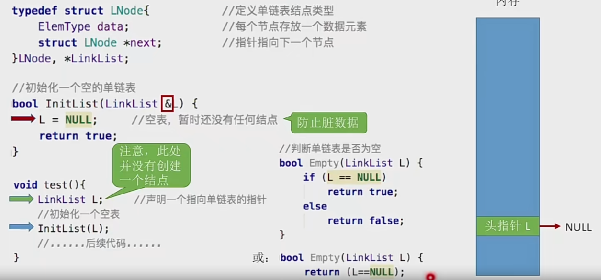
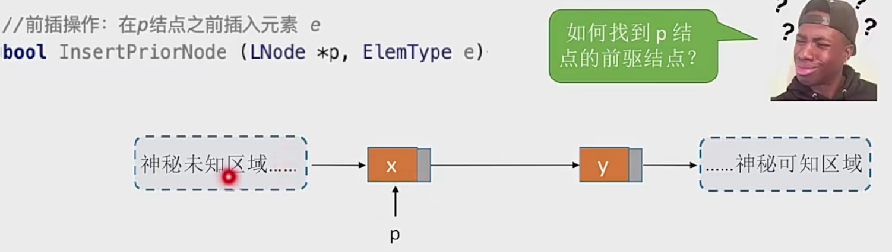
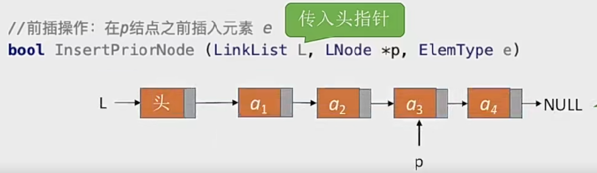
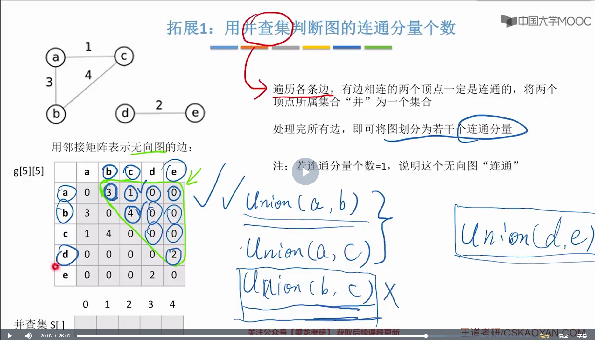
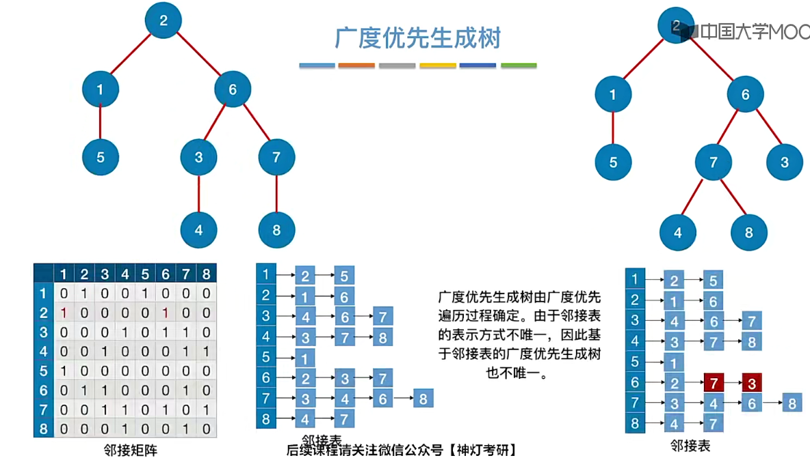
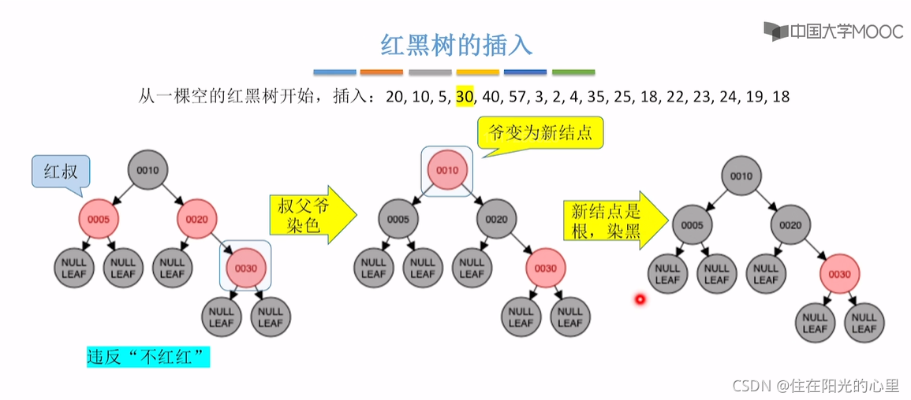
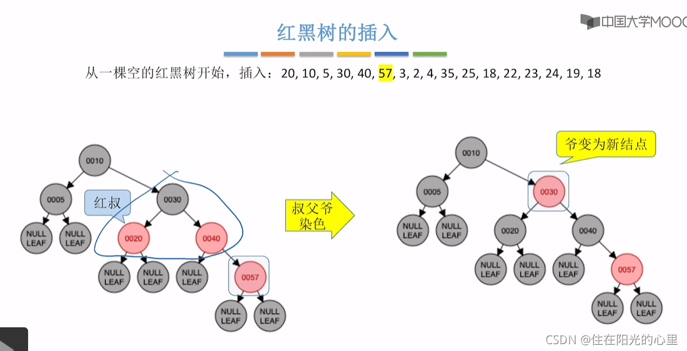
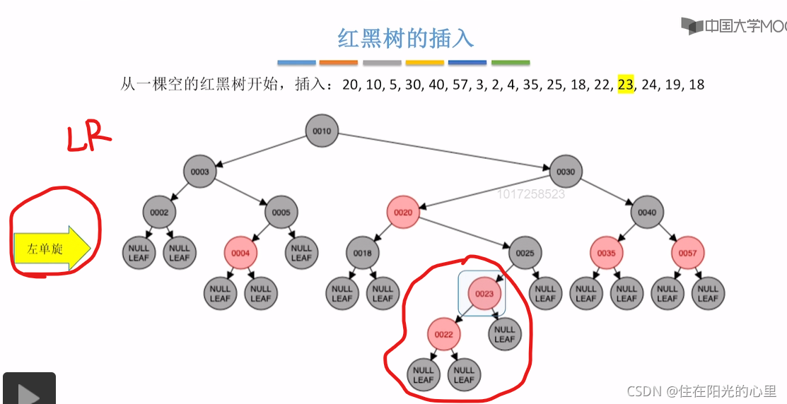

# 数据结构

## 线性表

### 线性表的顺序表示

##### 线性表的定义

1. 线性表的静态分配

   一维数组可以是静态分配的，也可以是动态分配的。在静态分配时，由于数组的大小和空间事先已经固定，一旦空间占满，再加入新的数据就会产生溢出，进而导致程序崩溃。

   ```c++
   //顺序表的实现--静态分配
   #include<stdio.h>
   #define MaxSize 10  //定义最大长度
   typedef struct {
   	int data[MaxSize];  //用静态的数组存放数据元素
   	int length; //顺序表的当前长度
   }SqList;
   //基本操作--初始化一个顺序表
   void InitList(SqList& L) {
   	for (int i = 0; i < MaxSize; i++)
   		L.data[i] = 0;
   	L.length = 0;
   }
   int main() {
   	SqList L;//声明一个顺序表
   	InitList(L);//初始化顺序表
   	//操作
   	return 0;
   }
   ```

2. 线性表的动态分配

   动态分配并不是链式存储，它同样属于顺序存储结构，物理结构没有变化，依然是随机存取方式，只是分配的空间大小可以在运行时动态决定。

   C的初始动态分配语句为

   ```c++
   L.data=(ElemType*)malloc(sizeof(ElemType)*InitSize);
   ```

   C++的初始动态分配语句为

   ```c++
   L.data=new ElemType[InitSize];
   ```

   需要将数据元素复制到新的存储区域，并用free函数释放原区域

   ```c++
   //顺序表的实现--动态分配
   #include<stdlib.h>
   #define InitSize 10  //默认的最大长度
   typedef struct {
   	int* data;  //指示动态分配数组的指针
   	int MaxSize;//顺序表的最大容量
   	int length; //顺序表的当前长度
   }SeqList;
   void InitList(SeqList& L) {
   	//用malloc函数申请一片连续的存储空间
   	L.data = (int*)malloc(InitSize * sizeof(int));
   	L.length = 0;
   	L.MaxSize = InitSize;
   }
   //增加动态数组的长度
   void IncreaseSize(SeqList& L, int len) {
   	int* p = L.data;
   	L.data = (int*)malloc((L.MaxSize + len) * sizeof(int));
   	for (int i = 0; i < L.length; i++) {
   		L.data[i] = p[i];//将数据复制到新区域
   	}
   	L.MaxSize = L.MaxSize + len;//顺序表最大长度增加len
   	free(p);//释放原来的内存空间
   }
   int main() {
   	SeqList L;//声明一个顺序表
   	InitList(L);//初始化顺序表
   	//往顺序表中随便插入几个元素
   	IncreaseSize(L, 5);
   	return 0;
   }
   ```

   顺序表的特点

   - **随机访问**，即可以在O（1）时间内找到第i个元素。
   - **可随机存取，存储密度高**，每个节点只存储数据元素。
   - **拓展容量不方便**（即便采用动态分配的方式实现，拓展长度的时间复杂度也比较高）
   - **插入、删除操作不方便**，需要移动大量数据。

##### 线性表的基本操作

1. 线性表的插入操作

   ListInsert（&L, i, e）  将元素e插入到L的第i个位置

   插入位置之后的元素都要后移

   时间复杂度    最好O(1)、最坏O（n）、平均O（n）

   ```c++
   //顺序表的插入操作
   #include<stdio.h>
   #define MaxSize 10  //定义最大长度
   typedef struct {
   	int data[MaxSize];  //用静态的数组存放数据元素
   	int length; //顺序表的当前长度
   }SqList;
   bool ListInsert(SqList& L, int i, int e) {
   	if (i<1 || i>L.length + 1)
   		return false;
   	if (L.length >= MaxSize)
   		return false;
   	for (int j = L.length; j >= i; j--)
   		L.data[j] = L.data[j - 1];
   	L.data[i - 1] = e;
   	L.length++;
   }
   int main() {
   	SqList L;//声明一个顺序表
   	InitList(L);//初始化顺序表
   	//操作
   	ListInsert(L, 3, 3);
   	return 0;
   }
   ```

2. 线性表的删除操作

   ListDelete（&L, i, &e）将L的第i个元素删除，并用e返回

   删除位置之后的元素都要前移

   时间复杂度    最好O(1)、最坏O（n）、平均O（n）

   ```c++
   //顺序表的删除操作
   #include<stdio.h>
   #define MaxSize 10  //定义最大长度
   typedef struct {
   	int data[MaxSize];  //用静态的数组存放数据元素
   	int length; //顺序表的当前长度
   }SqList;
   bool ListDelete(SqList& L, int i, int &e) {
   	if (i<1 || i>L.length)
   		return false;
   	e = L.data[i - 1];
   	for (int j = i; j <L.length; j++)
   		L.data[j-1] = L.data[j];
   	L.length--;
   }
   int main() {
   	SqList L;//声明一个顺序表
   	InitList(L);//初始化顺序表
   	//操作
   	int e = -1;
   	if (ListDelete(L, 3, e))
   		printf("已删除第3个元素，删除元素值为=%d\n", e);
   	else
   		printf("位序i不合法，删除失败\n");
   	return 0;
   }
   ```

3. 线性表的按位查找

   GetElem(L，i)

   - 获取表L中第i个位置的元素的值
   - 用数组下标即可得到第i个元素L.data[i-1]

   时间复杂度   最好/最坏/平均时间复杂度都是O（1）

   ```c++
   //线性表的按位查找
   #define InitSize 10
   ElemType GetElem(SeqList L, int i) {
   	return L.data[i - 1];
   }
   int main() {
   
   }
   ```

4. 线性表的按值查找

   LocateElem（L，e）

   - 在顺序表L中查找第一个元素值等于e的元素，并返回其位序
   - 从第一个元素开始依次往后检索

   时间复杂度

   - 最好O（n）：目标元素在第一个位置
   - 最坏O（n）：目标元素在最后一个位置
   - 平均O（n）：目标元素在每个位置的概率相同

   ```c++
   #define InitSize 10  //默认的最大长度
   typedef struct {
   	int* data;  //指示动态分配数组的指针
   	int MaxSize;//顺序表的最大容量
   	int length; //顺序表的当前长度
   }SeqList;
   int LocateElem(SeqList L, int e) {
   	for (int i = 0; i < L.length; i++)
   		if (L.data[i] == e)
   			return i + 1;
   	return 0;
   }
   ```

### 线性表的链式表示

##### 单链表的定义

每个结点除了存放数据元素外，还要存储指向下一个结点的指针。

优点：不要求大片连续空间，改变容量方便。

缺点：不可随机存取，要耗费一定空间存放指针。

1. 单链表的定义

   ```c++
   typedef struct LNode{    //定义单链表结点类型
       ElemType data;//数据域
   	struct LNode *next;//指针域
   }LNode, *LinkList
   ```

   两种实现方式

   - 不带头结点

     空表判断：L==NULL。写代码不方便。

     

   - 带头结点

     空表判断：L->next==NULL。写代码更方便。

     头结点的数据域可以不设任何信息，也可以记录表长等信息。为了操作方便。

     

##### 单链表上基本操作的实现

1. 单链表的插入与删除

   - 按位序插入（带头结点）

     ListInsert(&L,i,e)：插入操作。在表L中的第i个位置上插入指定元素e。即找到第i-1个结点，将新结点插入其后。

     

     分析：

     - 如果i=1（插入表头）
     - 如果i=3（插入表中）
     - 如果i=5（插入表尾）最坏时间复杂度O（n）
     - 如果i=6（i>Length）
     - 平均时间复杂度O（n）

   - 按位序插入（不带头结点）

     

     

     

     分析：

     - 如果i=1（插在表头），专门写一段逻辑。
     - 如果i>1,和带头结点的一样。

   - 指定结点的后插操作

     

     时间复杂度O（1）

   - 指定结点的前插操作

     

     

     时间复杂度O（n）

     

     时间复杂度O（1）

     

   - 按位序删除（带头结点）

     ListDelete（&L，i，&e）：删除操作，删除表L中第i个位置的元素，并用e返回删除元素的值。

     

     最好时间复杂度：O（1）

     最坏平均时间复杂度：O（n）

   - 指定结点的删除

     

     时间复杂度O（1），不能删除最后一个节点。

     如果是最后一个节点，只能从表头开始依次寻找p的前驱，时间复杂度O（n）

2. 单链表的查找

   GetElem（L,i）：按位查找操作，获取表L中第i个位置的元素的值。

   LocateElem（L,e）：按值查找操作，在表L中查找具有给定关键字值的元素。

   - 按位查找

     

     平均时间复杂度O（n）

   - 按值查找

     

   - 求表的长度

     

     时间复杂度O（n）

3. 单链表的建立

   - 尾插法

     

     永远保持r指向最后一个结点

     时间复杂度O（n）

   - 头插法

     

     只要初始化单链表，都先把头指针指向NULL。

   核心都是初始化操作、指定结点的后插操作。

   头插法的重要应用：链表的逆置。

##### 双链表

单链表：无法逆向检索，有时候不太方便

双链表：可进可退，存储密度更低一丢丢


带头结点的双链表


双链表的插入操作


如果是插入到最后一个结点，会报错，更加严谨的代码（健壮性）


双链表的删除操作


销毁双链表


双链表的遍历


双链表不可随机存取，按位查找、按值查找操作都只能用遍历的方式实现。时间复杂度O（n）

##### 循环链表

循环单链表

单链表：从一个结点出发只能找到后续的各个结点

循环单链表：从一个结点出发可以找到其他任何一个结点


循环双链表

表头结点的prior指向表尾结点，表尾结点的next指向头结点


##### 静态链表

用数组的方式实现的链表


优点：增、删操作不需要大量移动元素。

缺点：不能随机存取，只能从头结点开始依次往后查找：容量固定不可变。

适用场景

- 不支持指针的低级语言
- 数据元素数量固定不变的场景（如操作系统的文件分配表FAT）

##### 顺序表和链表的比较

1. 逻辑结构

   都属于线性表，都是线性结构

   链式存储用指针表示逻辑结构，而指针的设置是任意的，所以可以很方便地表示各种逻辑结构；

   顺序表只能用物理上的邻接关系来表示逻辑结构。

2. 物理结构/存储结构

   顺序表（顺序存储）

   - 优点：支持随机存取、存储密度高。
   - 缺点：大片连续空间分配不方便，改变容量不方便。

   链表（链式存储）

   - 优点：离散的小空间分配方便，改变容量方便。
- 缺点：不可随机存取，存储密度低。
  
   二者都可以顺序存取

3. 数据的运算/基本操作

   创销、增删改查

   - 创建

     - 顺序表

       需要预分配大片连续空间。若分配空间过小，则之后不方便拓展；若分配空间过大，则浪费内存资源。

       静态分配：静态数组（容量不可改变）

       动态分配：动态数组（malloc、free）（容量可改变，但需要移动大量元素，时间代价高）

     - 链表

       只需分配一个头结点（也可以不要头结点，只声明一个头指针），之后方便拓展。

     链表更胜一筹

   - 销毁

     - 顺序表

       修改Length=0

       静态分配：系统自动回收空间。

       动态分配：需要手动free。

     - 链表

       依次删除各个结点（free）

   - 增删

     - 顺序表

       插入/删除元素要将后续元素都后移/前移。

       时间复杂度O（n），时间开销主要来自移动元素。

       若数据元素很大，则移动的时间代价很高。

     - 链表

       插入/删除元素只需修改指针即可。

       时间复杂度O（n），时间开销主要来自查找目标元素。

       查找元素的时间代价更低。

     实际应用中链表效率更高

   - 改查

     - 顺序表

       按位查找：O（1）

       按值查找：O（n） 若表内元素有序，可在O（$log_2n$）时间内找到。（折半查找）

     - 链表

       按位查找：O（n）

       按值查找：O（n）

4. 用顺序表or链表？

   |                | 顺序表 | 链表 |
   | -------------- | ------ | ---- |
   | 弹性（可扩容） | ×      | √    |
   | 增、删         | ×      | √    |
   | 查             | √      | ×    |

   表长难以估计、经常要增加/删除元素    ---链表

   表长可预估、查询（搜索）操作较多     ---顺序表


## 栈、队列和数组

### 栈

##### 栈的基本概念

栈是只允许在一端进行插入或删除操作的线性表。（栈是限制存取点的线性结构）

重要术语

- 栈顶：线性表允许进行插入删除的那一端。
- 栈底：固定的，不允许进行插入和删除的另一端。
- 空栈：不含任何元素的空表。

特点：后进先出（LIFO）

逻辑结构：与普通线性表相同。

数据的运算：插入、删除操作有区别。

栈的基本操作

- InitStack（&S）：初始化栈。构造一个空栈S，分配内存空间。
- DestoryStack（&L）：销毁栈。销毁并释放栈S所占用的内存空间。
- Push（&S，x）：进栈，若栈S未满，则将x加入使之成为新栈顶。（只能在栈顶操作）
- Pop（&S，&x）：出栈，若栈S非空。则弹出栈顶元素，并用x返回。（只能在栈顶操作）
- GetTop（S，&x）：读栈顶元素，若栈S非空，则用x返回栈顶元素。（栈的使用场景中大多只访问栈顶元素）
- StackEmpty（S）：判断一个栈S是否为空。若S为空，则返回true，否则返回false。

栈的数学性质：n个不同元素进栈，出栈元素不同排列的个数为$\frac{1}{n+1}C^n_{2n}$,该公式称为卡特兰数。

##### 栈的顺序存储结构

**基本操作**

创增删查都是O（1）的时间复杂度。

栈顶指针：S.top，初始时设置S.top=-1；栈顶元素：S.data[S.top]。

进栈操作：栈不满时，栈顶指针先加1，再送值到栈顶元素。

出栈操作：栈非空时，先取栈顶元素值，再将栈顶指针减1。

栈空条件：S.top==-1；栈满条件:S.top==MaxSize-1；栈长：S.top+1.

```c++
#define MaxSize 10  //定义栈中元素的最大个数
//顺序栈的定义
typedef struct{
    ElemType data[MaxSize];  //静态数组存放栈中元素
    int top;     //栈顶指针
}SqStack;
//初始化栈
void InitStack(SqStack &S){
    S.top=-1;    //初始化栈顶指针
}
//判断栈空
bool StackEmpty(SqStack S){
    if(S.top==-1)  //栈空
        return true;
    else          // 不空
        return false;
}
//新元素入栈
bool Push(SqStack &S,ElemType x){
    if(S.top==MaxSize-1)  //栈满，报错
        return false;
    S.top=S.top+1;  //指针先加1
    S.data[S.top]=x; //新元素入栈
    //上面两行等价于 S.data[++S.top]=x;
    return true;
}
//出栈操作
bool Pop(SqStack &S,ElemType &x){
    if(S.top==-1)  //栈空，报错
        return false;
    x=S.data[S.top];//先出栈
    S.top=S.top-1;//指针再减1
    //上面两行等价于 x=S.data[S.top--]
    return true;
}
//读取栈顶元素操作
bool GetTop（SqStack S，ElemType &x）{
    if(S.top==-1) //栈空，报错
        return false;
    x=S.data[S.top];//x记录栈顶元素
    return true;
}
void testStack(){
    SqStack S;  //声明一个顺序栈（分配空间）
    InitStack(S);
}
```

若栈顶指针初始化为S.top=0，即top指向栈顶元素的下一个位置则相应操作都会发生变化，入栈操作变为S.data[S.top++]=x；出栈操作变为x=S.data[--S.top]。

顺序栈的缺点：栈的大小不可变。

**共享栈**


当0号栈进栈时top0先加1再赋值，1号栈进栈时top1先减1再赋值；出栈时则刚好相反。

存储数据的时间复杂度均为O（1）。

优点：节省存储空间，降低发生上溢的可能。

##### 栈的链式存储结构

链栈的优点是便于多个栈共享存储空间和提高其效率，且不存在栈满上溢的情况。

**基本操作**

链式存储的定义

```c++
typedef struct Linknode{
    ElemType data;  //数据域
    struct Linknode *next; //指针域
}  *LiStack;  //栈类型定义
```

链栈操作与链表类似，入栈出栈都在表头进行。注意区别带头结点和不带头结点的区别。

顺序栈和链栈的区别：

- 顺序栈采用数组存储，数组的大小是固定的，不能动态地分配大小。
- 链栈相比顺序栈的最大优势是可以动态地分配存储空间。

### 队列

##### 队列的基本概念

队列是只允许在一端进行插入，在另一端删除的线性表。

特点：先进先出（FIFO）

队头：允许删除的额一端，又称为队首。

队尾：允许插入的一端。

队列的基本操作

- InitQueue（&Q）：初始化队列，构造一个空队列Q。
- DestoryQueue（&Q）：销毁队列。销毁并释放队列Q所占用的内存空间。
- EnQueue（&Q，x）：入队，若队列Q未满，将x加入，使之成为新的队尾。
- DeQueue（&Q，&x）：出队，若队列Q非空，删除队头元素，并用x返回。
- GetHead（Q，&x）：读队头元素，若队列Q非空，则将队头元素赋值给x。
- QueueEmpty（Q）：判队列空，若队列Q为空返回true，否则返回false。

##### 队列的顺序存储结构

队列的顺序存储类型描述为

```c++
#define MaxSize 10  //定义队列中元素的最大个数
typedef struct{
    ElemType data[MaxSize];//用静态数组存放队列元素
    int front,rear;   //队头指针和队尾指针
}SqQueue;
//初始化队列
void InitQueue(SqQueue &Q){
    //初始时队头、队尾指针指向0
    Q.rear=Q.front=0;
}
//判断队列是否为空
bool QueueEmpty(SqQueue Q){
    if(Q.rear==Q.front)  //队空条件
        return true;
    else
        return false;
}
//入队
bool EnQueue(SqQueue &Q,ElemType x){
    if(（Q.rear+1）%MaxSize=Q.front)
        return false;//队满则报错
    Q.data[Q.rear]=x;//将x插入队尾
    Q.rear=(Q.rear+1)%MaxSize;//队尾指针后移
    //如果队尾指针指向队尾元素，则上面两行互换
    return true;
}
//出队
bool DeQueue(SqQueue &Q,ElemType &x){
    if(Q.rear==Q.front)
        return false;//队空则报错
    x=Q.data[Q.front];
    Q.front=(Q.front+1)%MaxSize;//队头指针后移
    return true;
}
//获取队头元素
bool GetHead(SqQueue Q,ElemType &x){
    if(Q.rear==Q.front)
        return false;//队空则报错
    x=Q.data[Q.front];
    return true;
}
void testQueue(){
    //声明一个队列（顺序存储）
    SqQueue Q;
    InitQueue(Q);
}
```

**循环队列**

初始时：Q.front=Q.rear=0

队首指针进1：Q.front=(Q.front+1)%MaxSize

队尾指针进1：Q.rear=(Q.rear+1)%MaxSize

队列长度：（Q.rear+MaxSize-Q.front）%MaxSize

出队入队时：指针都按顺时针方向进1

**区分队空还是队满的情况**

front，rear初始化为0

1. 牺牲一个单元来区分队空还是队满，入队时少用一个队列单元，这是一种较为普遍的做法,约定以“队头指针在队尾指针的下一位置作为队满的标志”

   队空条件：Q.rear==Q.front

   队满条件：（Q.rear+1）%MaxSize=Q.front

   上面代码都是使用的方法1的判空判满条件。

2. 类型中增设表示元素个数的数据成员size，初始化为0。

   插入成功size++；删除成功size--

   队空条件：size=0

   队满条件：size==MaxSize

3. 类型中增设tag数据成员，以区分队满还是队空。tag==0时，若因删除导致Q.rear==Q.front,则为队空；tag==1时，若因插入导致Q.rear==Q.front，则为队满。

Q:如果队尾指针指向队尾元素，如何初始化？

A：front指向0，rear指向MaxSize-1,此时判空条件为：（Q.rear+1）%MaxSize=Q.front

判满的话有两种方案，第一种是牺牲一个存储单元（判空：（Q.rear+1）%MaxSize=Q.front；判满：（Q.rear+2）%MaxSize=Q.front），第二种是增加辅助变量（size、tag）。

##### 队列的链式存储结构

队列的链式表示称为链队列。

队列的链式实现

```c++
typedef struct LinkNode{  //链式队列结点
    ElemType data;
    struct LinkNode *next;
}LinkNode;
typedef struct{//链式队列
    LinkNode *front,*rear;//队列的队头和队尾指针
}LinkQueue;
//初始化(带头结点)
void InitQueue(LinkQueue &Q){
    Q.front=Q.rear=(LinkNode*)malloc(sizeof(LinkNode));//建立头结点，并让front、rear都指向头结点
    Q.front->next=NULL;//初始为空
}
//判队空(带头结点)
bool IsEmpty(LinkQueue Q){
    if(Q.front==Q.rear)
        return true;
    else
        return false;
}
//初始化(不带头结点)
void InitQueue(LinkQueue &Q){
    Q.front=NULL；
    Q.rear=NULL;
}
//判队空(不带头结点)
bool IsEmpty(LinkQueue Q){
    if(Q.front==NULL)
        return true;
    else
        return false;
}
//入队(带头结点)
void EnQueue(LinkQueue &Q,ElemType x){
    LinkNode *s=(LinkNode*)malloc(sizeof(LinkNode));
    s->data=x;
    s->next=NULL;
    Q.rear->next=s;//新结点插入到rear之后
    Q.rear=s; //修改表尾指针
}
//入队(不带头结点)
void EnQueue(LinkQueue &Q,ElemType x){
    LinkNode *s=(LinkNode*)malloc(sizeof(LinkNode));
    s->data=x;
    s->next=NULL;
    if(Q.front==NULL){
        Q.front=s;//在空队列中插入第一个元素
        Q.rear=s;//修改队头队尾指针
    }
    else{
        Q.rear-next=s;//新结点插入到rear之后
        Q.rear=s;//修改rear指针
    }
}
//出队(带头结点)
bool DeQueue(LinkQueue &Q,ElemType &x){
    if(Q.front==Q.rear)
        return false;//空队
    LinkNode *p=Q.front->next;
    x=p->data;//用变量x返回队头元素
    Q.front->next=p->next;//修改头结点的next指针
    if(Q.rear==p)//此次是最后一个结点出队
        Q.rear=Q.front;//修改rear指针
    free(p);   //释放结点空间
    return true;
}
//出队(不带头结点)
bool DeQueue(LinkQueue &Q,ElemType &x){
    if(Q.front==NULL)
        return false;//空队
    LinkNode *p=Q.front;//p指向此次出队的结点
    x=p->data;//用变量x返回队头元素
    Q.front=p->next;//修改front指针
    if(Q.rear==p){  //此次是最后一个结点出队
        Q.front=NULL；//front指向NULL
        Q.rear=NULL;//rear指向NULL
    }
    free(p);   //释放结点空间
    return true;
}
```

##### 双端队列

只允许从两端插入、两端删除的线性表。

输入受限的双端队列：两端输出一端输入

输出受限的双端队列：两端输入一端输出

在栈中合法的输出序列，在双端队列中必定合法

### 栈和队列的应用

栈的应用：括号匹配、递归、进制转换、迷宫求解。

队列的应用：缓冲区、页面替换算法。

##### 栈在括号匹配中的应用

从左到右依次扫描所有字符，遇到左括号，入栈，遇到右括号则弹出栈顶元素检查是否匹配。

匹配失败情况：

- 左括号单身（所有括号检测完，但栈非空）
- 右括号单身（扫描到右括号，但栈空）
- 左右括号不匹配

```c++
#define MaxSize 10  //定义栈中元素的最大个数
typedef struct{
    char data[MaxSize];//静态数组存放栈中元素
    int top;//栈顶指针
}SqStack;
//初始化栈
void InitStack(SqStack &S)
//判断栈是否为空
bool StackEmpty(SqStack S)
//新元素入栈
bool Push(SqStack &S,char x)
//栈顶元素出栈，用x返回
bool Pop(SqStack &S,char &x)
bool bracketCheck (ElemType str[], int lenght){
	//初始化顺序栈
	SqStack S;
	InitStack(S);
	//for循环遍历字符串
	for(int i = 0; i < lenght; i++){
		//str[i]是否为左括号(如果是,将其压入栈中)
		if(str[i] == '(' || str[i] == '[' || str[i] == '{'){
			//将str入栈
			Push(S, str[i]);
		}
        else{//不是的话但是右括号的话
			//判断栈是否为空
			if(StackEmpty(S)){
				//如果为空的话就返回错误(结束)
				return false;
			}
			char topElem;
			//栈顶元素出栈
			Pop(S, topElem);
			if(str[i] == ')' && topElem != '(')
				return false;
			if(str[i] == ']' && topElem != '[')
				return false;
			if(str[i] == '}' && topElem != '{')
				return false;
		}
	}
	return StackEmpty(S);//检索完全部括号后，栈空说明匹配成功
}
```

##### 栈在表达式求值中的应用

**中缀表达式**：运算符在两个操作数中间

---

**后缀表达式**：运算符在两个操作数后面（逆波兰表达式）

中缀转后缀：**左优先原则**。

- 手算方法：从左往右扫描，每遇到一个运算符，就让运算符前面最近的两个操作数执行对应运算，合体为一个操作数。（注意两个操作数的左右顺序）

  特点：越往后出现的操作数越先被运算。LIFO  栈

- 机算方法：初始化一个栈，用于保存**暂时还不能确定运算顺序的运算符**。

  从左到右处理各个元素，直到末尾。可能遇到三种情况：

  - 遇到操作数。直接加入后缀表达式。
  - 遇到界限符。遇到"("直接入栈；遇到")"则依次弹出栈内运算符并加入后缀表达式，直到弹出"("为止。注意："("不加入后缀表达式。
  - 遇到运算符。依次弹出栈中优先级高于或等于当前运算符的所有运算符，并加入后缀表达式，若碰到"("或栈空则停止。之后再把当前运算符入栈。

  按上述方法处理完所有字符后，将栈中剩余运算符依次弹出，并加入后缀表达式。

**用栈实现后缀表达式的计算：**

初始化一个栈，用来存放当前暂时不能确定运算次序的操作数。

1. **从左往右**扫描下一个元素，直到处理完所有元素。
2. 若扫描到操作数则压入栈，并回到1；否则执行3。
3. 若扫描到运算符，则弹出两个栈顶元素（先出栈的是**右操作数**），执行相应运算，运算结果压回栈顶，回到1。

若表达式合法，则最后栈中只会留下一个元素，就是最终结果。

**用栈中缀表达式的计算**（中缀转后缀+后缀表达式求值两个算法结合）

- 初始化两个栈，操作数栈和运算符栈
- 若扫描到操作数，则压入操作数栈。
- 若扫描到运算符或界限符，则按照“中缀转后缀算法”相同的逻辑压入运算符栈（期间也会弹出运算符，每当弹出一个运算符时，就需要再弹出两个操作数栈的栈顶元素并执行相应的运算，运算结果再压回操作数栈）

---

**前缀表达式**：运算符在两个操作数前面（波兰表达式）

中缀转前缀：**右优先原则**。

用栈实现前缀表达式的计算：

1. **从右往左**扫描下一个元素，直到处理完所有元素。
2. 若扫描到操作数则压入栈，并回到1；否则执行3。
3. 若扫描到运算符，则弹出两个栈顶元素（先出栈的是**左操作数**），执行相应运算，运算结果压回栈顶，回到1。

##### 栈在递归中的应用

函数调用的特点：最后被调用的函数最先执行结束(LIFO)

函数调用时，需要用一个栈存储：

- 调用返回地址
- 实参
- 局部变量

递归调用时，函数调用栈称为 “递归工作栈”:

- 每进入一层递归，就将递归调用所需信息压入栈顶
- 每退出一层递归，就从栈顶弹出相应信息

缺点：太多层递归可能回导致栈溢出。

通常情况下，递归算法在计算机实际执行的过程中包含很多的重复计算，所以效率会低。

适合用“递归”算法解决：可以把原始问题转换为属性相同，但规模较小的问题。

##### 队列在层次遍历中的应用

1. 根节点入队
2. 若队空（所有节结点都已处理完毕），则结束遍历；否则重复3操作。
3. 队列中第一个结点出队并访问之。若其有左孩子则将左孩子入队；若其有右孩子则将右孩子入队，返回2。

##### 队列在操作系统中的应用

多个进程抢着使用有限的系统资源时，FCFS（先到先服务）是一种常用策略。

### 数组和特殊矩阵

##### 数组的存储结构

1. 一维数组

   ```c++
   Elemtype a[10];
   ```

   各数组元素大小相同，物理上连续存放。

   起始地址：LOC

   数组下标：默认从0开始！

   数组元素 a[i]的存放地址 = LOC + i × sizeof(ElemType)。

2. 二维数组

   ```c++
   Elemtype b[2][4]; //2行4列的二维数组
   ```

   行优先/列优先存储优点：实现随机存储

   起始地址：LOC

   M行N列的二维数组 b[M] [N]中，b[i] [j]的存储地址：

   行优先存储: LOC + ( i×N + j ) × sizeof(ElemType)
   列优先存储：LOC + ( j×M + i ) × sizeof(ElemType)

##### 普通矩阵的存储

二维数组存储：

- 描述矩阵元素时，行、列号通常从1开始
- 描述数组时，通常下标从 0 开始

##### 特殊矩阵的压缩存储

压缩存储：指多个值相同的元素只分配一个存储空间，对零元素不分配存储空间。其目的是节省存储空间。

1. 对称矩阵

   策略：只存储主对角线+下三角区

   按行优先原则将各元素存入一堆数组中。

   

2. 三角矩阵

   下三角矩阵策略：按行优先原则将**下三角**区域存入一维数组中。并在最后一个位置存储常量c。

   

   上三角矩阵策略：按行优先原则将**上三角**区域存入一维数组中。并在最后一个位置存储常量c。

   

3. 三对角矩阵

   

   已知i,j求k，k=2i+j-3

   ---

   

   已知数组下标k,求i，j。  i=[(k+2)/3]=[(k+1)/3+1]，j=k-2i+3。

4. 稀疏矩阵

   设在m×n的矩阵中有t个非零元素，令c=t/(m*n),当c<=0.05时称为稀疏矩阵。
   压缩存储原则：存各非零元的值、行列位置和矩阵的行列数。

   - 顺序存储----三元组（行标，列标，值）

   - 链式存储----十字链表法

     优点：它能够灵活得插入因运算而产生的新的非零元素，删除因运算而产生的新的零元素，实现矩阵的运算。

     十字链表中结点的结构示意图： 

     

     right：用于链接同一行中的下一个非零元素；
     down：用于链接同一列中的下一个非零元素。

     


## 串

### *串的定义和实现

串是特殊的线性表，数据元素之间呈线性关系（逻辑结构相似）；
串的数据对象限定为字符集：中文字符、英文字符、数字字符、标点字符…
串的基本操作，如增删改除通常以子串为操作对象

### 串的模式匹配

##### 朴素模式匹配算法

**模式匹配**：子串的定位操作称为串的模式，它求的是子串（常称模式串）在主串中的位置。

```c++
int Index(SString S, SString T){
    int i=1;                //扫描主串S
    int j=1;                //扫描模式串T
    while(i<=S.length && j<=T.length){
        if(S.ch[i] == T.ch[j]){
            ++i;
            ++j;             //继续比较后继字符
        }
        else{
            i = i-j+2;
            j=1;             //指针后退重新开始匹配
        }
    }
    if(j>T.length)
        return i-T.length;
    else
        return 0;
}
```

**时间复杂度分析：**

主串长度为n，模式串长度为m
最多比较n-m+1个子串
最坏时间复杂度 = O(nm)
每个子串都要对比m个字符(对比到最后一个字符才匹配不上)，共要对比n-m+1个子串，复杂度 = O((n-m+1)m) = O(nm - m^2 + m) = O(nm)
PS:大多数时候，n>>m
最好时间复杂度 = O(n)
每个子串的第一个字符就匹配失败，共要对比n-m+1个子串，复杂度 = O(n-m+1) = O(n)

##### KMP算法

- 不匹配的字符之前，一定是和模式串一致的
- 根据模式串T，求出next数组（只与模式串有关，与主串无关），利用next数组进行匹配，当匹配失败时，主串的指针 i 不再回溯！
  next数组是根据子串求出来的，当前面的字符串已知时如果有重复的，从当前的字符匹配即可。

1. 求next数组

   - 作用：当模式串的第j个字符失配时，从模式串的第next[j]继续往后匹配;

   - 对于任何模式串，当第1个字符不匹配时，只能匹配下一个子串，因此，next[1] = 0——表示模式串应右移一位，主串当前指针后移一位，再和模式串的第一字符进行比较；

   - 对于任何模式串，当第2个字符不匹配时，应尝试匹配模式串的第一个字符，因此，next[2] = 1;
     例：对于串 T = 'abaabc'

     

2. 利用next数组进行模式匹配

   ```c++
   int Index_KMP(SString S, SString T, int next[]){
       int i=1;     //主串
       int j=1;     //模式串
       while（i<S.length && j<=T.length){
           if(j==0 || S.ch[i]==T.ch[j]){      //第一个元素匹配失败时
               ++j;
               ++i;         //继续比较后继字符
           }
           else
               j=next[j]   //模式串向右移动
       }
       if(j>T.length)
           return i-T.length; //匹配成功
   }
   ```

3. 时间复杂度分析

   - 求next数组时间复杂度 = O(m)
   - 模式匹配过程最坏时间复杂度 = O(n)
   - KMP算法的最坏时间复杂度 = O(m+n)
   
4. KMP算法的进一步优化

   ```c++
   nextval[1]=0;
   for (int j=2;j<T.length;j++){
       if(T.ch[next[j]]==T.ch[j])
           nextval[j]=nextval[next[j]];
       else
           nextval[j]=next[j];
   }
   ```

## 树与二叉树

### 树的基本概念

树是n个结点的有限集。当n=0时称为空树。

非空树应满足以下几点：

- 有且只有一个根节点
- 没有后继的结点称为叶子结点
- 有后继的结点称为分支结点
- 除了根结点之外，任何一个结点都有且只有一个前驱
- 每个结点可以0个或多个后继

##### 树的性质

- 树中的结点数等于所有结点的度数之和加1。

- 度为m的树第i层上至多有$m^{i-1}个$结点。

- 高度为h的m叉树至多有$\frac{m^h-1}{m-1}$个结点。

- 高度为h的m叉树至少有h个结点。

  高度为h、度为m的树至少有h+m-1个结点。

- 具有n的结点的m叉树最小高度为$[log_m(n(m-1)+1)]$。

| 度为m的树                       | m叉树                         |
| ------------------------------- | ----------------------------- |
| 任意结点的度≤m（最多m个孩子）   | 任意结点的度≤m（最多m个孩子） |
| 至少有一个结点度=m（有m个孩子） | 允许所有结点的度都＜m         |
| 一定是非空树，至少有m＋1个结点  | 可以是空树                    |

### 二叉树的概念

##### 二叉树的定义及其主要特性

二叉树是n(n>=0)个结点的有限集，它或者是空集（n=0），或者由一个根结点及两颗互不相交的分别称作这个根的左子树和右子树的二叉树组成。

特点：

- 每个结点最多有俩孩子（二叉树中不存在度大于2的结点）。
- 二叉树可以是空集合，根可以有空的左子树和空的右子树。
- 二叉树有左右之分，次序不能颠倒。

**几种特殊的二叉树**

1. 满二叉树：一颗高度为h且有$2^h-1$个结点的二叉树称为满二叉树。每一层上的结点数都达到最大。叶子全部在最低层。

   - 只有最后一层有叶子结点。
   - 不存在度为1的结点。
   - 按层序从1开始编号，结点i的左孩子为2i，右孩子为2i+1；结点i的父结点为[i/2]。

2. 完全二叉树：高度为h的具有n个结点的二叉树，当且仅当其每一个结点都与高度为h的满二叉树中编号为1~n的结点一 一对应时，称之为完全二叉树。

   - 只有最后两层可能有叶子结点。
   - 最多只有一个度为1的结点。
   - 按层序从1开始编号，结点i的左孩子为2i，右孩子为2i+1；结点i的父结点为[i/2]。
   - i≤[n/2]为分支结点，i＞[n/2]为叶子结点。

3. 二叉排序树

   左子树上所有结点的关键字均小于根结点的关键字

   右子树上所有结点的关键字均大于根结点的关键字

   左子树和右子树又各是一颗二叉排序树

4. 平衡二叉树

   树上任一结点的左子树和右子树的深度之差不超过1。

**二叉树性质**

二叉树

1. 对任何一颗二叉树T，如果其叶子数为$n_0$，度为2的结点数为$n_2$，则$n_0=n_2+1$。（叶子结点比二分支结点多一个）
2. 在二叉树的第i层上至多有$2^{i-1}$个结点（i>1）。
3. 深度为k的二叉树至多有$2^k-1$个结点（k>=1）。

完全二叉树：

1. 具有n个结点的完全二叉树的深度为$\lceil log_2(n+1) \rceil或\lfloor log_2n \rfloor+1。$序号为i的结点所在层次为$\lfloor log_2i \rfloor+1$。
2. 对于完全二叉树，可以由结点数n推出度为0,1,2的结点个数$n_0,n_1,n_2$。
   - 若完全二叉树有2k个结点，则必有$n_1=1,n_0=k,n_2=k-1$。
   - 若完全二叉树有2k-1个结点，则必有$n_1=0,n_0=k,n_2=k-1$。

##### 二叉树的存储结构

1. 顺序存储

   二叉树的顺序存储中，一定要把二叉树的结点编号与完全二叉树对应起来；

   ```c++
   #define MaxSize 100
   
   struct TreeNode{
      ElemType value; //结点中的数据元素
      bool isEmpty;   //结点是否为空
   }
   
   int main(){
      TreeNode t[MaxSize];
      for (int i=0; i<MaxSize; i++){
         t[i].isEmpty = true;
      }
   }
   ```

   最坏情况：高度为h且只有h个结点的单支树（所有结点只有右孩子），也至少需要$2^h-1$个存储单元。

   所以，二叉树的顺序存储结构，只适合存储完全二叉树和满二叉树。

2. 链式存储

   ```c++
   struct ElemType{
      int value;
   };
   typedef struct BiTNode{
      ElemType data;          //数据域
      struct BiTNode *lchild, *rchild; //左、右孩子指针
   }BiTNode, *BiTree;
   //定义一棵空树
   BiTree root = NULL;
   //插入根节点
   root = (BiTree) malloc (sizeof(BiTNode));
   root -> data = {1};
   root -> lchild = NULL;
   root -> rchild = NULL;
   
   //插入新结点
   BiTNode *p = (BiTNode) malloc (sizeof(BiTNode));
   p -> data = {2};
   p -> lchild = NULL;
   p -> rchild = NULL;
   root -> lchild = p; //作为根节点的左孩子
   ```

   n个结点的二叉链表共有n+1个空指针域（用来构造线索二叉树）

   找到指定结点p的父节点；只能从根结点开始遍历，也可以使用**三叉链表**

   ```c++
   typedef struct BiTnode{
      ElemType data;          //数据域
      struct BiTNode *lchild, *rchild; //左、右孩子指针
      struct BiTNode *parent;          //父节点指针
   }BiTNode, *BiTree;
   ```

### 二叉树的遍历和线索二叉树

##### 二叉树的遍历

1. 前序遍历（先序遍历）：根左右（NLR）

   - 若二叉树为空，不用操作
   - 若二叉树非空
     - 访问根节点
     - 前序遍历左子树
     - 前序遍历右子树

   ```c++
   typedef struct BiTNode{
      ElemType data;          
      struct BiTNode *lchild, *rchild; 
   }BiTNode, *BiTree;
   //递归算法
   void PreOrder(BiTree T){
      if(T!=NULL){
         visit(T);                 //访问根结点
         PreOrder(T->lchild);      //递归遍历左子树
         PreOrder(T->rchild);      //递归遍历右子树
      }
   }
   //非递归算法
   void PreOrder2(BiTree T){
       InitStack(S);BiTree p=T;//初始化栈S；p是遍历指针
       while(p||!IsEmpty(S)){//栈不空或p不空时循环
           if(p){   //一路向左
               visit(p);//访问当前结点
               Push(S,p);//当前节点入栈
               p=p->lchild;//左孩子不空，一直向左走
           }
           else{  //出栈，并转向出栈结点的右子树
               Pop(S,p);//栈顶元素出栈
               p=p->rchild;//向右子树走，p赋值为当前结点的右孩子
           }//返回while循环继续进入if-else语句
       }
   }
   ```

   每个节点都会被路过三次

   第一次路过结点时访问结点

2. 中序遍历：左根右（LNR）

   - 若二叉树为空，不用操作
   - 若二叉树非空
     - 中序遍历左子树
     - 访问根节点
     - 中序遍历右子树

   ```c++
   typedef struct BiTNode{
      ElemType data;          
      struct BiTNode *lchild, *rchild; 
   }BiTNode, *BiTree;
   //递归算法
   void InOrder(BiTree T){
      if(T!=NULL){
         InOrder(T->lchild);       //递归遍历左子树
         visit(T);                 //访问根结点
         InOrder(T->rchild);       //递归遍历右子树
      }
   }
   //非递归算法
   void InOrder2(BiTree T){
       InitStack(S);BiTree p=T;//初始化栈S；p是遍历指针
       while(p||!IsEmpty(S)){//栈不空或p不空时循环
           if(p){   //一路向左
               Push(S,p);//当前节点入栈
               p=p->lchild;//左孩子不空，一直向左走
           }
           else{  //出栈，并转向出栈结点的右子树
               Pop(S,p);//栈顶元素出栈
               visit(p);//访问栈顶元素
               p=p->rchild;//向右子树走，p赋值为当前结点的右孩子
           }//返回while循环继续进入if-else语句
       }
   }
   ```

   每个节点都会被路过三次

   第二次路过结点时访问结点

3. 后序遍历：左右根（LRN）

   - 若二叉树为空，不用操作
   - 若二叉树非空
     - 后序遍历左子树
     - 后序遍历右子树
     - 访问根节点

   ```c++
   typedef struct BiTNode{
      ElemType data;          
      struct BiTNode *lchild, *rchild; 
   }BiTNode, *BiTree;
   //递归算法
   void PostOrder(BiTree T){
      if(T!=NULL){
         PostOrder(T->lchild);       //递归遍历左子树    
         PostOrder(T->rchild);       //递归遍历右子树
         visit(T);                 //访问根结点
      }
   }
   //非递归算法
   void PostOrder2(BiTree T){
       InitStack(S);BiTree p=T;//初始化栈S；p是遍历指针
       r=NULL;
       while(p||!IsEmpty(S)){//栈不空或p不空时循环
           if(p){   //一路向左
               Push(S,p);//当前节点入栈
               p=p->lchild;//左孩子不空，一直向左走
           }
           else{  //向右
               GetTop(S,p);//读栈顶结点
               if(p->rchild&&p->rchild!=r)//若右子树存在，且未被访问过
                   p=p->rchild;//转向右
               else{//否则，弹出结点并访问
                   Pop(S,p);//将结点弹出
                   visit(p->data);//访问该结点
                   r=p;//记录最近访问过的结点
                   p=NULL;//结点访问完后，重置p指针
               }
           }//else
       }//while
   }
   ```

   每个节点都会被路过三次

   第三次路过结点时访问结点

   三种遍历的空间复杂度：O（h）

4. 层序遍历（层次遍历）

   算法思想

   - 初始化一个辅助队列
   - 根节点入队
   - 若队列非空，则队头结点出队，访问该结点，依次将其左、右孩子插入队尾（如果有的话）
   - 重复以上操作直至队列为空

   ```c++
   //二叉树的结点(链式存储)
   typedef struct BiTNode{
      ElemType data;          
      struct BiTNode *lchild, *rchild; 
   }BiTNode, *BiTree;
   //链式队列结点
   typedef struct LinkNode{
      BiTNode * data;
      typedef LinkNode *next;
   }LinkNode;
   typedef struct{
      LinkNode *front, *rear;  
   }LinkQueue;
   //层序遍历
   void LevelOrder(BiTree T){
      LinkQueue Q;
      InitQueue (Q);          //初始化辅助队列
      BiTree p;
      EnQueue(Q,T);           //将根节点入队
      while(!isEmpty(Q)){     //队列不空则循环
         DeQueue(Q,p);        //队头结点出队
         visit(p);            //访问出队结点
         if(p->lchild != NULL)
            EnQueue(Q,p->lchild);   //左孩子入队
         if(p->rchild != NULL)
            EnQueue(Q,p->rchild);   //右孩子入队
      }
   }
   ```

5. 由遍历序列构造二叉树

   - 前序序列 + 中序序列
   - 后序序列 + 中序序列
   - 层序序列 + 中序序列

   key：找到树的根节点，并根据中序序列划分左右子树，再找到左右子树根节点

##### 线索二叉树（二叉树在计算机内部的一种存储结构）

1. 线索二叉树的概念与作用
   在二叉树的结点上加上线索的二叉树称为线索二叉树，对二叉树以某种遍历方式（如先序、中序、后序或层次等）进行遍历，使其变为线索二叉树的过程称为对二叉树进行线索化。

2. 线索二叉树的存储结构

   - 中序线索二叉树——线索指向中序前驱、中序后继

     ```c++
     //线索二叉树结点
     typedef struct ThreadNode{
        ElemType data;
        struct ThreadNode *lchild, *rchild;
        int ltag, rtag;                // 左、右线索标志
     }ThreadNode, *ThreadTree;
     ```

     > tag == 0: 指针指向孩子

     > tag == 1: 指针是“线索”

   - 先序线索二叉树——线索指向先序前驱、先序后继

   - 后序线索二叉树——线索指向后序前驱、后序后继

3. 二叉树线索化

   - 中序线索化

     （代码和王道树有一点差别）

     ```c++
     typedef struct ThreadNode{
        int data;
        struct ThreadNode *lchild, *rchild;
        int ltag, rtag;                // 左、右线索标志
     }ThreadNode, *ThreadTree;
     //全局变量pre, 指向当前访问的结点的前驱
     ThreadNode *pre=NULL;
     void InThread(ThreadTree T){
         if(T!=NULL){
             InThread(T->lchild);    //中序遍历左子树
             visit(T);               //访问根节点
             InThread(T->rchild);    //中序遍历右子树
         }
     }
     void visit(ThreadNode *q){
        if(q->lchild = NULL){                 //左子树为空，建立前驱线索   
           q->lchild = pre;
           q->ltag = 1;
        }
        if(pre!=NULL && pre->rchild = NULL){ 
           pre->rchild = q;           //建立前驱结点的后继线索
           pre->rtag = 1;
        }
        pre = q;
     }
     //中序线索化二叉树T
     void CreateInThread(ThreadTree T){
        pre = NULL;                //pre初始为NULL
        if(T!=NULL);{              //非空二叉树才能进行线索化
           InThread(T);            //中序线索化二叉树
           if(pre->rchild == NULL)
              pre->rtag=1;         //处理遍历的最后一个结点
        }
     }
     ```

   - 先序线索化

     注意【转圈】问题，当ltag==0时，才能对左子树先序线索化

     ```c++
     typedef struct ThreadNode{
        int data;
        struct ThreadNode *lchild, *rchild;
        int ltag, rtag;                // 左、右线索标志
     }ThreadNode, *ThreadTree;
     //全局变量pre, 指向当前访问的结点的前驱
     ThreadNode *pre=NULL;
     //先序遍历二叉树，一边遍历一边线索化
     void PreThread(ThreadTree T){
        if(T!=NULL){
           visit(T);
           if(T->ltag == 0)         //lchild不是前驱线索
              PreThread(T->lchild);
           PreThread(T->rchild);
        }
     }
     void visit(ThreadNode *q){
        if(q->lchild = NULL){                 //左子树为空，建立前驱线索   
           q->lchild = pre;
           q->ltag = 1;
        }
        if(pre!=NULL && pre->rchild = NULL){ 
           pre->rchild = q;           //建立前驱结点的后继线索
           pre->rtag = 1;
        }
        pre = q;
     }
     //先序线索化二叉树T
     void CreateInThread(ThreadTree T){
        pre = NULL;                //pre初始为NULL
        if(T!=NULL){              //非空二叉树才能进行线索化
           PreThread(T);            //先序线索化二叉树
           if(pre->rchild == NULL)
              pre->rtag=1;         //处理遍历的最后一个结点
        }
     }
     ```

   - 后序线索化

     ```c++
     typedef struct ThreadNode{
        int data;
        struct ThreadNode *lchild, *rchild;
        int ltag, rtag;                // 左、右线索标志
     }ThreadNode, *ThreadTree;
     //全局变量pre, 指向当前访问的结点的前驱
     ThreadNode *pre=NULL;
     //后序遍历二叉树，一边遍历一边线索化
     void PostThread(ThreadTree T){
        if(T!=NULL){
           PostThread(T->lchild);
           PostThread(T->rchild);
           visit(T);                  //访问根节点
        }
     }
     void visit(ThreadNode *q){
        if(q->lchild = NULL){                 //左子树为空，建立前驱线索   
           q->lchild = pre;
           q->ltag = 1;
        }
        if(pre!=NULL && pre->rchild = NULL){ 
           pre->rchild = q;           //建立前驱结点的后继线索
           pre->rtag = 1;
        }
        pre = q;
     }
     //后序线索化二叉树T
     void CreateInThread(ThreadTree T){
        pre = NULL;                //pre初始为NULL
        if(T!=NULL){              //非空二叉树才能进行线索化
           PostThread(T);            //后序线索化二叉树
           if(pre->rchild == NULL)
              pre->rtag=1;         //处理遍历的最后一个结点
        }
     }
     ```

4. 线索二叉树中找前驱、后继

   - 中序线索二叉树找中序后继

     在中序线索二叉树中找到指定节点 *p 的中序后继 next

     - 若 p->rtag == 1, 则 next = p->rchild
     - 若 p->rtag == 0, 则 p 必有右孩子, 则 next = p的右子树中最左下结点

     ```c++
     //1. 找到以P为根的子树中，第一个被中序遍历的结点
     ThreadNode *Firstnode(ThreadNode *p){
        //循环找到最左下的结点（不一定是叶结点）
        while(p->ltag == 0)
           p=p->lchild;
        return p;
     }
     //2. 在中序线索二叉树中找到结点p的后继结点
     ThreadNode *Nextnode(ThreadNode *p){
        //右子树最左下结点
        if(p->rtag==0)
           return Firstnode(p->rchild);
        else 
           return p->rchild; //rtag==1，直接返回后继线索
     }
     //3. 对中序线索二叉树进行中序遍历
     void Inorder(ThreadNode *T){            //T为根节点指针
        for(ThreadNode *p = Firstnode(T); p!=NULL; p = Nextnode(p))
           visit(p);
     }（空间复杂度O（1））
     ```

   - 中序线索二叉树找中序前驱

     在中序线索二叉树中找到指定节点 *p 的中序前驱 pre

     - 若 p->ltag == 1, 则 pre = p->lchild
     - 若 p->ltag == 0, 则 p 必有左孩子, 则 pre = p的左子树中最右下结点

     ```c++
     //1. 找到以P为根的子树中，第一个被中序遍历的结点
     ThreadNode *Lastnode(ThreadNode *p){
        //循环找到最右下的结点（不一定是叶结点）
        while(p->rtag == 0)
           p=p->rchild;
        return p;
     }
     //2. 在中序线索二叉树中找到结点p的前驱结点
     ThreadNode *Prenode(ThreadNode *p){
        //左子树最右下结点
        if(p->ltag==0)
           return Lastnode(p->lchild);
        else 
           return p->lchild; //ltag==1，直接返回后继线索
     }
     //3. 对中序线索二叉树进行逆向中序遍历
     void RevInorder(ThreadNode *T){            //T为根节点指针
        for(ThreadNode *p = Lastnode(T); p!=NULL; p = Prenode(p))
           visit(p);
     }（空间复杂度O（1））
     ```

   - 先序线索二叉树找先序后继

     在先序线索二叉树中找到指定节点 *p 的先序后继 next

     - 若 p->rtag == 1，则 next = p->rchild
     - 若 p->rtag == 0，则p必有右孩子
       - 若p有左孩子，则先序后继为左孩子
       - 若p没有左孩子，则先序后继为右孩子

   - 先序线索二叉树找先序前驱

     在先序线索二叉树中找到指定节点 *p 的先序前驱pre

     - 若 p->ltag == 1, 则 pre = p->lchild
     - 若 p->ltag == 0，p必有左孩子，但是先序遍历中，左右子树的结点只可能是根的后继，不可能是前驱，所以不能从左右孩子里寻找p的先序前驱，（除非从头开始遍历/三叉链表）
       - 如果能够找到p的父节点，且p是左孩子 —— p的父节点就是p的前驱；
       - 如果能够找到p的父节点，且p是右孩子，且其左兄弟为空 —— p的父节点就是p的前驱；
       - 如果能够找到p的父节点，且p是右孩子，且其左兄弟非空 ——p的前驱为左兄弟子树中最后一个被先序遍历到的结点（根节点出发，先往右，右没有往左，找到最下一层的结点）；
       - p没有父节点，即p为根节点，则p没有先序前驱

   - 后序线索二叉树找后序后继

     在后序线索二叉树中找到指定节点 *p 的后序后继next

     - 若 p->rtag == 1, 则 next = p->rchild;
     - 若 p->rtag == 0，则p必有右孩子，左孩子不知道, 但是在后序遍历中，左右子树中的结点只有可能是根的前驱，而不可能是根的后继，所以找不到后继，（除非从头开始遍历/三叉链表）
       - 如果能找到p的父节点，且p是右孩子 —— p的父节点即为其后继
       - 如果能找到p的父节点，且p是左孩子，其右兄弟为空 —— p的父节点即为其后继
       - 如果能找到p的父节点，且p是左孩子，其右兄弟非空 —— p的后继为其右兄弟子树中第一个被后序遍历的结点
       - p没有父节点，即p为根节点，则p没有后序后继

   - 后续线索二叉树找后序前驱

     在后序线索二叉树中找到指定节点 *p 的后序前驱pre

     - 若 p->ltag == 1, 则 next = p->lchild;
     - 若 p->ltag == 0，必有左孩子
       - 若p有右孩子，则后序前驱为右孩子
       - 若p没有右孩子，则后序前驱为左孩子

   |        | 中序线索二叉树 | 先序线索二叉树 | 后序线索二叉树 |
   | ------ | -------------- | -------------- | -------------- |
   | 找前驱 | √              | ×              | √              |
   | 找后继 | √              | √              | ×              |

### 树、森林

##### 树的存储结构

1. 双亲表示法

   每个结点中保存指向双亲的指针（顺序存储）

   数据域：存放结点本身信息。
   双亲域：指示本结点的双亲结点在数组中的位置。

   ```c++
   #define MAX_TREE_SIZE 100  //树中最多结点数
   typedef struct{      //树的结点定义
      ElemType data; 
      int parent;      //双亲位置域
   }PTNode;
   typedef struct{                   //树的类型定义
      PTNode nodes[MAX_TREE_SIZE];   //双亲表示
      int n;                         //结点数
   }PTree;
   ```

   增：新增数据元素，无需按逻辑上的次序存储；（需要更改结点数n）

   删（叶子结点）：① 将伪指针域设置为-1；②用后面的数据填补；（需要更改结点数n）（方法二更好）

   查询：①优点-查指定结点的双亲很方便；②缺点-查指定结点的孩子只能从头遍历，空数据导致遍历更慢；

2. 孩子表示法(顺序+链式)

   孩子链表：把每个结点的孩子结点排列起来，看成是一个线性表，用单链表存储，则n个结点有n个孩子链表（叶子的孩子链表为空表）。而n个头结点又组成一个线性表，用顺序表（含n个元素的结构数组）存储。

   ```c++
   struct CTNode{
      int child;    //孩子结点在数组中的位置
      struct CTNode *next;    // 下一个孩子
   };
   typedef struct{
      ElemType data;
      struct CTNode *firstChild;    // 第一个孩子
   }CTBox;
   typedef struct{
      CTBox nodes[MAX_TREE_SIZE];
      int n, r;   // 结点数和根的位置
   }CTree;
   ```

3. 孩子兄弟表示法（链式）

   ```c++
   typedef struct CSNode{
      ElemType data;                               //数据域
      struct CSNode *firstchild, *nextsibling;     //第一个孩子和右兄弟指针, *firstchild 看作左指针，*nextsibling看作右指针
   }CSNode. *CSTree;
   ```

##### 树、森林与二叉树的转换

本质：森林中各个树的根结点之间视为兄弟关系

**将树转换成二叉树：**

- 加线：在兄弟之间加一连线
- 抹线：对每个结点去除其与孩子之间的关系（第一孩子除外）
- 旋转：以树的根结点为轴心，顺时针转45度
  （兄弟相连留长子）


##### 树、森林的遍历

1. 树的遍历

   - 先根遍历（深度优先遍历）

     若树非空，先访问根结点，再依次对每棵子树进行先根遍历；（与对应二叉树的先序遍历序列相同）

     ```c++
     void PreOrder(TreeNode *R){
        if(R!=NULL){
           visit(R);    //访问根节点
           while(R还有下一个子树T)
              PreOrder(T);      //先跟遍历下一个子树
        }
     }
     ```

   - 后根遍历（深度优先遍历）

     若树非空，先依次对每棵子树进行后根遍历，最后再返回根节点；（与对应二叉树的中序遍历序列相同）

     ```c++
     void PostOrder(TreeNode *R){
        if(R!=NULL){
           while(R还有下一个子树T)
              PostOrder(T);      //后跟遍历下一个子树
           visit(R);    //访问根节点
        }
     }
     ```

   - 层次遍历（广度优先遍历）

     - 若树非空，则根结点入队；
     - 若队列非空，队头元素出队并访问，同时将该元素的孩子依次入队；
     - 重复以上操作直至队尾为空；

2. 森林的遍历

   - 先序遍历

     等同于依次对各个树进行**先根遍历**；也可以先转换成与之对应的二叉树，对二叉树进行先序遍历；

   - 中序遍历

     等同于依次对各个树进行**后根遍历**；也可以先转换成与之对应的二叉树，对二叉树进行中序遍历；

**树和森林的遍历与二叉树遍历的对应关系**

| 树       | 森林     | 二叉树   |
| -------- | -------- | -------- |
| 先根遍历 | 先序遍历 | 先序遍历 |
| 后根遍历 | 中序遍历 | 中序遍历 |

### 树与二叉树的应用

##### 哈夫曼树和哈夫曼编码

1. 带权路径长度

   结点的权：有某种现实含义的数值（如：表示结点的重要性等）

   结点的带权路径长度：从根节点到该结点之间的路径长度与该节点的权的乘积。

   树的带权路径长度：树中所有叶结点的带权路径长度之和（WPL）。

2. 哈夫曼树的定义

   在含有n个带权叶结点的二叉树中，其中带权路径长度最小的二叉树称为哈夫曼树，也称最优二叉树。

3. 哈夫曼树的构造

   给定n个权值分别为$w_1,w_2,...,w_n$的结点，构造哈夫曼树的算法描述如下

   - 将这n个结点分别作为n棵仅含一个结点的二叉树，构成森林F。
   - 构造一个新结点，从F中选取两棵根结点权值最小的树作为新结点的左、右子树，并且将新结点的权值置为左右子树上根结点的权值之和。
   - 从F中删除刚才选出的两棵树，同时将新得到的树加入F中。
   - 重复步骤2和3，直至F中只剩下一棵树为止。

   特点：

   - 每个初始结点最终都成为叶结点，且权值越小的结点到根结点的路径长度越大。
   - 构造过程中共新建了n-1个结点，因此哈夫曼树的结点总数为2n-1。
   - 每次构造都选择2棵树作为新结点的孩子，因此哈夫曼树中不存在度为1的结点。
   - 哈夫曼树并不唯一，但WPL必然相同且为最优。

4. 哈夫曼编码

   前缀编码

   没有一个编码是另一个编码的前缀。

##### 并查集

顺序存储，每一个集合组织成一棵树，采用双亲表示法

```c++
// 并查集的结构定义
#define SIZE  100
int UFsets[SIZE];     // 集合元素数组（双亲指针数组）
// 初始化（s[] 即为并查集）
void Initial(int S[]){
    for(int i = 0; i < SIZE; i++){
        S[i] = -1;
    }
}
// Find操作：在s[] 中查找并返回包含元素 x 的树的根
// 最坏时间复杂度：O(n)  （即结点排列形似成竖直状的单链表）
int Find(int s[], int x){
    while(S[x] >= 0)  
        x = S[x];     // 循环寻找 x 的根
    return x;    // 根的s[] < 0
}
// Union操作：求两个不相交子集合的并集
// 时间复杂度：O(1)
void Union(int s[], int Root1, int Root2){
    if(Root1 == Root2) return;     // 要求 Root1 和 Root2 是不同的，且表示字集合的名字
    S[Root2] = Root1;    // 将 Root2 连接到另一根 Root1 下面
}
```

优化思路

在每次Union操作构建树的时候，尽可能让树不长高。

- 用根节点的绝对值表示树的结点总数。
- Union操作，让小树合并到大树。

```c++
// Find操作的优化：
// 压缩路径（先找到根结点，再将查找路径上所有结点都挂到根结点下）
int Find(int S[], int x){
    int root = x;
    while(S[root] >= 0)  root = S[root];    // 循环找到根
    while(x != root){    // 压缩路径
        int t = x;       // t 指向 x 的父结点
        S[x] = root;     // x 直接挂到根结点下
        x = t;      // 继续使 x 的父结点也挂到根结点下
    }
    return root;
}
// Union操作的优化：小树并入大树
void Union(int S[], int Root1, int Root2){
    if(Root1 == Root2) return;
    if(Root2 > Root1){              // Root2 结点数更少
        S[Root1] += S[Root2];   //累加结点总数
        S[Root2] = Root1;        // 小树合并到大树
    }
    else{       // Root1 结点数更少
        S[Root2] += S[Root1];      //累加结点总数
        S[Root1] = Root2;     // 小树合并到大树
    }
}
```

该方法构造的树高不超过$[log_2n]+1$

Union操作优化后，Find操作最坏时间复杂度：$O(log_2n)$


**并查集的应用**




## 图

### 图的基本概念

线性表可以是空表，树可以是空树，但图不可以是空，即V一定是非空集。

1. 有向图

   若E是有向边（弧）的有限集合时，则图G为有向图。弧是顶点的有序对，记为<v,w>，其中v，w是顶点，v称为弧尾，w称为弧头，<v,w>称为从v到w的弧，也称v邻接到w。

2. 无向图

   若E是无向边（边）的有限集合时，则图G为无向图。弧是顶点的无序对，记为（v,w）或（w,v）。可以说w和v互为邻接点。边（v，w）依附于w和v，或称边（v，w）和v，w相关联。

3. 简单图、多重图

   简单图

   - 不存在重复边。
   - 不存在顶点到自身的边。

   多重图

   图中某两个结点之间的边数大于1条，又允许顶点通过一条边和自身关联，则G为多重图。

4. 完全图（简单完全图）

   无向完全图

   无向图中任意两个顶点之间都存在边

   若顶点数为n，则边数为$C^2_n$。

   有向完全图（一定是强连通有向图）

   有向图中任意两个顶点之间都存在方向相反的两条弧。

   若顶点数为n，则边数为$2C^2_n$。

5. 子图

6. 连通、连通图和连通分量

   无向图中，若从顶点v到顶点w有路径存在，则称v和w是**连通的**。

   若图G中任意两点都是连通的，则称图G为连通图，否则称为非连通图。

   无向图中的极大连通子图称为连通分量。

   对于n个顶点的无向图G

   - 若G是连通图，则最少有n-1条边
   - 若G是非连通图，则最多可能有$C^{2}_{n-1}$条边

7. 强连通、强连通图、强连通分量

   有向图中，若从顶点v到顶点w和从w到v均有路径，则称这两个顶点是**强联通的**。

   若图中任何一对顶点都是强连通的，则称此图为强连通图。

   有向图中的极大强连通子图称为有向图的强连通分量。

   对于n个顶点的有向图G

   若G是强连通图，则最少有n条边（形成回路）

8. 生成树、生成森林

   连通图的生成树是包含图中全部顶点的一个极小连通子图。

   在非连通图中，连通分量的生成树构成了非连通图的生成森林。

9. 顶点的度、入度和出度

   对于无向图：顶点v的度是指依附于该顶点的边的条数，记为TD（v）。

   ​                       无向图的全部顶点的度的和等于边数的2倍。

   对于有向图：入度是以顶点v为终点的有向边的数目，记为ID（v）；

   ​                       出度是以顶点v为起点的有向边的数目，记为OD（v）。

   顶点v的度等于其入度和出度之和，即TD（v）=ID（v）+OD（v）。

   有向图的全部顶点的入度之和和出度之和相等，并且等于边数。

10. 边的权和网

    在一个图中，每条边都可以标上具有某种含义的数值，称为该边的权值。这种边上带有权值的图称为带权图，也称网。一条路径上所有边的权值之和，称为该路径的带权路径长度。

11. 稠密图、稀疏图

    边数很少的图称为稀疏图，反之为稠密图。

    一般当$|E|<|V|log|V|$时，可以将G视为稀疏图。

12. 路径、路径长度和回路

    路径：顶点$v_p$到顶点$v_q$之间的一条路径是指顶点序列$v_p,v_{i_1},...,v_q$。

    路径长度：路径上边的数目。

13. 简单路径、简单回路

    回路：第一个顶点和最后一个顶点相同的路径称为回路或环。

    简单路径：在路径序列中，顶点不重复出现的路径称为简单路径。

    简单回路：除第一个顶点和最后一个顶点外，其余顶点不重复出现的回路称为简单回路。

14. 距离

    从顶点u出发到顶点v的最短路径若存在，则此路径的长度称为从u到v的距离。

    若从u到v根本不存在路径，则记该距离为无穷（∞）

15. 有向树

    一个顶点的入度为0，其余顶点的入度均为1的有向图称为有向树。

### 图的存储及基本操作

##### 邻接矩阵法

顺序存储

图的邻接矩阵存储结构定义如下：

```c++
#define MaxVertexNum 100//顶点数目的最大值
//如果是带权图则宏定义常量“无穷”  #define INFINITY 最大的int值
typedef char VertexType;//顶点的数据类型
typedef int EdgeType;//带权图中边上权值的数据类型
tyoedef struct{
    VertexType Vex[MaxVertexNum];//顶点表
    EdgeType Edge[MaxVertexNum][MaxVertexNum];//邻接矩阵，边表
    int vexnum,arcnum;//图的当前顶点数和弧数
}MGraph
```


特点：

1. 无向图的邻接矩阵对称，可压缩存储；有n个顶点的无向图所需存储空间为n(n-1)/2。
2. 有向图的邻接矩阵不一定对称；有n个顶点的有向图所需存储空间为$n^2$，用于稀疏图时空间浪费严重。
3. 无向图中顶点$v_i$的度TD($v_i$)是邻接矩阵中第i行（或第i列）的非零元素个数。
4. 有向图中：
   - 顶点$v_i$的出度是邻接矩阵第i行中1的个数。
   - 顶点$v_i$的入度是邻接矩阵第i列中1的个数。
   - 顶点$v_i$的度是第i行和第i列的非零元素个数之和。
5. 设图G的邻接矩阵A，则$A^n$的元素$A^n$[i] [j]等于由顶点i到顶点j的长度为n的路径的数目。

##### 邻接表法

顺序+链式存储

图的邻接表存储结构定于如下：

```c++
#define MaxVertexNum 100//图中顶点数目的最大值
typedef struct ArcNode{//边表结点
    int adjvex;//该弧所指向的顶点的位置
    struct ArcNode *next;//指向下一条弧的指针
    //InfoType info;//网的边权值
}ArcNode;
typedef stryct VNode{//顶点表结点
    VertexType data;//顶点信息
    ArcNode *first;//指向第一条依附该顶点的弧的指针
}VNode,AdjList[MaxVertexNum];
typedef struct{
    AdjList vertices;//邻接表
    int vexnum.arcnum;//图的顶点数和弧数
}ALGraph;//ALGraph是以邻接表存储的图类型
```

|                  | 邻接表                                          | 邻接矩阵           |
| ---------------- | ----------------------------------------------- | ------------------ |
| 空间复杂度       | 无向图O（\|V\|+2\|E\|）；有向图O（\|V\|+\|E\|） | O（$|V|^2$）       |
| 适合用于         | 存储稀疏图                                      | 存储稠密图         |
| 表示方式         | 不唯一                                          | 唯一               |
| 计算度/出度/入度 | 计算有向图的度、入度不方便，其余很方便          | 必须遍历对应行或列 |
| 找相邻的边       | 找有向图的入边不方便，其余很方便                | 必须遍历对应行或列 |

##### 十字链表

十字链表存储有向图


空间复杂度：O（\|V\|+\|E\|）

##### 邻接多重表

邻接多重表存储无向图


**四种存储方法对比**

|              | 邻接矩阵                               | 邻接表                                          | 十字链表       | 邻接多重表     |
| ------------ | -------------------------------------- | ----------------------------------------------- | -------------- | -------------- |
| 空间复杂度   | O($|V|^2$)                             | 无向图O（\|V\|+2\|E\|）；有向图O（\|V\|+\|E\|） | O(\|V\|+\|E\|) | O(\|V\|+\|E\|) |
| 找相邻边     | 遍历对应行或列，时间复杂度为O（\|V\|） | 找有向图的入边必须遍历整个邻接表                | 很方便         | 很方便         |
| 删除边或顶点 | 删除边很方便，删除顶点需要大量移动数据 | 无向图中删除边或顶点都不方便                    | 很方便         | 很方便         |
| 适用于       | 稠密图                                 | 稀疏图和其他                                    | 只能存有向图   | 只能存无向图   |
| 表示方式     | 唯一                                   | 不唯一                                          | 不唯一         | 不唯一         |

##### 图的基本操作

Adjacent(G, x, y)：判断图 G 是否存在边 < x , y > 或 ( x , y )。
Neighbors(G, x)：列出图 G 中与结点 x 邻接的边。
InsertVertex(G, x)：在图 G 中插入顶点 x 。
DeleteVertex(G, x)：从图 G 中删除顶点 x。
AddEdge(G, x, y)：若无向边 ( x , y ) 或有向边 < x , y >  不存在，则向图 G 中添加该边。
RemoveEdge(G, x, y)：若无向边 ( x , y ) 或有向边 < x , y >存在，则从图 G 中删除该边。
**FirstNeighbor(G, x)**：求图 G 中顶点 x 的第一个邻接点，若有则返回顶点号。若 x 没有邻接点或图中不存在 x，则返回 -1。
**NextNeighbor(G, x, y)**：假设图 G 中顶点 y 是顶点 x 的一个邻接点，返回除 y 之外顶点 x 的下一个邻接点的顶点号，若 y 是 x 的最后一个邻接点，则返回 -1。
Get_edge_value(G, x, y)：获取图 G 中边 ( x , y ) 或 < x , y > 对应的权值。
Set_edge_value(G, x, y, v)：设置图 G 中边 ( x , y )或 < x , y > 对应的权值为 v。

### 图的遍历

##### 广度优先搜索（BFS）

要点：

- 找到与⼀个顶点相邻的所有顶点；
- 标记哪些顶点被访问过；
- 需要⼀个辅助队列。

用到的操作：

- `FirstNeighbor(G, x)`：求图 G 中顶点 x 的第⼀个邻接点，若有则返回顶点号；若 x 没有邻接点或图中不存在 x，则返回 -1。
- `NextNeighbor(G, x, y)`：假设图 G 中顶点 y 是顶点 x 的⼀个邻接点，返回除 y 之外顶点 x 的下⼀个邻接点的顶点号，若 y 是 x 的最后⼀个邻接点，则返回 -1。

```c++
bool visited[MAX_VERTEX_NUM];	//访问标记数组
// 对图G进行广度优先遍历
void BFSTraverse(Graph G){
    for(i=0; i<G.vexnum; ++i)	//访问标记数组初始化
        visited[i]=FALSE;
    InitQueue(Q);				//初始化辅助队列
    for(i=0; i<G.vexnum; ++i)	//从0号结点开始遍历，对每个连通分量进行一次广度优先遍历
        if(!visited[i])
            BFS(G,i);//vi未访问过，从vi开始BFS
}
//从顶点v开始广度优先遍历图G
void BFS(Graph G,int v){
    visit(v);					//访问图G的结点v
    visited[v]=TRUE;			//标记v已被访问
    EnQueue(Q,v);				//顶点v入队列Q
    while(!isEmpty(Q)){
        DeQueue(Q,v);			//队列头节点出队并将头结点的值赋给v
        for(w=FirstNeighbor(G,v); w>=0; w=NextNeighbor(G,v,w)){
            //检测v的所有邻结点
            if(!visited[w]){//w为v的尚未访问的邻接顶点
                visit(w);//访问顶点w
                visited[w]=TRUE;//对w做已访问标记
                EnQueue(Q,w);//顶点w入队列
            }//if
        }//while
    }
}
//对于无向图，调用BFS函数的次数=连通分量数
```

复杂度分析：

- 空间复杂度：来自于辅助队列，最坏情况，辅助队列大小为 O(|V|)
- 对于邻接矩阵存储的图，访问|V|个顶点需要O(|V|)的时间，查找每个顶点的邻接点都需要O(|V|)的时间，总共有|V|个顶点，时间复杂度O($|V|^2$)。
- 对于邻接表存储的图，访问|V|个顶点需要O(|V|)的时间，查找每个顶点的邻接点都需要O(|E|)的时间，时间复杂度=O(|V|+|E|)。

**广度优先生成树**

广度优先生成树由广度优先遍历过程确定。由于邻接表的表示方式不唯⼀，因此基于邻接表的⼴度优先⽣成树也不唯⼀。

广度优先搜索，先访问2号顶点



**广度优先生成森林**

对非连通图的广度优先遍历，可得到广度优先生成森林。

##### 深度优先搜索（DFS）

递归实现DFS算法：

```c++
bool visited[MAX_VERTEX_NUM];	//访问标记数组
// 对图G进行深度优先算法
void DFSTraverse(Graph G){
    for(v=0; v<G.vexnum; ++v){	//初始化标记数组
        visited[v]=FALSE;
    }
    for(v=0; v<G.vexnum; ++v){
        if(!visited[v])
            DFS(G,v);
    }
}
// 从顶点v出发深度优先遍历图G
void DFS(Graph G,int v){
    visit(v);//访问顶点v
    visited[v]=TRUE;//设已访问标记
    for(w=FirstNeighbor(G,v);w>=0;w=NextNeighbor(G,v,w))
        if(!visited[w]){//w为u的尚未访问的邻接顶点
            DFS(G,w);
        }
}
```

复杂度分析：

- 空间复杂度主要来自来⾃函数调⽤栈（递归工作栈），最坏情况下递归深度为O(|V|)，最好情况为O(1)。
- 对于邻接矩阵存储的图，访问|V|个顶点需要O(|V|)的时间，查找每个顶点的邻接点都需要O(|V|)的时间，总共有|V|个顶点，时间复杂度O($|V|^2$)。
- 对于邻接表存储的图，访问|V|个顶点需要O(|V|)的时间，查找每个顶点的邻接点都需要O(|E|)的时间，时间复杂度=O(|V|+|E|)。


- 从 2 出发的深度优先遍历序列：2, 1, 5, 6, 3, 4, 7, 8
- 从 3 出发的深度优先遍历序列：3, 4, 7, 6, 2, 1, 5, 8
- 从 1 出发的深度优先遍历序列：1, 2, 6, 3, 4, 7, 8, 5

同⼀个图的邻接矩阵表示⽅式唯⼀，因此深度优先遍历序列唯⼀，深度优先⽣成树也唯⼀；

同⼀个图的邻接表表示⽅式不唯⼀，因此深度优先遍历序列不唯⼀，深度优先⽣成树也不唯⼀。

**深度优先生成树**

**深度优先生成森林**

##### 图的遍历和图的连通性

1. 对⽆向图进⾏ BFS/DFS 遍历，调⽤ BFS/DFS函数的次数=连通分量数。

   对于连通图，只需调⽤ 1 次 BFS/DFS函数。

2. 对有向图进⾏ BFS/DFS 遍历，调⽤ BFS/DFS函数的次数要具体问题具体分析。

   若起始顶点到其他各顶点都有路径，则只需调⽤ 1 次 BFS/DFS函数。

   对于强连通图，从任⼀结点出发都只需调⽤ 1 次 BFS/DFS函数。

### 图的应用

##### 最小生成树

最小生成树（最小代价树）：对于⼀个带权连通⽆向图G = ( V , E ) ，⽣成树不同，每棵树的权（即树中所有边上的权值之和）也可能不同。设 R 为 G 的所有⽣成树的集合，若 T 为 R 中边的权值之和最小的生成树，则 T 称为 G 的最小生成树（Minimum-Spanning-Tree, MST）。

- 最小生成树可能有多个，但边的权值之和总是唯⼀且最⼩的。
- 最小生成树的边数 = 顶点数 - 1。砍掉⼀条则不连通，增加⼀条边则会出现回路。
- 如果⼀个连通图本身就是⼀棵树，则其最小生成树就是它本身。
- 只有连通图才有生成树，⾮连通图只有生成森林。

**Prim算法**（普里姆）

从某⼀个顶点开始构建生成树，每次将代价最小的新顶点纳入生成树，直到所有顶点都纳入为止。

**Kruskal算法**（克鲁斯卡尔）

每次选择⼀条权值最小的边，使这条边的两头连通（原本已经连通的就不选），直到所有结点都连通。

|            | **Prim算法**（普⾥姆） | **Kruskal算法**（克鲁斯卡尔） |
| ---------- | ---------------------- | ----------------------------- |
| 时间复杂度 | O($|V|^2$)             | O($|E|log_2|E|$)              |
| 适用场景   | 稠密图                 | 稀疏图                        |

##### 最短路径

最短路径一定是简单路径

1. BFS算法求解单源最短路径问题（无权图）

   > 无权图可以视为每条边的权值都是1的带权图

   使用BFS算法求无权图的最短路径问题，需要使用三个数组

   - `d[]`数组用于记录顶点 u 到其他顶点的最短路径。
   - `path[]`数组用于记录最短路径从那个顶点过来。
   - `visited[]`数组用于记录是否被访问过。

   ```c++
   // 求顶点u到其他顶点的最短路径
   void BFS_MIN_Disrance(Graph G,int u){
       //d[i]表示从u到i结点的最短路径
       for(i=0; i<G.vexnum; i++){
           d[i]=∞;				//初始化路径长度
           path[i]=-1;						//初始化最短路径记录
       }
       d[u]=0;
       visites[u]=TRUE;
       EnQueue(Q,u);
       while(!isEmpty[Q]){					//BFS算法主过程
           DeQueue(Q,u);					//队头元素出队并赋给u
           for(w=FirstNeighbor(G,u);w>=0;w=NextNeighbor(G,u,w)){
               if(!visited[w]){
                   d[w]=d[u]+1; //路径长度加1
                   path[w]=u;     //最短路径应从u到v
                   visited[w]=TRUE;        //设已访问标记
                   EnQueue(Q,w);			//顶点w入队
               }
           }
       }
   }
   ```

   BFS算法求单源最短路径只适用于无权图或所有边的权值都相同的图。

2. Dijkstra算法求解单源最短路径问题（无权图、有权图）

   使用Dijkstra算法求无权图的最短路径问题，需要使用三个数组

   - `final[]`数组用于标记各顶点是否已找到最短路径。
   - `dist[]`数组用于记录各顶点到源顶点的最短路径长度。
   - `path[]`数组用于记录各顶点现在最短路径上的前驱。

   

   时间复杂度：O($|V|^2$)

   ```c++
   #define MAX_LENGTH = 2147483647;
   // 求顶点u到其他顶点的最短路径
   void BFS_MIN_Disrance(Graph G,int u){
       for(int i=0; i<G.vexnum; i++){		//初始化数组
           final[i]=FALSE;
           dist[i]=G.edge[u][i];
           if(G.edge[u][i]==MAX_LENGTH || G.edge[u][i] == 0)
               path[i]=-1;
           else
               path[i]=u;
           final[u]=TREE;
       }
     	for(int i=0; i<G.vexnum; i++){
           int MIN=MAX_LENGTH;
           int v;
   		// 循环遍历所有结点，找到还没确定最短路径，且dist最⼩的顶点v
           for(int j=0; j<G.vexnum; j++){
   	        if(final[j]!=TREE && dist[j]<MIN){
    	            MIN = dist[j];
                   v = j;
               }
           }
           final[v]=TREE;
           // 检查所有邻接⾃v的顶点路径长度是否最短
           for(int j=0; j<G.vexnum; j++){
   	        if(final[j]!=TREE && dist[j]>dist[v]+G.edge[v][j]){
               	dist[j] = dist[v]+G.edge[v][j];
                   path[j] = v;
               }
           }
   	}
   }
   ```

   >  **Dijkstra算法能够很好的处理带权图的单源最短路径问题，但不适⽤于有负权值的带权图。**

3. Floyd算法求解各顶点间的最短路径问题

   Floyd算法：求出每⼀对顶点之间的最短路径，使用动态规划思想，将问题的求解分为多个阶段。

   Floyd算法使用到两个矩阵：

   - `A[][]`：目前各顶点间的最短路径。
   - `path[][]`：两个顶点之间的中转点。

   ```c
   // 算法核心部分
   for(int k=0;k<n;k++){//考虑以vk作为中转点
       for(int i=0;i<n;i++){//遍历整个矩阵，i为行号，j为列号
           for(int j=0;j<n;j++){
               if(A[i][j]>A[i][k]+A[k][j])//以vk为中转点的路径更短
               {
                   A[i][j]=A[i][k]+A[k][j];//更新最短路径长度
                   path[i][j]=k;//中转点
               }
           }
       }
   }
   ```

   时间复杂度：O($|V|^3$)

   空间复杂度：O($|V|^2$)

   > Floyd算法可以用于负权值带权图，但是不能解决带有“负权回路”的图

|                | BFS算法                    | Dijkstra算法           | Floyd算法                    |
| -------------- | -------------------------- | ---------------------- | ---------------------------- |
| 无权图         | √                          | √                      | √                            |
| 带权图         | ×                          | √                      | √                            |
| 带负权值的图   | ×                          | ×                      | √                            |
| 带负权回路的图 | ×                          | ×                      | ×                            |
| 时间复杂度     | O($|V|^2$)或O(\|V\|+\|E\|) | O($|V|^2$)             | O($|V|^3$)                   |
| 通常用于       | 求无权图的单源最短路径     | 求带权图的单源最短路径 | 求带权图中各顶点间的最短路径 |

也可以用Dijkstra算法求所有顶点间的最短路径，重复|V|次即可，总的时间复杂度也是O($|V|^3$)。

##### 有向无环图描述表达式

**有向无环图**：若⼀个有向图中不存在环，则称为有向无环图，简称 DAG图（Directed Acyclic Graph）。

**顶点中不可能出现重复的操作数。**

有向无环图描述表达式的截图步骤    

- 把各个操作数不重复地排成⼀排；
- 标出各个运算符的⽣效顺序（先后顺序有点出⼊⽆所谓）；
- 按顺序加⼊运算符，注意“分层”；
- 从底向上逐层检查同层的运算符是否可以合并。

##### 拓扑排序

AOV网（用顶点表示活动的网）

用DAG图（有向无环图）表示一个工程。顶点表示活动，有向边$<V_i,V_j>$表示活动$V_i$必须先于活动$V_j$进行。


拓扑排序：在图论中，由⼀个有向无环图的顶点组成的序列，当且仅当满足下列条件时，称为该图的⼀个拓扑排序：

- 每个顶点出现且只出现一次
- 若顶点A在序列中排在顶点B的前面，则在图中不存在从顶点B到顶点A的路径。

或定义为：拓扑排序是对有向无环图的顶点的⼀种排序，它使得若存在⼀条从顶点 A 到顶点 B 的路径，则在排序中顶点 B 出现在顶点 A 的后⾯。每个 AOV 网都有⼀个或多个拓扑排序序列。

拓扑排序的实现:

- 从AOV网中选择一个没有前驱（入度为0）的顶点并输出。

- 从网中删除该顶点和所有以它为起点的有向边。

- 重复前两步知道当前的AOV网为空或当前网中不存在无前驱的顶点为止。

  

```c
#define MaxVertexNum 100			//图中顶点数目最大值
typedef struct ArcNode{				//边表结点
    int adjvex;						//该弧所指向的顶点位置
    struct ArcNode *nextarc;		//指向下一条弧的指针
}ArcNode;
typedef struct VNode{				//顶点表结点
    VertexType data;				//顶点信息
    ArcNode *firstarc;				//指向第一条依附该顶点的弧的指针
}VNode,AdjList[MaxVertexNum];
typedef struct{
    AdjList vertices;				//邻接表
    int vexnum,arcnum;				//图的顶点数和弧数
}Graph;								//Graph是以邻接表存储的图类型
// 对图G进行拓扑排序
bool TopologicalSort(Graph G){
    InitStack(S);					//初始化栈，存储入度为0的顶点
    for(int i=0;i<g.vexnum;i++){
        if(indegree[i]==0)
            Push(S,i);				//将所有入度为0的顶点进栈
    }
    int count=0;					//计数，记录当前已经输出的顶点数
    while(!IsEmpty(S)){				//栈不空，则存入
        Pop(S,i);					//栈顶元素出栈
        print[count++]=i;			//输出顶点i
        for(p=G.vertices[i].firstarc;p;p=p=->nextarc){
            //将所有i指向的顶点的入度减1，并将入度为0的顶点压入栈
            v=p->adjvex;
            if(!(--indegree[v]))
                Push(S,v);			//入度为0，则入栈
        }
    }
    if(count<G.vexnum)
        return false;				//排序失败，有向图中有回路
    else
        return true;				//排序成功
}
```

若采用邻接表，则时间复杂度为：O（|V|+|E|）

若采用邻接矩阵，则时间复杂度为：O（$|V|^2$）

**逆拓扑排序**

- 从AOV网中选择一个没有后继（出度为0）的顶点并输出。
- 从网中删除该顶点和所有以它为终点的有向边。
- 重复前两步知道当前的AOV网为空或当前网中不存在无前驱的顶点为止。

逆拓扑排序的实现（DFS算法）

```c
void DFSTraverse(Graph G){
    for(v=0; v<G.vexnum; ++v){	//初始化标记数组
        visited[v]=FALSE;
    }
    for(v=0; v<G.vexnum; ++v){
        if(!visited[v])
            DFS(G,v);
    }
}
void DFS(Graph G,int v){
    visited[v]=TRUE;//设已访问标记
    for(w=FirstNeighbor(G,v);w>=0;w=NextNeighbor(G,v,w))
        if(!visited[w]){//w为u的尚未访问的邻接顶点
            DFS(G,w);
        }
    print(v);//输出顶点
}
```

DFS实现逆拓扑排序在顶点退栈前输出。

##### 关键路径

1. AOE 网：在带权有向图中，以顶点表示事件，以有向边表示活动，以边上的权值表示完成该活动的开销（如 完成活动所需的时间），称之为⽤边表示活动的⽹络，简称 AOE 网 (Activity On Edge NetWork)。

2. AOE网具有以下两个性质：

   - 只有在某顶点所代表的事件发⽣后，从该顶点出发的各有向边所代表的活动才能开始；
   - 只有在进入某顶点的各有向边所代表的活动都已结束时，该顶点所代表的事件才能发⽣。另外，有些活动是可以并行进⾏的。

3. 在 AOE 网中仅有⼀个入度为 0 的顶点，称为开始顶点（源点），它表示整个⼯程的开始； 也仅有⼀个出度为 0 的顶点，称为结束顶点（汇点），它表示整个⼯程的结束。

4. 从源点到汇点的有向路径可能有多条，所有路径中，具有最大路径长度的路径称为**关键路径**，⽽把关键路径上的活动称为关键活动。完成整个工程的最短时间就是关键路径的长度，若关键活动不能按时完成，则整个工程的完成时间就会延长。

5. 术语

   - 事件$v_k$的最早发生时间$ve(k)$

     决定了所有从$v_k$开始的活动能够开工的最早时间。

   - 活动$a_i$的最早开始时间$e(i)$

     指该活动弧的起点所表示的事件的最早发生时间。

   - 事件$v_k$的最迟发生时间$vl(k)$

     它是指在不推迟整个工程完成的前提下，该事件最迟必须发生的时间。

   - 活动$a_i$最迟发生时间$l(i)$

     它是指该活动弧的终点所表示事件的最迟发⽣时间与该活动所需时间之差。

   - 一个活动$a_i$的最迟开始时间$l(i)$和最早开始时间$e(i)$的差额$d(i)=l(i)-e(i)$

     表示在不增加完成整个⼯程所需总时间的情况下，活动$a_i$可以拖延的时间

     若⼀个活动的时间余量为零，则说明该活动必须要如期完成，$d(i)=0$即$l(i)=e(i)$的活动$a_i$是关键活动，由关键活动组成的路径就是关键路径。

6. 求关键路径的步骤

   - 求所有事件的最早发生时间$ve()$

     按拓扑排序序列，依次求各个顶点的$ve()$：

     $ve(源点)=0$

     $ve(k)$=Max{$ve(j)+Weight(v_i,v_k)$},$v_j为v_k的任意前驱$

   - 求所有事件的最迟发生时间$vl(k)$

     按逆拓扑排序序列，依次求出各个顶点的$vl()$：

     $vl(汇点)=ve(汇点)$

     $vl(k)$=Min{$vl(j)-Weight(v_k,v_j)$},$v_j为v_k的任意后继$

   - 求所有活动的最早发生时间$e()$

     若边$<v_k,v_j>$表示活动$a_i$,则有$e(i)=ve(k)$

   - 求所有活动的最迟发生时间$l()$

     若边$<v_k,v_j>$表示活动$a_i$,则有$l(i)=vl(j)-Weight(v_k,v_j)$

   - 求所有活动的时间余量$d()$

     $d(i)=l(i)-e(i)$

7. 关键活动、关键路径的特性

   - 若关键活动耗时增加，则整个工程的工期将增长。
   - 缩短关键活动的时间，可以缩短整个工程的工期。
   - 当缩短到⼀定程度时，关键活动可能会变成非关键活动。
   - 可能有多条关键路径，只提高⼀条关键路径上的关键活动速度并不能缩短整个工程的工期，只有加快那些包括在所有关键路径上的关键活动才能达到缩短工期的目的。

## 查找

### 查找的基本概念

1. 查找：在数据集合中寻找满⾜某种条件的数据元素的过程称为查找。

2. 查找表（查找结构）：用于查找的数据集合称为查找表，它由同⼀类型的数据元素（或记录）组成。

3. 关键字：数据元素中唯⼀标识该元素的某个数据项的值，使用基于关键字的查找，查找结果应该是唯⼀的。

4. 对查找表的常见操作：

   - 查找符合条件的数据元素
   - 插入、删除某个数据元素

   > 只进⾏查找操作最好使用静态查找表，若需要进⾏大量插入、删除操作可使用动态查找表。

5. 查找⻓度：在查找运算中，需要对⽐关键字的次数称为查找长度。

6. 平均查找⻓度（ASL, Average Search Length）：所有查找过程中进⾏关键字的⽐较次数的平均值。

   

   评价一个查找算法的效率时，通常考虑查找成功/查找失败两种情况的ASL。


### 顺序查找和折半查找

##### 顺序查找

顺序查找：又叫“线性查找”，通常用于线性表。

算法思想：从头到尾挨个找（或者从尾到头）。

**一般线性表的顺序查找**

```c
typedef struct{				//查找表的数据结构（顺序表）
    ElemType *elem;			//动态数组基址
    int TableLen;			//表的长度
}SSTable;
//顺序查找
int Search_Seq(SSTable ST,ElemType key){
    int i;
    for(i=0;i<ST.TableLen && ST.elem[i]!=key;++i);
    // 查找成功返回数组下标，否则返回-1
    	return i=ST.TableLen? -1 : i;
}
```

“哨兵”方式

```c
typedef struct{				//查找表的数据结构（顺序表）
    ElemType *elem;			//动态数组基址
    int TableLen;			//表的长度
}SSTable;
//顺序查找
int Search_Seq(SSTable ST,ElemType key){
    ST.elem[0]=key;//数组0号位置存放“哨兵”
    int i;
    for(i=ST.TableLen;ST.elem[i]!=key;--i)//从后往前找
    // 查找成功返回数组下标，否则返回0
	    return i;
}
```

优点：无需判断是否越界，效率更高

$ASL_{成功}=\frac{n+1}{2}$

$ASL_{失败}=n+1$

**优化**

1. 有序表的顺序查找

   查找判定树

   当关键字大于（或小于）目标关键字时，查找失败

   

   一个成功结点的查找长度=自身所在层数

   一个失败结点的查找长度=其父节点所在层数

   $ASL_{失败}=\frac{1+2+3+...+n+n}{n+1}=\frac{n}{2}+\frac{n}{n+1}$

   默认各种情况都是等概率发生

   优点：查找失败时ASL更少

2. 若各个关键字被查概率不同

   可按被查概率降序排列

   优点：查找成功时ASL更少

顺序查找时间复杂度：O（n）

##### 折半查找

折半查找：又称“⼆分查找”，仅适用于有序的顺序表。（顺序表拥有随机访问的特性，链表没有）

```c
typedef struct{
    ElemType *elem;
    int TableLen;
}SSTable;
// 折半查找
int Binary_Search(SSTable L,ElemType key){
    int low=0,high=L.TableLen,mid;
    while(low<=high){
        mid=(low+high)/2;               //取中间位置
        if(L.elem[mid]==key)
            return mid;                 //查找成功则返回所在位置
        else if(L.elem[mid]>key)
            high=mid-1;					//从前半部分继续查找
        else
            low=mid+1;					//从后半部分继续查找
    }
    return -1;                          //查找失败，返回-1
}
```

查找效率分析


折半查找判定树的构造

- 

- 折半查找的判定树一定是平衡二叉树

- 折半查找的判定树中，只有最下面的一层是不满的，因此元素个数为n时的树高$h=[log_2(n+1)]$（向上取整）

  $ASL_{成功}$≤h，$ASL_{失败}$≤h

- 判定树结点关键字：左<中<右，满足二叉排序树的定义。失败结点：n+1个（等于成功结点的空链域数量）

- 折半查找的时间复杂度：$O(log_2n)$

拓展思考：mid向上取整？

##### 分块查找（索引顺序查找）

特点：块内无序、块间有序


算法过程：

- 在索引表中确定待查记录所属的分块（顺序查找、折半查找）
- 在块内顺序查找

用折半查找查索引

若使用折半查找且索引表中不包含⽬标关键字，则最终要停在 low > high，要在 low 所指分块中查找目标关键字。low超出索引表范围，查找失败。

**查找效率分析**


### 树型查找

##### 二叉排序树

二叉排序树，又称二叉查找树（BST，Binary Search Tree）。一棵二叉树或者是空二叉树，或者是具有如下性质的二叉树：

- 左子树上所有结点的关键字均小于根结点的关键字；
- 右子树上所有结点的关键字均大于根结点的关键字；
- 左子树和右子树又各是一棵二叉排序树。

即：左子树结点值 < 根结点值 < 右子树结点值。因此，对二叉排序树进行中序遍历，可以得到一个递增的有序序列。

1. BST的查找

   若树非空，目标值与根节点的值比较：若相等，则查找成功；若小于根节点，则在左子树上查找，否则在右子树上查找。查找成功，返回结点指针；查找失败返回NULL。

   ```c++
   // 二叉排序树结点
   typedef struct BSTNode{
       int key;
       struct BSTNode *lchild, *rchild;
   }BSTNode, *BSTree;
   // 在二叉排序树中查找值为key的结点（非递归）最坏空间复杂度O（1）
   BSTNode *BST_Search(BSTree T, int key){
       while(T!=NULL && key!=T->data){//若树空或等于根节点值，则结束循环
           if(key < T->data)	T=T->lchild;//小于，则在左子树上查找
           else	T=T->rchild;//大于，则在右子树上查找
       }
       return T;
   }
   // 在二叉排序树中查找值为key的结点（递归实现）最坏空间复杂度O（h）
   BSTNode *BST_Search(BSTree T, int key){
       if(T==NULL)
           return NULL;
       if(key==T->data)
       	return T;
       else if(key < T->data)
           return BSTSearch(T->lchild, key);
       else if(key > T->data)
           return BSTSearch(T->rchild, key);
   }
   ```

2. BST的插入

   若原二叉排序树为空，则直接插入结点；否则，若关键字 k 小于根结点值，则插入到左子树；若关键字 k 大于根结点值，则插入到右子树。

   ```c
   // 在二叉排序树中插入关键字为k的新节点（递归实现）最坏空间复杂度O（h）
   int BST_Insert(BSTree &T, int k){
       if(T==NULL){//原数为空，新插入的记录为根节点
           T=(BSTree)malloc(sizeof(BSTNode));
           T->data=k;
           T->lchild = T->rchild = NULL;
           return 1;//返回1，插入成功
       }else if(k==T->data){//树中存在相同关键字的结点，插入失败
           return 0;
       }else if(k<T->data){//插入到T的左子树
           return BST_Insert(T->lchild, k);
       }else               //插入到T的右子树
           return BST_Insert(T->rchild, k);
   }
   ```

3. BST的构造

   ```c
   // 按照str[]中的关键字序列建立二叉排序树
   void Creat_BST(BSTree &T, int str[], int n){
       T=NULL;
       int i=0;
       while(i<n){//依次将每个关键字插入到二叉排序树中
           BST_Insert(T,str[i]);
           i++;
       }
   }
   ```

4. BST的删除

   先搜索找到目标结点：

   - 若被删除结点 z 是叶结点，则直接删除，不会破坏二叉排序树的性质；
   - 若结点 z 只有一棵左子树或右子树，则让 z 的子树成为 z 父结点的子树，替代 z 的位置；
   - 若结点 z 有左、右两棵子树，则令 z 的直接后继（或直接前驱）替代 z ，然后从二叉排序树中删去这个直接后继（或直接前驱），这样就转换成了第一或第二种情况。

5. 查找效率分析

   查找长度：在查找运算中，需要对比关键字的次数称为查找长度，反映了查找操作时间复杂度。

   取决于树的高度，最好$O(log_2n)$，最坏$O(n)$。

##### 平衡二叉树

1. 平衡二叉树的定义

   **平衡二叉树**（Balanced Binary Tree），简称平衡树（AVL树），树上任一结点的左子树和右子树的高度之差不超过 1。

   结点的平衡因子 = 左子树高 - 右子树高

   平衡二叉树结点的平衡因子的值只可能是-1，0或1。

   ```c
   //平衡二叉树结点
   typedef struct AVLNode{
       int key;
       int balance;	//平衡因子
       struct AVLNode *lchild, *rchild;
   }AVLNode, *AVLTree;
   ```

2. 平衡二叉树的插入

   调整最小不平衡子树：在平衡二叉树的插入操作中，只要将最小不平衡子树调整平衡，则其他祖先结点都会恢复平衡。调整可分为以下四种情况：

   - LL：在A的左孩子的左子树中插入导致不平衡；

     由于在结点 A 的左孩子（L）的左子树（L）上插入了新结点，A的平衡因子由 1增至 2，导致以 A 为根的子树失去平衡，需要一次向右的旋转操作。将 A 的左孩子 B 向右上旋转代替 A 成为根结点，将 A 结点向右下旋转成为 B 的右子树的根结点，而 B 的原右子树则作为 A 结点的左子树。

     

   - RR：在A的右孩子的右子树中插入导致不平衡；

     由于在结点 A 的右孩子（R）的右子树（R）上插入了新结点，A的平衡因子由 -1 减至 -2，导致以 A 为根的子树失去平衡，需要一次向左的旋转操作。将 A 的右孩子 B 向左上旋转代替 A成为根结点，将 A 结点向左下旋转成为 B 的左子树的根结点，而 B 的原左子树则作为 A 结点的右子树。

     

   - LR：在A的左孩子的右子树中插入导致不平衡；

     由于在 A 的左孩子（L）的右子树（R）上插入新结点，A 的平衡因子由 1 增至 2，导致以 A 为根的子树失去平衡，需要进行两次旋转操作，先左旋转后右旋转。先将 A 结点的左孩子 B 的右子树的根结点 C 向左上旋转提升到 B 结点的位置，然后再把该 C 结点向右上旋转提升到 A 结点的位置。
     

     

   - RL：在A的右孩子的左子树中插入导致不平衡。

     由于在 A 的右孩子（R）的左子树（L）上插入新结点，A 的平衡因子由 -1 减至 -2，导致以 A 为根的子树失去平衡，需要进行两次旋转操作，先右旋转后左旋转。先将A 结点的右孩子 B的左子树的根结点 C 向右上旋转提升到 B 结点的位置，然后再把该 C 结点向左上旋转提升到 A 结点的位置。
     

     

3. 查找效率分析

   若树高为h，则最坏情况下，查找一个关键字最多需要对比 h 次，即查找操作的时间复杂度不可能超过 O(h)。

   由于平衡二叉树上任一结点的左子树和右子树的高度之差不超过 1，假如以$n_h$表示深度为h的平衡树中含有的最少结点数。

   则有$n_0=0,n_1=1,n_2=2,$并且有$n_h=n_{h-1}+n_{h-2}+1$

   可以证明含有n个结点的平衡二叉树的最大深度为$H<\frac{3}{2}log_2(N+1),即O(log_2n)$，平衡二叉树的平均查找长度为$O(log_2n)$。
   
4. 平衡二叉树的删除

   


##### 红黑树

1. 红黑树的定义

   红黑树是二叉排序树

   - 每个结点或是红色，或是黑色的。
   - 根结点时黑色的。
   - 叶结点（虚构的外部结点，NULL结点）都是黑色的。
   - 不存在两个相邻的红结点（即红结点的父结点和孩子结点均是黑色的）。
   - 对每个结点，从该结点到任一叶结点的简单路径上，所含黑结点的数量相同。

   ```c
   // 红黑树的结点定义
   struct RBnode{
       int key;    // 关键字的值
       RBnode *parent;   // 父节点的指针
       RBnode *lChild;   // 左孩子的指针
       RBnoce *rChild;   // 右孩子的指针
       int color;  // 结点颜色，如可用 0/1 表示 黑/红。也可用枚举型 enum 表示颜色。
   };
   ```

   

   根节点黑高为h的红黑树，内部结点数（关键字）至少有$2^h-1$个（总共h层黑结点的满树状态），至多有$2^{2h}-1$个。

   **性质**

   - 从根结点到叶结点的最长路径不大于最短路径的2倍。
   - 有 n 个内部结点的红黑树的高度 $h\leq2log_2(n+1)$。

2. 红黑树的查找

   与BST、AVL相同，从根出发，左小右大，若查找到一个空叶结点，则查找失败

3. 红黑树的插入

   

   例子

   

   

   

   红黑树的插入，并不用考虑是否满足“左根右，根叶黑，黑路同”的条件。 只需考虑是否破坏了“不红红”的特点，如果父子都是红结点，则按“红叔”、“黑叔”的划分进行下一步。

   

   

   

   

   

   

   

   可以看到上图，插入23结点后，违背了“不红红”，结点23的父亲的兄弟结点是黑色，即黑叔。而结点23是“LR”型，则先进行左单旋，再右单旋，再将结点23（儿子）和结点25（爷爷）染色（即23红变黑，25黑变红）。（右单旋的结果：是儿子辈分升高再升高。）

   

   

   

   上图插入结点24后，违背“不红红”，则看其叔为结点22，是红色，“红叔”则“染色+变新”，叔父爷染色，爷变新结点。如下图，但结点20和23违背了 “不红红”，则看结点23的叔为结点40，是黑色。

   黑叔：旋转+染色（LR型：左、右双旋，儿换爷+染色）

   

   

   

   

   

    最后一步插入18时，18是重复的关键字，可以插在第一个18结点的左子树，也可插入到右子树中，下面示范的是插入到第一个18结点的右子树。那么第二个18结点，是RL型，其叔是黑色。

   黑叔：旋转+染色（RL型：右、左双旋，儿换爷+染色）

   

   

   

   


### B树和B+树

##### B树

B树，⼜称多路平衡查找树，B树中所有结点的孩子个数的最大值称为B树的阶，通常⽤m表示。⼀棵m阶B树或为空树，或为满⾜如下特性的m叉树：

- 树中每个结点至多有 m 棵子树，即至多含有 m-1 个关键字。

- 若根结点不是终端结点，则至少有两棵子树。

- 除根结点外的所有非叶结点至少有$\lceil \frac{m}{2} \rceil$，即至少含有$\lceil \frac{m}{2} \rceil-1$个关键字。

- 所有的叶结点都出现在同⼀层次上，并且不带信息（可以视为外部结点或类似于折半查找判定树的查找失败结点，实际上这些结点不存在，指向这些结点的指针为空）。

- 所有的非叶结点的结构如下：

  

  

m阶B树的核心特性：


**B树的高度**

含有n个关键字的m阶B树。最小高度、最大高度是多少？

- 最小高度：让每个结点尽可能满，有m-1个关键字，m个分叉，则有

  $n\leq(m-1)(1+m+m^2+...+m^{h-1})=m^h-1,因此h\ge log_m(n+1)$。

- 最大高度：让各层的分叉尽可能的少，即根节点只有2个分叉，其他结点只有$\lceil \frac{m}{2} \rceil$个分叉

  各层结点至少有：第一层1，第二层2，第三层$2\lceil \frac{m}{2} \rceil$...第h层$2(\lceil \frac{m}{2} \rceil)^{h-2}$

  第h+1层共有叶子结点（失败结点）$2(\lceil \frac{m}{2} \rceil)^{h-1}$个。

  n个关键字的B树必有n+1个叶子结点，则$n+1\ge2(\lceil m/2 \rceil)^{h-1}$，即$h\leq log_{\lceil m/2 \rceil}\frac{n+1}{2}+1$

- 

- 综上，n个关键字的m阶B树，高度范围为：$ log_m(n+1)\leq h \leq log_{\lceil m/2 \rceil}\frac{n+1}{2}+1$。

##### B树的基本操作

1. B树的插入

   - 对m阶B树----除根结点外，结点关键字个数为$\lceil m/2\rceil-1\leq n \leq m-1$。
   - 子树0＜关键字1＜子树1＜关键字2＜子树2＜...
   - 新元素一定是插入到最底层“终端结点”，用查找来确定插入位置。
   - 在插入key后，若导致原结点关键字数超过上限，则从中间位置$(\lceil m/2\rceil)$将其中的关键字分为两个部分，左部分包含的关键字放在原结点中，右部分包含的关键字放到新结点中，中间位置$(\lceil m/2\rceil)$的结点插入原结点的父结点。若此时导致其父结点的关键字个数也超过了上限，则继续进行这种分裂操作，直至这个过程传到根结点为止，进而导致B树高度增加1。
   - 

2. B树的删除

   - 若被删除关键字在非终端结点，则用直接前驱或直接后继来替代被删除的关键字

     - 直接前驱：当前关键字左侧指针所指子树中“最右下”的元素。
     - 直接后继：当前关键字右侧指针所指子树中“最左下”的元素。

     对非终端结点关键字的删除，必然可以转化为对终端结点的删除操作。

   - 终端结点的删除，具体分为三种情况：

     - 直接删除关键字：若删除关键字所在结点关键字个数≥$\lceil m/2\rceil$，则可直接删除。
     - 兄弟够借：若被删除关键字所在结点删除前的关键字个数低于或等于下限，且与此结点右（或左）兄弟结点的关键字个数还很宽裕，则需要调整该结点、右（或左）兄弟结点及其双亲结点（父子换位法）          
     - 兄弟不够借：若被删除关键字所在结点删除前的关键字个数低于下限，且此时与该节点相邻的左、右兄弟结点的关键字个数均=$\lceil m/2\rceil-1$，则将关键字删除后与左（或右）兄弟结点及双亲结点中的关键字进行合并
     - 

##### B+树

一棵m阶的B+树需满足以下条件：

- 每个分支结点最多有m棵子树（孩子结点）。
- 非叶根结点至少有两颗子树，其他每个分支结点至少有$\lceil m/2\rceil$棵子树。
- **结点的子树个数与关键字个数相同。**
- 所有叶子结点包含所有关键字及指向相应记录的指针，叶结点中将关键字按大小排列，并且相邻叶结点按大小顺序相互链接起来。（说明B+树支持顺序查找）
- 所有分支结点仅包含它的各个结点中关键字的最大值及指向其子结点的指针。


B+树中无论查找成功与否，最终一定都要走到最下面一层结点。

| m阶B树                                                       | m阶B+树                                                      |
| ------------------------------------------------------------ | ------------------------------------------------------------ |
| 结点中n个关键字对应n+1棵子树                                 | 结点中的n个关键字对应n棵子树                                 |
| 根结点关键字数$n\in[1,m-1]$。其他结点的关键字数$n\in[\lceil m/2 \rceil-1,m-1]$。 | 根结点关键字数$n\in[1,m]$。其他结点的关键字数$n\in[\lceil m/2 \rceil,m]$。 |
| 各结点中包含的关键字是不重复的                               | 叶结点包含全部关键字，非叶结点出现过的关键字也会出现在叶结点中 |
| 结点中包含了关键字对应的记录的存储地址                       | 叶结点包含信息，非叶结点只起索引作用。非叶结点中的每个索引项只含有对应子树的最大关键字和指向该子树的指针，不含有该关键字对应记录的存储地址。 |
| 不支持顺序查找。查找成功时可能停在任何一层结点，查找速度不稳定 | 支持顺序查找。查找成功或失败一定会达到最下一层结点，查找速度稳定 |

B树和B+树都能有效地支持随机查找。

B树和B+树都是平衡的多叉树。

B树和B+树都可以用于文件索引结构。

**B+树适用于关系数据库系统中的索引**：B+树是应文件系统所需而产生的B树的变形，前者比后者更加适用于实际应用中的操作系统的文件索引和数据库索引，因为前者的磁盘读写代价更低，查询效率更加稳定。编译器中的词法分析使用有穷自动机和语法树。网络中的路由表快速查找主要靠高速缓存、路由表压缩技术和快速查找算法。系统一般使用空闲空间链表管理磁盘空闲块。

### 散列表

##### 散列表的基本概念

散列表，又称哈希表，是一种数据结构，特点是：数据元素的关键字与其存储地址直接相关。

装填因子$\alpha=表中记录数/散列表长度$。（散列查找成功的ASL只与装填因子有关）

常见的散列函数（设计目标--让不同关键字的冲突尽可能地少）

1. 除留余数法-----H（key）=key%p

   散列表表长为m，取一个不大于m但最接近或等于m的**质数p。**

   （用质数取模，分布更均匀，冲突更少。）

2. 直接定址法-----H（key）=key或H（key）=a*key+b

   其中，a和b是常数。这种方法计算最简单，且不会产生冲突。它适合关键字的分布基本连续的情况，若关键字分布不连续，空位较多，则会造成存储空间的浪费。

3. 数字分析法-----选取数码分布较为均匀的若干位作为散列地址

   设关键字是 r进制数，而r个数码在各位上出现的频率不一定相同，可能在某些位上分布的均匀一些，每种数码出现的机会均等；而在某些位分布的不均匀。此时应选数码分布均匀的若干位作为散列地址。

4. 平方取中法-----取关键字的平方值的中间几位作为散列地址

   具体取多少位视具体情况而定。这种方法得到的散列地址与关键字的每一位都有关系，因此使得散列地址分布比较均匀。适用于关键字每位取值都不够均匀或均小于散列地址所需的位数。

处理冲突的方法

1. 开放定址法

   开放定址法：指可存放新表项的空闲地址既向它的同义词表项开放，又向它的非同义词表项开放。其数学递推公式为：$H_i=(H(key)+d_i)\%m,i=0,1,2...,k(k\leq m-1),m表示散列表表长；d_i为增量序列；i可以理解为第i次发生冲突$

   增量序列有四种取法：

   - 线性探测法

     发生冲突时，顺序查看下一个单元，直到找到一个空闲单元或查遍全表。使用这种方法可能造成大量元素在相邻的散列地址上堆积起来，大大降低了查找效率。使用这种方法删除元素时需要做标记，否则会影响查找元素。（查找的时候，空位置的判断也要算作一次比较）

     线性探测法很容易造成同义词、非同义词的“聚集（堆积）”现象，严重影响查找效率。

   - 平方探测法

     $d_i=0^2,1^2,-1^2,2^2,-2^2,...,k^2,-k^2$时，称为平方探测法，又称二次探测法，其中$k\leq m/2$

     比起线性探测法更不容易产生聚集问题。

     散列表长度m必须是一个可以表示为4j+3的质数，才能探测到所有位置

   - 伪随机序列法

     $d_i$是一个伪随机序列。

   - 再散列法（再哈希法）

     除了原始的散列函数H（key）之外，多准备几个散列函数，当散列函数冲突时，用下一个散列函数计算一个新地址，直到不冲突为止。

2. 拉链法（链地址法）

   若不同的关键字通过散列函数映射到同一个值，则称它们为同义词。

   通过散列函数确定的位置已经存放了其他元素，则称这种情况为冲突。（产生冲突对存储效率、散列函数和装填因子不会有影响，而ASL会因为堆积现象而增大）

   对于不同的关键字通过散列函数映射到同一地址时，为了避免非同义词发生冲突，可以把所有的同义词存储到一个线性链表中。拉链法适用于经常进行插入和删除的方法。

## 排序

### 排序的基本概念

排序算法的稳定性：关键字相同的元素在使用某一排序算法之后相对位置不变，则称这个排序算法是稳定的，否则称其为不稳定的。稳定的排序算法不一定比不稳定的排序算法要好。

排序算法的评价指标：时间复杂度、空间复杂度、稳定性。

排序算法的分类：

- 内部排序：排序期间元素都在内存中——关注如何使时间、空间复杂度更低。
- 外部排序：排序期间元素无法全部同时存在内存中，必须在排序的过程中根据要求不断地在内、外存之间移动——关注如何使时间、空间复杂度更低，如何使读/写磁盘次数更少。

### 插入排序

##### 直接插入排序

1. 算法思想：每次将一个待排序的记录按其关键字大小，插入到前面已经排好序的子序列中，直到全部记录插入完成。

2. 代码实现（不带哨兵）

   ~~~c
   // 对A[]数组中共n个元素进行插入排序
   void InsertSort(int A[],int n){
       int i,j,temp;
       for(i=1; i<n; i++){
           if(A[i]<A[i-1]){    	//如果A[i]关键字小于前驱
               temp=A[i];  
               for(j=i-1; j>=0 && A[j]>temp; --j)
                   A[j+1]=A[j];    //所有大于temp的元素都向后挪
               A[j+1]=temp;
           }
       }
   }
   ~~~

3. 代码实现（带哨兵）

   ```c
   // 对A[]数组中共n个元素进行插入排序
   void InsertSort(int A[], int n){
       int i,j;
       for(i=2; i<=n; i++){
           if(A[i]<A[i-1]){
               A[0]=A[i];     	//复制为哨兵，A[0]不放元素
               for(j=i-1; A[0]<A[j]; --j)
                   A[j+1]=A[j];
               A[j+1]=A[0];
           }
       }
   }
   ```

4. 算法效率分析

   - 时间复杂度：最好情况$O(n)$，最差情况$O(n^2)$，平均情况O(n^2)$。
   - 空间复杂度：$O(1)$。
   - 算法稳定性：稳定。
   - 适用于：适用于顺序存储和链式存储的线性表。

5. 对链表进行插入排序

   ```c
   //对链表L进行插入排序
   void InsertSort(LinkList &L){
       LNode *p=L->next, *pre;
       LNode *r=p->next;
       p->next=NULL;
       p=r;
       while(p!=NULL){
           r=p->next;
           pre=L;
           while(pre->next!=NULL && pre->next->data<p->data)
               pre=pre->next;
           p->next=pre->next;
           pre->next=p;
           p=r;
       }
   }
   ```

##### 折半插入排序

1. 算法思路： 每次将一个待排序的记录按其关键字大小，使用折半查找找到前面子序列中应该插入的位置并插入，直到全部记录插入完成。

2. 注意：为了保证稳定性，当查找到和插入元素关键字一样的元素时，应该在这个元素的右半部分继续查找以确认位置。即当 A[mid] == A[0] 时，应继续在mid所指位置右边寻找插入位置。

3. 代码实现

   ```c
   //对A[]数组中共n个元素进行折半插入排序
   void InsertSort(int A[], int n){ 
       int i,j,low,high,mid;
       for(i=2; i<=n; i++){
           A[0]=A[i];    		     	 //将A[i]暂存到A[0]
               low=1; high=i-1;
           while(low<=high){            //折半查找
               mid=(low+high)/2;
               if(A[mid]>A[0])
                   high=mid-1;
               else
                   low=mid+1;
           }
           for(j=i-1; j>high+1; --j)
               A[j+1]=A[j];//统一后移元素，空出插入位置
           A[high+1]=A[0];//插入操作
       }
   }
   ```

4. 与直接插入排序相比，比较关键字的次数减少了，约为$O(nlog_2n)$，但是移动元素的次数没有变。时间复杂度仍为$O(n^2)$。

##### 希尔排序

1. 算法思路：先追求表中元素的部分有序，再逐渐逼近全局有序，以减小插入排序算法的时间复杂度。

2. 具体实施：先将待排序表分割成若干形如$L[i,i+d,i+2d,...,i+kd]$的“特殊”子表，对各个子表分别进行直接插入排序。缩小增量d，重复上述过程，直到 d=1 为止。

3. 代码实现：

   ```c
   // 对A[]数组共n个元素进行希尔排序
   void ShellSort(ElemType A[], int n){
       int d,i,j;
       for(d=n/2; d>=1; d=d/2){  	//步长d递减
           for(i=d+1; i<=n; ++i){
               if(A[i]<A[i-d]){
                   A[0]=A[i];		//A[0]做暂存单元，不是哨兵
                   for(j=i-d; j>0 && A[0]<A[j]; j-=d)
                       A[j+d]=A[j];//记录后移，查找插入的位置
                   A[j+d]=A[0];//插入
               }
   		}
       }
   }
   ```

4. 算法效率分析

   - 时间复杂度：希尔排序时间复杂度依赖于增量序列的函数。最坏情况$O(n^2)$，当n在某个特定范围时，可达$O(n^{1.3})$。
   - 空间复杂度：$O(1)$。
   - 算法稳定性：不稳定。
   - 适用于：适用于线性表为顺序存储的情况。

### 交换排序

基于交换的排序：根据序列中两个元素关键字的比较结果来对换这两个记录在序列中的位置。

##### 冒泡排序

1. 算法思路

   算法思路：从后往前（或从前往后）两两比较相邻元素的值，若为逆序（即 $A [ i − 1 ] > A [ i ] $），则交换它们，直到序列比较完。如此重复最多 n-1 次冒泡就能将所有元素排好序。为保证稳定性，关键字相同的元素不交换。

2. 代码实现

   ```c
   // 交换a和b的值
   void swap(int &a, int &b){
       int temp=a;
       a=b;
       b=temp;
   }
   // 对A[]数组共n个元素进行冒泡排序
   void BubbleSort(int A[], int n){
       for(int i=0; i<n-1; i++){
           bool flag = false; 			//标识本趟冒泡是否发生交换
           for(int j=n-1; j>i; j--){//一趟冒泡过程
               if(A[j-1]>A[j]){//若为逆序
                   swap(A[j-1],A[j]);//交换
                   flag=true;
               }
           }
           if(flag==false)
               return;       //若本趟遍历没有发生交换，说明已经有序
       }
   }
   ```

   每次交换都需要移动元素3次，移动次数=3*交换次数

3. 算法效率分析

   - 空间复杂度：$O(1)$。
   - 时间复杂度：最好情况$O(n)$（比较次数=n-1；交换次数=0），最坏情况$O(n^2)$（比较次数=交换次数=n(n-1)/2），平均情况$O(n^2)$。
   - 稳定性：稳定
   - 适用于：顺序表、链表

##### 快速排序

1. 算法思路

   算法思路：在待排序表 $L [ 1... n ]$中任选一个元素 pivot 作为枢轴（或基准，通常取首元素），通过一趟排序将待排序表分为独立的两部分 $L [ 1... k − 1 ]$和 $L [ k + 1... n ]$。使得$ L [ 1... k − 1 ]$中的所有元素小于 pivot，$L [ k + 1... n ]$中的所有元素大于等于 pivot，则 pivot 放在了其最终位置$ L [ k ]$上。重复此过程直到每部分内只有一个元素或空为止。

2. 快速排序是所有内部排序算法中平均性能最优的排序算法$O(log_2n)$。

3. 在快速排序算法中每一趟都会将枢轴元素放到其最终位置上。（可用来判断进行了几趟快速排序）

4. 快速排序可以看作数组中n个元素组织成二叉树，每趟处理的枢轴是二叉树的根节点，递归调用的层数是二叉树的层数。

5. 代码实现

   ```c
   // 用第一个元素将数组A[]划分为两个部分
   int Partition(int A[], int low, int high){
       int pivot = A[low];//第一个元素作为枢轴
       while(low<high){//用low、high搜索枢轴最终位置
           while(low<high && A[high]>=pivot)
               --high;
           A[low] = A[high];//比枢轴小的元素移动到左端
           while(low<high && A[low]<=pivot) 
               ++low;
           A[high] = A[low];//比枢轴大的元素移动到右端
       }
       A[low] = pivot;//枢轴元素存放到最终位置
       return low;//返回存放枢轴的最终位置
   } 
   // 对A[]数组的low到high进行快速排序
   void QuickSort(int A[], int low, int high){
       if(low<high){
           int pivotpos = Partition(A, low, high);  //划分
           QuickSort(A, low, pivotpos - 1);
           QuickSort(A, pivotpos + 1, high);
       }
   }
   ```

6. 算法效率分析

   - 时间复杂度：每一层QuickSort只需要处理剩余的待排序元素，时间复杂度不超过$O(n)$。时间复杂度=O(n*递归层数)。最好情况$O(nlog_2n)$，最坏情况$O(n^2)$，
   - 空间复杂度：O(递归层数)。最好情况$O(log_2n)$，最坏情况$O(n)$
   - 稳定性：不稳定

7. 优化思路

   - 选头、中、尾三个位置的元素，取中间值作为枢轴元素。
   - 随机选一个元素作为枢轴元素。

### 选择排序

选择排序思想： 每一趟在待排序元素中选取关键字最小（或最大）的元素加入有序子序列。

##### 简单选择排序

1. 算法思路

   每一趟在待排序元素中选取关键字最小的元素与待排序元素中的第一个元素交换位置。

   n个元素的简单选择排序需要n-1趟处理。

2. 代码实现

   ```c
   // 交换a和b的值
   void swap(int &a, int &b){
       int temp = a;
       a = b;
       b = temp;
   }
   // 对A[]数组共n个元素进行选择排序
   void SelectSort(int A[], int n){
       for(int i=0; i<n-1; i++){          	//一共进行n-1趟，i指向待排序序列中第一个元素
           int min = i;
           for(int j=i+1; j<n; j++){		//在A[i...n-1]中选择最小的元素
               if(A[j]<A[min])
                   min = j;
           }
           if(min!=i)                     
               swap(A[i], A[min]);
       }
   }
   ```

3. 算法性能分析

   - 空间复杂度：$O(1)$。
   - 时间复杂度：$O(n^2)$。
   - 稳定性：不稳定。
   - 元素间比较的次数与序列的初始状态无关，始终是$\frac{n(n-1)}{2}$。
   - 适用于：顺序存储和链式存储的线性表。

4. 对链表进行简单选择排序

   ```c
   void selectSort(LinkList &L){
       LNode *h=L,*p,*q,*r,*s;
       L=NULL;
       while(h!=NULL){
           p=s=h; q=r=NULL;
           while(p!=NULL){
               if(p->data>s->data){
                   s=p; r=q;
               }
               q=p; p=p->next;
           }
           if(s==h)
               h=h->next;
           else
               r->next=s->next;
           s->next=L; L=s;
       }
   }
   ```

##### 堆排序

1. 什么是堆？

   - 大根堆：完全二叉树中，根≥左右孩子。
   - 小根堆：完全二叉树中，根≤左右孩子。

2. 建立大根堆

   - 把所有非终端结点都检查一遍，是否满足大根堆的要求，如果不满足，则进行调整。
   - 若不满足，将当前结点与更大的一个孩子互换。
   - 若元素互换破坏了下一级的堆，则采用相同的方法继续往下调整（小元素不断“下坠”）。

3. 建立大根堆以及堆排序（代码）

   ```c
   // 对初始序列建立大根堆
   void BuildMaxHeap(int A[], int len){
       for(int i=len/2; i>0; i--) 		//从后往前调整所有非终端结点
           HeadAdjust(A, i, len);
   }
   // 将以k为根的子树调整为大根堆
   void HeadAdjust(int A[], int k, int len){
       A[0] = A[k];
       for(int i=2*k; i<=len; i*=2){	//沿k较大的子结点向下调整
           if(i<len && A[i]<A[i+1])	//若左右孩子一样大，则优先和左孩子交换
               i++;
           if(A[0] >= A[i])
               break;
           else{
               A[k] = A[i];			//将A[i]调整至双亲结点上
               k=i;					//修改k值，以便继续向下筛选
           }
       }
       A[k] = A[0]
   }
   // 交换a和b的值
   void swap(int &a, int &b){
       int temp = a;
       a = b;
       b = temp;
   }
   // 对长为len的数组A[]进行堆排序
   void HeapSort(int A[], int len){
       BuildMaxHeap(A, len);         	//初始建立大根堆
       for(int i=len; i>1; i--){      	//n-1趟的交换和建堆过程
           swap(A[i], A[1]);
           HeadAdjust(A,1,i-1);
       }
   }
   ```

   基于大根堆的堆排序得到递增序列，小根堆的堆排序得到递减序列。

4. 算法效率分析

   - 时间复杂度：一个结点，每下坠一层，最多只需对比关键字2次。

     建堆时间为$O(n)$，之后有n-1次向下调整操作，每次调整的时间复杂度为$O(h)$，故在最好、最坏和平均情况下，堆排序的时间复杂度$O(nlog_2n)$。

   - 空间复杂度：$O(1)$。

   - 稳定性：不稳定。

5. 堆的插入

   对于小根堆，要插入的元素放到表尾，然后与父节点对比，若新元素比父节点更小，则将二者互换。新元素就这样一路==“上升”==，直到无法继续上升为止。大根堆相反。

6. 堆的删除

   被删除的元素用堆底元素替换，然后让该元素不断==“下坠”==，直到无法下坠为止。大根堆相反。

   每次上升调整只需对比关键字1次。

   每次下降调整可能需要对比关键字2次，也可能只需对比1次。

### 归并排序和基数排序

##### 归并排序

1. 归并（Merge）：把两个或多个已经有序的序列合并成一个新的有序表。k路归并每选出一个元素，需对比关键字k-1次。

2. 把待排序表看作 n 个有序的长度为1的子表，然后两两合并，得到 $\lceil n/2\rceil$个长度为2或1的有序表……如此重复直到合并成一个长度为n的有序表为止。

3. 代码实现

   ```c
   // 辅助数组B
   int *B=(int *)malloc(n*sizeof(int));
   // A[low,...,mid]，A[mid+1,...,high]各自有序，将这两个部分归并
   void Merge(int A[], int low, int mid, int high){
       int i,j,k;
       for(k=low; k<=high; k++)
           B[k]=A[k];//将A中所有元素复制到B中
       for(i=low, j=mid+1, k=i; i<=mid && j<= high; k++){
           if(B[i]<=B[j])
               A[k]=B[i++];//将较小的值复制到A中
           else
               A[k]=B[j++];
       }
       while(i<=mid)
           A[k++]=B[i++];
       while(j<=high) 
           A[k++]=B[j++];
   }
   // 递归操作
   void MergeSort(int A[], int low, int high){
       if(low<high){
           int mid = (low+high)/2;
           MergeSort(A, low, mid);
           MergeSort(A, mid+1, high);
           Merge(A,low,mid,high);     //归并
       }
   }
   ```

4. 算法效率分析

   - 时间复杂度：n个元素进行2路归并排序，归并趟数$=\lceil log_2n\rceil$。每趟归并时间复杂度为$O(n)$，则算法最好、最坏、平均时间复杂度为$O(nlog_2n)$。
   - 空间复杂度：$O(n)$，来自于辅助数组B。
   - 稳定性：稳定。

##### 基数排序

1. 算法思想

   把整个关键字拆分为d位，按照各个关键字位递增的次序（比如：个、十、百），做d趟“分配”和“收集”，若当前处理关键字位可能取得r个值，则需要建立r个队列。

2. 分配：顺序扫描各个元素，根据当前处理的关键字位，将元素插入相应的队列。一趟分配耗时$O(n)$。

3. 收集：把各个队列中的结点依次出队并链接。一趟收集耗时$O(r)$。

4. 算法效率分析：

   - 时间复杂度：一共进行d趟分配收集，$O(d(n+r))$。与序列的初始状态无关。
   - 空间复杂度：$O(r)$，其中r为辅助队列数量。
   - 稳定性：稳定。

5. 基数排序擅长解决的问题：

   - 数据元素的关键字可以方便地拆分为d组，且d较小。
   - 每组关键字的取值范围不大，即r较小。
   - 数据元素个数n较大。

### 各种内部排序算法的比较及应用

| 算法种类     | 最好情况     | 平均情况     | 最坏情况     | 空间复杂度  | 稳定性 |
| ------------ | ------------ | ------------ | ------------ | ----------- | ------ |
| 直接插入排序 | $O(n)$       | $O(n^2)$     | $O(n^2)$     | $O(1)$      | 稳定   |
| 冒泡排序     | $O(n)$       | $O(n^2)$     | $O(n^2)$     | $O(1)$      | 稳定   |
| 简单选择排序 | $O(n^2)$     | $O(n^2)$     | $O(n^2)$     | $O(1)$      | 不稳定 |
| 希尔排序     |              |              | $O(n^2)$     | $O(1)$      | 不稳定 |
| 快速排序     | $O(nlog_2n)$ | $O(nlog_2n)$ | $O(n^2)$     | $O(log_2n)$ | 不稳定 |
| 堆排序       | $O(nlog_2n)$ | $O(nlog_2n)$ | $O(nlog_2n)$ | $O(1)$      | 不稳定 |
| 2路归并排序  | $O(nlog_2n)$ | $O(nlog_2n)$ | $O(nlog_2n)$ | $O(n)$      | 稳定   |
| 基数排序     | $O(d(n+r))$  | $O(d(n+r))$  | $O(d(n+r))$  | $O(r)$      | 稳定   |

1. 选取排序方法需要考虑的因素
   - 待排序的元素数目n。
   - 元素本身信息量的大小。
   - 关键字的结构及其分布情况。
   - 稳定性的要求。
   - 语言工具的条件，存储结构及辅助空间的大小等。
2. 排序算法的选择
   - 若n较小，可采用 **直接插入排序** 或 **简单选择排序**。由于直接插入排序所需的记录移动次数较简单选择排序的多，因而当记录本身信息量较大时，用简单选择排序较好。
   - 若文件的初始状态已按关键字基本有序，则选用**直接插入排序**或**冒泡排序**为宜。
   - 若n较大，则应采用时间复杂度为$O(log_2n)$的排序方法：**快速排序**、**堆排序** 或 **归并排序**。快速排序被认为是目前基于比较的内部排序方法中最好的方法，当待排序的关键字随机分布时，快速排序的平均时间最短。堆排序所需的辅助空间少于快速排序，并且不会出现快速排序可能出现的最坏情况，这两种排序都是不稳定的。若要求排序稳定且时间复杂度为$O(nlog_2n)$​，则可选用归并排序。但本章介绍的从单个记录起进行两两归并的排序算法并不值得提倡，通常可以将它和直接插入排序结合在一起使用。先利用直接插入排序求得较长的有序子文件，然后两两归并。直接插入排序是稳定的，因此改进后的归并排序仍是稳定的。
   - 在基于比较的排序方法中，每次比较两个关键字的大小之后，仅出现两种可能的转移，因此可以用一棵二叉树来描述比较判定过程，由此可以证明：当文件的n个关键字随机分布时，任何借助于“比较”的排序算法，至少需要$ O ( n l o g _2 n )$的时间。

   - 若n很大，记录的关键字位数较少且可以分解时，采用 **基数排序** 较好。
   - 当记录本身信息量较大时，为避免耗费大量时间移动记录，可用链表作为存储结构。
3. 元素的移动次数与关键字的初始排列次序无关的是基数排序。

### 外部排序

##### 外部排序

1. 外部排序：对大文件进行排序时，因为文件中的记录很多、信息量庞大，无法将整个文件复制进内存中进行排序。因此需要将待排序的记录存储在外存上，排序时再把数据一部分一部分地调入内存进行排序，在排序过程中需要多次进行内存和外存之间的交换。若要进行k路归并排序，则需要在内存中分配k个输入缓冲区和1个输出缓冲区。

2. 步骤

   - 生成r个初始归并段（对L个记录进行内部排序，组成一个有序的初始归并段）
   - 进行S趟k路归并，$S=\lceil log_kr \rceil$。

3. 如何进行k路归并

   - 把k个归并段的块读入k个输入缓冲区。 
   - 用“归并排序”的方法从k个归并段中选出几个最小记录暂存到输出缓冲区中。 
   - 当输出缓冲区满时，写出外存。

4. 时间开销分析：

   外部排序时间开销 = 读写外存的时间 + 内部排序所需时间＋内部归并所需时间

5. 如何优化？

   采用多路归并可以减少归并趟数，从而减少磁盘I/O（读写）次数。

   对r个初始归并段，做k路归并，则归并树可用k叉树表示。

   若树高为h，则归并趟数$=(h-1)_{min}=\lceil log_kr \rceil$。推导：k叉树第h层最多有$k^{h-1}$个结点，则$r\leq k^{h-1}$。

   - 增大归并路数k

     需要增加相应的输入缓冲区，且每次从k个归并段中选出一个最小元素需要对比k-1次。

   - 减少初始归并段数数量r

   多路归并带来的负面影响：

   - k路归并时，需要开辟k个输入缓冲区，内存开销增加。
   - 每挑选一个关键字需要对比关键字k-1次，内部归并所需时间增加。

6. k路平衡归并

   - 最多只能有k个段归并为一个
   - 每一趟归并中，若有m个归并段参与归并，则经过这一趟处理得到$\lceil m/k \rceil$个新的归并段。

##### 败者树

败者树可视为一棵完全二叉树（多了一个头头）。k个叶结点分别对应k个归并段中当前参加比较的元素，非叶子结点用来记忆左右子树中的“失败者”，而让胜者往上继续进行比较，一直到根结点。

有个败者树，选出最小元素，只需对比关键字$\lceil log_2k \rceil$次。

##### 置换-选择排序

置换-选择排序：产生更长的初始归并段，从而减少初始归并段数量。

置换-选择排序不是一种完整的生成有序文件的外部排序算法。

作用：用于生成外部排序的初始归并段。

设初始待排文件为FI，初始归并段输出文件为FO，内存工作区为WA，FO和WA的初始状态为空，WA可容纳w个记录。

置换-选择算法的步骤如下：

1. 从FI输入w个记录到工作区WA。
2. 从WA中选出其中关键字取最小值的记录，记为MINIMAX记录。
3. 将MINIMAX记录输出到FO中去。
4. 若FI不空，则从FI输入下一个记录到WA中。
5. 从WA中所有关键字比MINIMAX记录的关键字大的记录中选出最小关键字记录，作为新的MINIMAX记录。
6. 重复③~⑤，直至在WA中选不出新的MINIMAX记录为止，由此得到一个初始归并段，输出一个归并段的结束标志到FO中去。
7. 重复②~⑥，直至WA为空。由此得到全部初始归并段。

##### 最佳归并树

1. 最佳归并树：调整多个初始归并段进行多路归并时的顺序，从而减少多路归并时I/O次数。

2. 理论基础：每个初始归并段对应一个叶子结点，把归并段的块数作为叶子的权值，归并树的WPL = 树中所有叶结点的带权路径长度之和。归并过程中的磁盘I/O次数 = 归并树的WPL * 2。

3. 注意：k叉归并的最佳归并树一定是严格k叉树，即树中只有度为k、度为0的结点。

4. 构造k叉哈夫曼树：每  次选择k个根节点权值最小的树合并，并将k个根节点的权值之和作为新的根节点的权值。

5. 对于k叉归并，若初始归并段的数量无法构成严格的k叉归并树，则需要补充几个长度为0的虚段，再进行k叉哈夫曼树的构造。

   补充虚段：2

   k叉的最佳归并树一定是一棵严格的k叉树，即树中只包含度为k、0的结点。设度为k的结点右$n_k$个，度为0的结点有$n_0$个，归并树的结点总数为n则;

   $n=n_0+n_k,kn_k=n-1$推出$n_0=(k-1)n_k+1$，所以$n_k=\frac{n_0-1}{k-1}$。

   - 若（初始归并段数量-1）%（k-1）=0，说明刚好可以构成严格k叉树，此时不需要添加虚段。
   - 若（初始归并段数量-1）%（k-1）=u≠0，则需要补充$(k-1)-u$个虚段。

## 算法题

##### 顺序表


##### 单链表


##### 树


