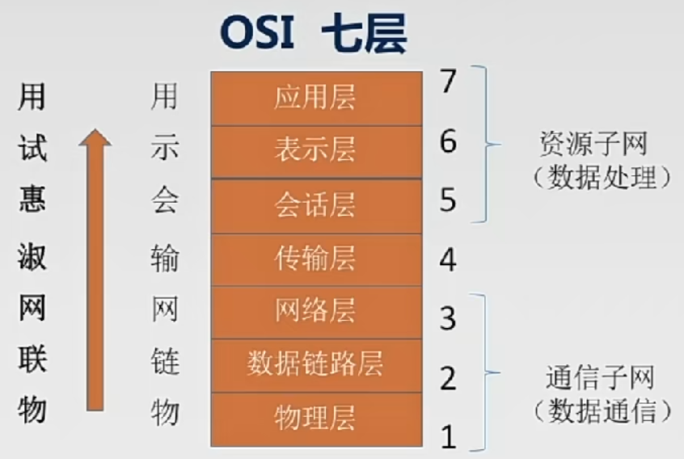
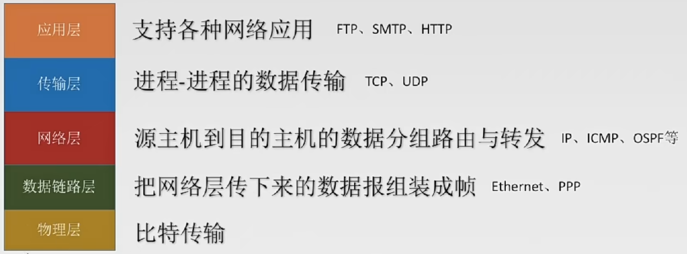
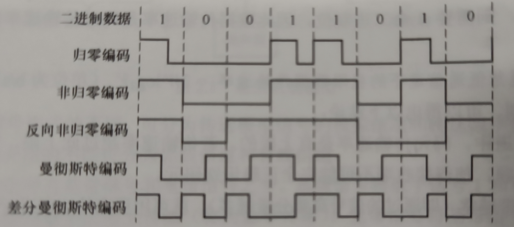
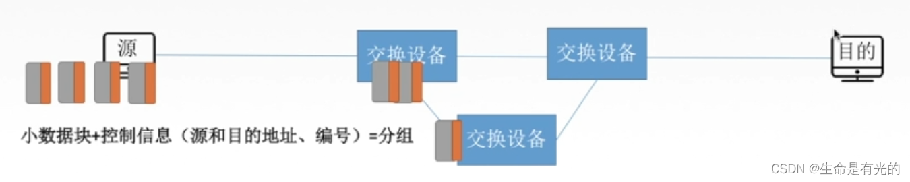
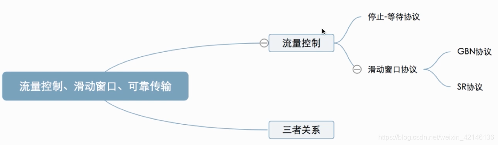
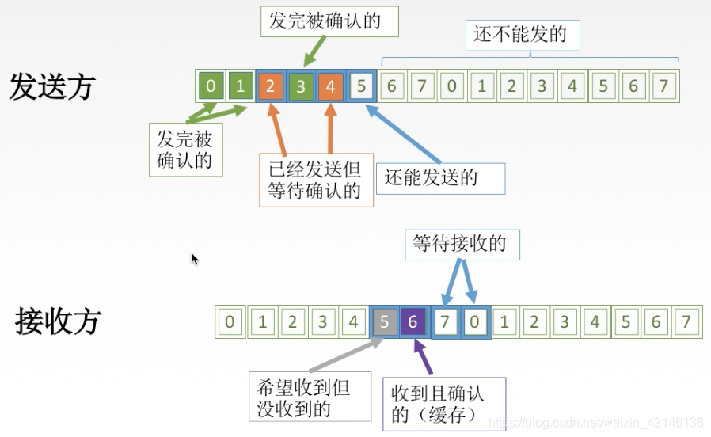
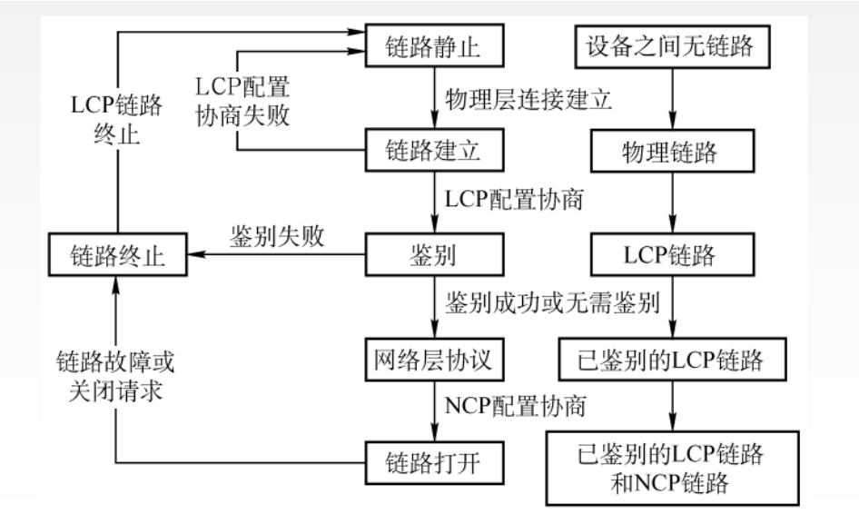
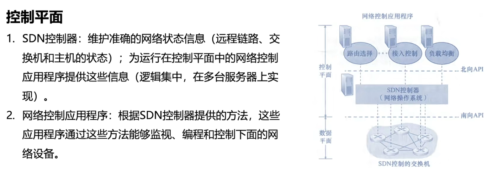
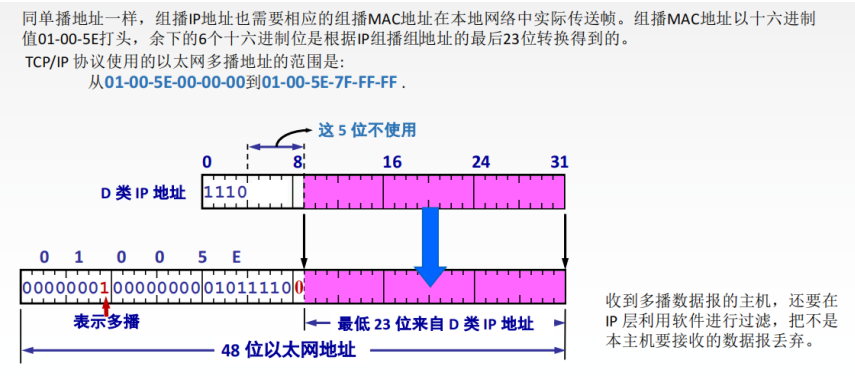
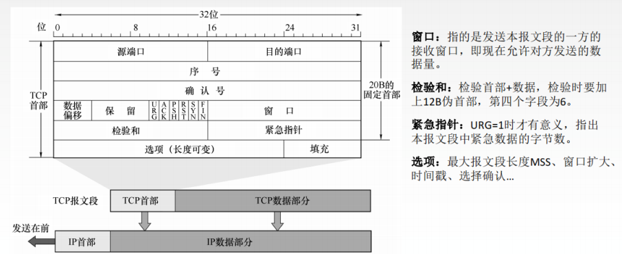

# 计算机网络

## 计算机网络体系结构

### 计算机网络概述

##### 计算机网络的概念

计算机网络：是一个将分散的、具有独立功能的**计算机系统**，通过**通信设备**与**线路**连接起来，由功能完善的**软件**实现**资源共享和信息传递**的系统。

计算机网络是**互连**的、**自治**的计算机集合。

**互连**--通过通信链路互联互通

**自治**--无主从关系

##### 计算机网络的功能

1. **数据通信**

   是计算机网络最基本和最重要的功能。用来实现联网计算机之间的各种信息的传输。

2. **资源共享**

   同一个计算机网络上的其他计算机可使用某台计算机的计算机资源的行为，可共享**硬件、软件、数据。**

3. 分布式处理

   多台计算机各自承担同一工作任务的不同部分。

4. 提高可靠性

   计算机网络中的各台计算机可以通过网络互为替代机。

5. 负载均衡

   将工作任务均衡地分配给计算机网络中的各台计算机。使各计算机之间更亲密。 

##### 因特网的发展阶段

1. ARPAnet$\rightarrow$internet$\rightarrow$Internet

2. 三级结构的因特网

3. 多层次ISP结构的因特网

   ISP是因特网服务提供者/因特网服务提供商，是一个向广大用户综合提供互联网接入业务、信息业务和增值业务的公司，如中国电信、中国移动等。

   分为主干ISP、地区ISP和本地ISP。

##### 计算机网络的组成

1. 组成部分

   硬件、软件、协议（一系列规定和约定的集合）

2. **工作方式**

   - 边缘部分

     用户直接使用

     - C/S方式
     - P2P方式

   - 核心部分

     由大量的网络和连接这些网络的路由器组成，为边缘部分服务。

   

3. **功能组成**

   - 通信子网

     实现数据通信

   - 资源子网

     实现资源共享/数据处理

   

   ##### 计算机网络的分类

   1. 按分布范围分

      - 广域网 WAN   

        使用交换技术

      - 城域网 MAN

      - 局域网 LAN

        使用广播技术

      - 个人区域网 PAN

   2. 按使用者分

      - 公用网

        指电信公司出资建造的大型网络。

      - 专用网

        指某个部门为满足本单位特殊业务的需要而建造的网络。

   3. 按传输技术分

      - 广播式网络

        共享公共通信信道

        不需要网络层

        不存在路由选择问题

      - 点对点网络

        使用**分组存储转发**和**路由选择机制**

   4. 按拓扑结构分

      - 总线型网络

      - 星形网络

      - 环形结构

      - 网状结构

        常用于广域网中

   5. 按交换技术分

      - 电路交换网络

        包括建立连接、传输数据和断开连接三个阶段。最典型的电路交换网是传统电话网络。
   
      - 报文交换网络（存储-转发网络）
   
      - 分组交换网络（包交换网络）
      
        - 优点：信道利用率高
        - 缺点：附加信息开销大

##### 计算机网络的性能指标

1. 速率

   即数据率或数据传输率或比特率。

   是连接在计算机网络上的主机在数字通道上传送数据位数的速率。

   

2. 带宽

   在计算机网络中，带宽表示网络的通信线路所能传送数据的能力，是数字通道所能传送的“最高数据传输速率”的同义语，单位是比特/秒，b/s。

3. 吞吐量

   表示在单位时间内通过某个网络（或信道、接口）的数据量。单位b/s、kb/s、Mb/s等。

   吞吐量受网络的带宽或网络的额定速率的限制。

4. 时延

   指数据（报文、分组、比特流）从网络（或链路）的一端传送到另一端所需的时间。也叫延迟或迟延。单位是s。

   包括四个部分发送时延（传输时延）、传播时延、排队时延、处理时延。

   - 发送时延

     从发送分组的第一个比特算起，到该分组的最后一个比特发送完毕所需的时间。

     公式：$发送时延=\frac{数据长度}{信道带宽（发送速率）}$

   - 传播时延

     一个比特从链路的一端传播到另一端所需的时间。

     公式：$传播时延=\frac{信道长度}{电磁波在信道上的传播速率}$

   - 排队时延

     分组在进入路由器后要先在输入队列中排队等待处理。

   - 处理时延

     数据在交换结点为存储转发而进行的一些必要的处理所花费的时间。

   数据在网络中经历的总时延就是以上四个时延之和。

   高速链路，提高的仅是数据发送速率而非比特在链路上的传播速率。提高数据的发送速率知识为了减少数据的发送时延。

5. 时延带宽积

   时延带宽积=传播时延×带宽

6. 往返时延（RTT）

   指从发送端发出一个短分组，到发送端收到来自接收端的确认（接收端收到数据后立即发送确认），总共经历的时延。

   RTT越大，在收到确认之前，可以发送的数据越多。

   RTT包括

   - 往返传播时延=传播时延×2
   - 末端处理时间

7. 利用率

   - 信道利用率

     有数据通过时间/（有+无）数据通过时间

   - 网络利用率

     信道利用率加权平均值
   
   根据排队论，当某信道的利用率增大时，该信道引起的时延也会迅速增加。因此，**信道利用率并非越高越好。**  
   
8. 丢包率

   

##### 习题笔记

- 计算机网络最基本的功能是数据通信。
- 局域网和广域网的主要差异不仅在于覆盖的范围不同，还有所使用的协议不同。
- 局域网和广域网的互联是通过路由器实现的。
- 计算机网络拓扑结构主要取决于它的通信子网。

### 计算机网络体系结构与参考模型

##### 计算机网络的分层结构

1. 分层的基本原则

   - 各层之间相互独立，每层只实现一种相对独立的功能。
   - 每层之间界面自然清晰，易于理解，相互交流尽可能少。
   - 结构上可分割开。每层都采用最合适的技术来实现。
   - 保持下层对上层的独立性，上层单向使用下层提供的服务。
   - 整个分层结构应该能促进标准化工作。

2. 实体

   第n层中的活动元素称为n层实体。同一层的实体叫做对等实体。

3. 协议

   为进行网络中的对等实体数据交换而建立的规则、标准或约定称为网络协议。（水平的）

   由语法、语义和同步三部分组成。

   - 语法

     规定传输数据的格式

   - 语义

     规定所要完成的功能

   - 同步（时序）

     规定各种操作的顺序

4. 接口（访问服务点SAP）

   上层使用下层服务的入口。

5. 服务

   下层为相邻上层提供的功能调用。（垂直）

6. 总结

   - 网络体系结构是从**功能**上描述计算机网络结构。
   - 计算机网络体系结构简称网络体系结构是**分层结构**。
   - 每层遵循某个/些网络协议以完成本层功能。
   - **计算机网络体系结构**是计算机网络的**各层及其协议**的集合。
   - 第n层在向n+1层提供服务时，此服务不仅包含第n层本身的功能，还包含由下层服务提供的功能。
   - 仅仅在**相邻层间有接口**，且所提供服务的具体实现细节对上一层完全屏蔽。
   - 体系结构是**抽象**的，而实现是指能运行的一些软件和硬件。

##### ISO/OSI参考模型

每层完成特定的功能，上面四层是端到端通信，下面三层是点到点通信。

**端到端的通信**是指运行在不同主机内的两个进程之间的通信，一个进程由一个端口来标识。

**点都点的通信**可以理解为主机到主机之间的通信，一个点是指一个硬件地址或IP地址，网络中参与通信的主机是通过硬件地址或IP地址标识的。

1. 应用层

   用户和网络的界面。所有能和用户交互产生网络流量的程序。

   典型的应用层服务：

   - 文件传输  FTP
   - 电子邮件  SMTP
   - 万维网  HTTP

2. 表示层

   用于处理在两个通信系统中交换信息的表示方式（语法和语义）

   - 功能一：数据格式变换
   - 功能二：数据加密解密
   - 功能三：数据压缩和恢复

3. 会话层

   为表示层实体/用户进程提供建立连接并在连接上有序地传输数据。

   这就是会话，也称建立同步（SYN）

   - 功能一：建立、管理、终止会话

   - 功能二：使用校验点可使会话在通信失效时从校验点/同步点继续恢复通信，实现数据同步。

     适用于传输大文件

4. 传输层

   负责主机中两个进程的通信，即端到端的通信。传输单位单位是报文段（TCP）或用户数据报（UDP）

   - 功能一：可靠传输、不可靠传输

   - 功能二：差错控制

   - 功能三：流量控制

   - 功能四：复用分用

     复用：多个应用层进程可同时使用下面传输层的服务。

     分用：传输层把收到的信息分别交付给上面应用层中相应的进程。

   主要协议TCP、UDP。

5. 网络层

   主要任务是把分组从源端传到目的端，为分组交换网上的不同主机提供通信服务。网络层传输单位是数据报。

   - 功能一：路由选择

   - 功能二：流量控制

   - 功能三：差错控制

   - 功能四：拥塞控制

     若所有结点都来不及接收分组而要丢弃大量分组的话，网络就处于拥塞状态。因此要采取一定措施，缓解这种拥塞。

   主要协议：IP、IPX、ICMP、IGMP、ARP、RARP、OSPF。

6. 数据链路层

   主要任务是把网络层传下来的数据报组装成帧。

   数据链路层的传输单位是帧。

   - 功能一：成帧（定义帧的开始和结束）
   - 功能二：差错控制  帧错+位错
   - 功能三：流量控制
   - 功能四：访问（接入）控制  控制对信道的访问

   主要协议：SDLC、HDLC、PPP、STP、帧中继。

7. 物理层（不参与数据封装工作）

   主要任务是在物理媒体上实现比特流的透明传输。

   传输单位是比特。

   透明传输：指不管所传数据是什么样的比特组合，都应当能够在链路上传送。

   - 功能一：定义接口特性
   - 功能二：定义传输模式     单工、半双工、双工
   - 功能三：定义传输速率
   - 功能四：比特同步
   - 功能五：比特编码

   主要协议：Rj45、802.3。

##### TCP/IP模型

二者相同点

- 都分层
- 基于独立的协议栈的概念
- 可以实现异构网络互连

不同点

- OSI定义三点：服务、协议、接口
- OSI先出现，参考模型先于协议发明，不偏向特定协议
- TCP/IP设计之初就考虑到异构网互连问题，将IP作为重要层次
- 

##### 五层参考模型

综合了OSI和TCP/IP的优点      

**五层参考模型的数据封装与解封装**

##### 习题笔记

- 提供标准语言，定义标准界面，增强功能之间的独立性是对网络模型进行分层的目标，定义功能执行的方法则不是。
- 协议是控制两个（或多个）对等实体进行通信的规则的集合，是水平的。
- 协议是指不同节点对等实体之间进行通信的规则或约定。
- 服务，接口，协议是OSI参考模型的三个主要概念

|            | 传输单位      | 功能                                               | 协议                |
| ---------- | ------------- | -------------------------------------------------- | ------------------- |
| 应用层     |               |                                                    |                     |
| 表示层     |               | 格式转换及压缩                                     |                     |
| 会话层     |               | 校验点，进程之间的对话                             |                     |
| 传输层     | 数据报/报文段 | 分组排序，差错控制，流量控制，端到端连接，可靠传输 | TCP，UDP            |
| 网络层     | 分组          | 路由选择，流量控制，差错控制，拥塞控制             | IP，ICMP，ARP，RARP |
| 数据链路层 | 帧            | 差错控制，流量控制 ，访问控制，帧定界功能          | PPP，HDLC，SLIP     |
| 物理层     | 比特          |                                                    |                     |

- （常考点）ISO/OSI参考模型在网络层支持无连接和面向连接的通信，但在传输层仅支持面向连接的通信；TCP/IP模型在网络层仅有无连接的通信，在传输层支持无连接和面向连接的通信。

- （易错点）在传输层将数据分割为报文后送入会话层。

- 只有传输层及以上各层的通信才能称为端到端。

- 因特网采用的核心技术是TCP/IP。

- 物理层的服务访问点（SAP）是**网卡接口**；数据链路层的SAP是**MAC地址（网卡地址）**；网络层的SAP是**IP地址（网络地址）**；传输层的SAP是**端口号**；应用层的SAP是**用户界面**。

  关于各层的SAP还有一种说法认为：数据链路层的SAP为帧的“类型”字段，网络层的SAP为IP数据报首部的“协议”字段。

- （重要）考研中层数一般是从下往上数的。物理层为第一层，应用层为第七层。

- OSI参考模型中，数据链路层、网络层、传输层都具有流量控制功能，**数据链路层**是相邻结点之间的流量控制，网络层是整个网络中的流量控制，**传输层**是端到端的流量控制。

- 协议与服务有何区别，有何联系？

  协议是控制两个对等实体之间通信的规则的集合。在协议的控制下，两个对等实体间的通信使得本层能够向上一层提供服务，而要实现本层协议，还需要使用下一层提供的服务。

  协议和服务概念上的区分：

  （1）协议的实现保证了能够向上一层提供服务。本层的服务用户只能看见本层的服务而无法看见下边的协议，即下边的协议对上层的服务用户是透明的。

  （2）协议是“水平”的，即协议是控制两个对等实体之间的通信的规则。但服务是“垂直”的，即服务是由下层通过层间接口向上层提供的。
  
- 

## 物理层

### 通信基础

##### 基本概念

1. **物理层接口特性**

   物理层解决如何在连接各种计算机的传输媒体上传输数据比特流，而不是指具体的传输媒体。

   物理层主要任务：确定与传输媒体接口有关的一些特性。

   - 机械特性

     定义物理连接的特性，规定物理连接时所采用的规格、接口状态、**引线数目、引脚数量**和排列情况。

   - 电气特性

     规定传输二进制位时，线路上信号的**电压范围**、阻抗匹配、传输**速率**和**距离**限制等。

   - 功能特性

     指明某条线上出现的某一**电平表示何种意义**，接口部件的信号线的用途。

   - 规程特性（过程特性）

     定义各条物理线路的工作**规程和时序**关系。

2. 数据通信相关术语

   数据通信指在不同计算机之间传输表示信息的二进制数0、1序列的过程。

   通信的目的是传送消息（消息：语音、文字、图像、视频等）。

   数据data：传送信息的实体，通常是有意义的符号序列。

   信号：数据的电气或电磁的表现，是数据在传输过程中的存在形式。

   - 数字信号（离散信号）：代表消息的参数的取值是离散的。
   - 模拟信号（连续信号）：代表消息的参数的取值是连续的。

   码元：指用一个固定时长的信号波形（数字脉冲），代表不同离散数值的基本波形，是数字通信中数字信号的计量单位，这个时长内的信号称为k进制码元，而该时长称为码元宽度。当码元的离散状态有M个时（M大于2），此时码元为M进制码元。

   1码元可以携带多个比特的信息量。例如，在使用二进制编码时，只有两种不同的码元，一种代表0状态，一种代表1状态。

   信源：产生和发送数据的源头。

   信宿：接受数据的终点。

   信道：信号的传输媒介。一般用来表示向某一个方向传送信息的介质，因此一条通信线路往往包含一条发送信道和一条接收信道。

   - 按传输信号分

     模拟信道（传送模拟信号）、数字信道（传送数字信号）

   - 按传输介质分

     无线信道、有限信道

   速率：也叫数据率，是指数据的传输速率，表示单位时间内传输的数据量。可以用码元传输速率和信息传输速率表示。

   - 码元传输速率（码元速率、波特率）

     单位时间内数字通信系统所传输的码元个数（也可称为脉冲个数或信号变化的次数），单位是波特（Baud）。1波特表示数字通信系统每秒传输一个码元。

     数字信号有多进制和二进制之分，但码元速率与进制数无关，只与码元长度T有关。

   - 信息传输速率（信息速率、比特率）

     表示单位时间内数字通信系统传输的二进制码元个数（即比特数），单位是比特/秒（b/s）

   M波特率的码元传输速率所对应的信息传输速率为M×n比特/秒。（n为一个码元携带多少比特的信息量）、

   **带宽**

   - **模拟信号系统中**，表示最高频率和最低频率间的差值，单位是赫兹（Hz）
   - **数字设备中**，表示网络的通信线路所能传送数据的能力，是数字通道所能传送的“最高数据传输速率”的同义语，单位是比特/秒，b/s。
   
   ---
   
   三种通信方式
   
   - 单工通信
   
     只有一个方向的通信而没有反方向的交互，仅需要一条通道。
   
   - 半双工通信/双向交替通信
   
     通信的双方都可以发送或接收信息，但任何一方都不能同时发送和接收，需要两条信道。
   
   - 全双工通信/双向同时通信
   
     通信双方可以同时发送和接收信息，也需要两条通道
   
   ---
   
   串行传输&并行传输（传输方式）
   
   - 串行传输
   
     将表示一个字符的8位二进制数按由低到高位的顺序依次发送。
   
     速度慢，费用低，**适合远距离。**
   
   - 并行传输
   
     将表示一个字符的8位二进制数同时通过8条信道发送。
   
     速度快，费用高，适合近距离。
     
     被用于计算机内部的数据传输。
   
   ---
   
   同步传输&异步传输（通信方式）
   
   - 同步传输
   
     在同步传输的模式下，数据的传送是以一个数据区块为单位，因此同步传输又称为区块传输。在传送数据时，需先送出1个或多个同步字符，再送出整批的数据。
   
   - 异步传输
   
     异步传输将比特分为小组进行传送，小组可以是8位的1个字符或更长。发送方可以在任何时刻发送这些比特组，而接收方不知道它们会在什么时候到达。传送数据时，加一个字符起始位和一个字符终止位。
   

##### 奈氏准则和香农定理

1. 奈氏准则 

   信道带宽是信道能通过的最高频率和最低频率之差。

   码间串扰：接收端收到的信号波形失去了码元之间清晰界限的现象。 

   奈氏准则（奈奎斯特定理）：在理想低通（无噪声、带宽受限）条件下，为了避免码间串扰，极限码元传输速率为2W波特，W是理想低通信道的带宽，单位是Hz。

   理想低通信道下的极限数据传输速率=$2Wlog_2V$（b/s），V表示几种码元/码元的离散电平数目。

   四条结论：

   - 在任何信道中，**码元传输速率是有上限的**。若传输速率超过此上限，就会出现严重的码间串扰问题，使得接收端不可能完全正确识别码元。
   - 信道的**频带越宽**（即通过的信号高频分量越多），就可以用更高的速率进行码元的有效传输。
   - 奈氏准则给出了码元传输速率的限制，但并没有对信息传输速率给出限制，即没有对一个码元可以对应多少个二进制位给出限制。
   - 由于码元传输速率受奈氏准则的制约，所以要提高数据的传输速率，就必须设法使每个码元能携带更多比特的信息量，这就需要采用多元制的调制方法。

2. 香农定理

   信噪比=信号的平均功率/噪声的平均功率，记为S/N，并用分贝（dB）为度量单位，即：信噪比（dB）=$10log_{10}(S/N)$。

   香农定理：在带宽受限且有噪声的信道中，为了不产生误差，信息的数据传输速率有上限值。

   信道的极限数据传输速率$=Wlog_2(1+S/N)$（b/s）。

   四条结论：

   - 信道的带宽或信道中的信噪比越大，则信息的极限传输速率就越高。
   - 对一定的传输带宽和一定的信噪比，信息传输速率的上限是确定的。
   - 只要信息传速速率低于信道的极限传输速率，就一定能找到某种方法实现**无差错的传输。**
   - 香农定理得出的是极限信息传输速率，实际信道能达到的传输速率要比它低不少。

3. 二者区别

   

##### 编码和调制

1. 基带信号与宽带信号

   信道上传送的信号的两种形式

   - 基带信号

     将数字信号1和0直接用两种不同的电压表示，再送到数字信道上去传输（基带传输）。

     **来自信源**的信号，像计算机输出的代表各种文字或图像文件的数据信号都属于基带信号。基带信号就是发出的**直接表达了要传输的信息的信号**，比如说我们说话的声波就是基带信号。

     对应数字信道

   - 宽带信号

     将基带信号进行调制后形成的频分复用模拟信号，再传送到**模拟信道**上去传输（宽带传输）

     把基带信号经过**载波调制**后，把信号的**频率范围搬移**到**较高的频段**以便在信道中传输（即仅在一端频率范围内能够通过信道）。

   在传输距离较近时，计算机网络采用**基带传输**方式（近距离减小，从而信号内容不易发生变化）

   在传输距离较远时，计算机网络采用**宽带传输**方式（远距离衰减大，即使信号变化大也能最后过滤出来基带信号）

2. 编码与调制

   数据$\longrightarrow$数字信号   编码    

   数据$\longrightarrow$模拟信号   调制

   数字数据$\stackrel{数字发送器}{\longrightarrow}$数字信号   编码           模拟数据$\stackrel{PCM编码器}{\longrightarrow}$数字信号   编码     

   数字数据$\stackrel{调制器}{\longrightarrow}$模拟信号   调制                模拟数据$\stackrel{放大器调制器}{\longrightarrow}$模拟信号   调制

   - 数字数据编码为数字信号

     

     - **非归零编码（NRZ）**

       高1低0

       编码容易实现，但没有检错功能，且无法判断一个码元的开始和结束，以至于收发双方**难以保持同步。**

     - **曼彻斯特编码**

       将一个码元分成两个相等的间隔，前低后高表示码元0，前高后低表示码元1，当然也可以采取相反的规定。

       该编码的特点是在每一个码元的中间出现电平跳变，位中间的跳变既作时钟信号(可用于同步)，又作数据信号，但它所占的频带宽度是原始的基带宽度的两倍。每一个码元都被调成两个电平，所以**数据传输速率只有调制速率的1/2**。

       最适合传输二进制数字信号。

     - **差分曼彻斯特编码**

       同1异0

       常用于局域网传输，其规则是：若码元为1，则前半个码元的电平与上一个码元的后半个码元的电平相同，若为0，则相反。

       在每个码元的中间，都有一次电平的跳转，可以实现自同步，且抗干扰性强于曼彻斯特编码

     - 归零编码（RZ）

       信号电平在一个码元之内都要恢复到零

     - 反向不归零编码（NRZI）

       信号电平翻转表示0，信号电平不变表示1。

     - 4B/5B编码

       比特流中插入额外的比特以打破一连串的0或1，就是用5个比特来编码4个比特的数据，之后再传给接收方，因此成为4B/5B。编码效率为80%。只采用16种对应16种不同的4位码，其他的16种作为控制码(帧的开始和结束，线路的状态信息等)或保留

   - 数字数据调制为模拟信号

     数字数据调制技术在发送端将数字信号转换为模拟信号，而在接收端将模拟信号还原为数字信号，分别对应于调制解调器的调制和解调过程。

     
   
     - ASK调幅：0对应的就是没有振幅，1对应的是有振幅。
     - FSK调频：0对应低频，1对应高频。(振动的频率越高，波形越多)。
     - PSK调相：对相位的一种调制，0对应一种波形，1对应一种波形。这种波形一般是正弦波或者余弦波。
     - 正交振幅调制（QAM）：在频率相同的前提下，将ASK和PSK结合起来，形成叠加信号。设波特率为B，采用m个相位，每个相位有n种振幅，则该QAM技术的数据传输速率R为：$R=Blog_2(mn)$（单位为b/s）

     考试一般都是调幅+调相(QAM) ，例题：

     例：某通信链路的波特率是1200Baud，采用4个相位，每个相位有4种振幅的QAM调制技术，则该链路的信息传输速率是多少？

     答：
   
     - 4个相位，每个相位有4种振幅，所以共有 4*4=16种波形，对应16种码元，每个码元携带的比特数为$ log_216=4$。
     - 波特率是1200Baud，也就是说1s传输1200个码元，而每个码元携带4个比特。
     - 所以信息传输速率(1s传输多少个比特) = 1200*4 = 4800 b/s。

   - 模拟数据编码为数字信号

     计算机内部处理的是二进制数据，处理的都是**数字音频**，所以需要将模拟音频通过采样、量化转换成有限个数字表示的离散序列(即实现**音频数字化**)。

     最典型的例子就是对音频信号进行编码的脉码调制(**PCM**)，在计算机应用中，能够达到**最高保真水平**的就是PCM编码，被广泛用于素材保存及音乐欣赏，CD、DVD以及我们常见的WAV文件中均有应用。它主要包括三步：抽样、量化、编码。

     - 抽样

       对模拟信号周期性扫描，把时间上连续的信号变成时间上离散的信号。

       为了使所得的离散信号能无失真地代表被抽样的模拟数据，要使用采样定理进行采样：$f_{采样频率} ≥ 2f{信号最高频率}$。

     - 量化

       把抽样取得的电平幅值按照一定的分级标度转化为对应的数字值，并取整数，这就把连续的电平幅值转换为离散的信号量。

     - 编码

       把量化的结果转换为与之对应的二进制编码。

   - 模拟数据调制为模拟信号
   
     为了实现传输的有效性，可能需要较高的频率。这种调制方式还可以使用频分复用技术，充分利用带宽资源。在电话机和本地交换机所传输的信号是采用模拟信号传输模拟数据的方式，模拟的声音数据是加载到模拟的载波信号中传输的。

##### 数据交换方式

1. 电路交换

   电路交换的原理：在数据传输期间，源结点与目的结点之间有一条由中间结点构成的专用物理连接线路，在数据传输结束之前，这条线路一直保持。

   

   - 建立连接

     首先A主机会向离它最近的交换设备发送呼叫请求，这个呼叫请求包含主机A、主机B的ip地址，交换设备A要执行路由选择算法，算法执行结束选择了交换设备B，那么就转发呼叫请求到交换设备B，之后再执行路由选择算法，直到最后转发呼叫请求到主机B。

     

     若主机B目前可以进行连接，那么主机B就会原路返回直至到主机A来发送一个呼叫应答，至此主机A、B就算是建立连接了，也就是电路交换的第一阶段结束了。

   - 通信

     建立连接完成后就可以进行通信了，这个通信双方都可以发送接收。类似于全双工通信

   - 释放连接

     若主机A想断开连接，那么主机A沿着之前的路径发送释放请求到主机B，主机B原路返回发送发送释放应答，至此主机A、B的本次通信就结束了。

   特点：**独占资源，**用户始终占用端到端的固定传输宽带。电路交换适用于远程批处理信息传输或系统间实时性要求高的大量数据传输的情况。(若我们好不容易建立连接，结果才传输1byte的内容，那么就太浪费资源了)。

   | 电路交换优点                                                 | 电路交换缺点                                                 |
   | ------------------------------------------------------------ | ------------------------------------------------------------ |
   | 传输时延小                                                   | 建立连接时间长                                               |
   | 数据顺序传送，无失序问题                                     | 线路独占，即使通信线路空闲，也不能供其他用户使用，信道使用效率低 |
   | 实时性强，双方一旦建立物理通路，便可以实时通信，适用于交互式会话类通信 | 灵活性差，双方连接通路中的任何一点出了故障，必须重新拨号建立新连接，不适应突发性通信 |
   | 全双工通信，没有冲突，通信双方有不同的信道，不会争用物理信道 | 无数据存储能力，难以平滑通信量                               |
   | 适用于模拟信号和数字信号                                     | 电路交换时，数据直达，不同类型、不同规格、不同速率的终端很难相互进行通信 |
   | 控制简单，电路的交换设备及控制较简单                         | 无法发现与纠正传输差错，难以在通信过程中进行差错控制         |

2. 报文交换

   **报文**：报文(message)是网络中交换与传输的数据单元，即站点一次性要发送的数据块。报文包含了将要发送的完整的数据信息，其长短很不一致，长度不限且可变。

   **报文交换的原理**：无需在两个站点之间建立一条专用通路，其数据传输的单位是报文，传送过程采用**存储转发**方式。

   

   信息+报头=报文，报文里面包括源ip地址、目的ip地址以及其他一些控制信息，这样封装成的报文就可以传输了，首先这个报文到达交换设备A这里，交换设备A收下整个报文，暂存报文并且检查报文有无错误，如果无错误交换设备A会利用路由信息找到下一个交换设备且保证到达目的主机的距离最短，由图可知，下一个交换设备应该选择B可以保证离目的主机距离最短。

   

   到达交换设备B时，交换设备A、C此时仍然可以进行其他报文传输，不像电路交换那样必须占用端到端的全部信道。

   | 报文交换优点                                                 | 报文交换缺点                                                 |
   | ------------------------------------------------------------ | :----------------------------------------------------------- |
   | 无需建立连接，无建立连接时延，用户可随时发送报文             | 实时性差，不适合传送实时或交互式业务的数据。数据进入交换节点后要经历存储转发过程，从而引起转发时延。 |
   | 动态分配线路，动态选择报文通过的最佳路径，可以平滑通信量     | 只适用于数字信号                                             |
   | 提高线路可靠性，某条传输路径发生故障，可重新选择另一条路径传输 | 由于报文长度没有限制，而每个中间结点都要完整地接收传来的整个报文，当输出线路不空闲时，还可能要存储几个完整报文等待转发，要求网络中每个结点有较大的缓冲区。为了降低成本，减少结点的缓冲存储器的容量，有时要把等待转发的报文存在磁盘上，进一步增加了传送时延。 |
   | 提高线路利用率，通信双方在不同的时间一段一段地部分占有这条物理通道，多个报文可共享信道 |                                                              |
   | 提供多目标服务：一个报文可同时发往多个目的地址               |                                                              |
   | 在存储转发中容易实现代码转换和速率匹配，甚至收发双发可以不同时处于可用状态。这样就便于类型、规格和速度不同的计算机之间进行通信 |                                                              |

3. 分组交换

   分组：大多数计算机网络都不能连续地传送任意长的数据，所以实际上网络系统把数据分割成小块，然后逐块的发送，这种小块就称作分组(packet)。

   分组交换的原理：分组交换与报文交换的工作方式基本相同，都采用存储转发形式，形式上的主要差别在于，分组交换网中要**限制所传输的数据单位的长度**，一般选128B。发送节点首先对从终端设备送来的数据报文进行接收、存储，而后将报文划分成一定长度的分组，并以分组为单位进行传输和交换。接收结点将收到的分组组装成信息或报文。

   ---

   首先将数据分割成一个个小数据块，小数据块+控制信息(源ip地址、目的ip地址、分组的编号)就是我们的分组，然后分组一组一组的传输到交换设备，交换设备暂存并检查是否有错误

   

   | 分组交换优点                                                 | 分组交换缺点                                                 |
   | ------------------------------------------------------------ | ------------------------------------------------------------ |
   | 无建立时延，无需为通信双方预先建立一条专用通信线路，用户可随时发送分组 | 尽管分组交换比报文交换的传输时延少，但仍存在存储转发时延，而且其结点交换机必须具有更强的处理能力 |
   | 提高线路利用率，通信双方在不同的时间一段一段地部分占有这条物理通道，多个分组可共享信道 | 每个分组都要加控制信息，一定程度上降低了通信效率，增加了处理的时间 |
   | 简化了存储管理。因为分组的长度固定，相应的缓冲区的大小也固定，在交换结点中存储器的管理通常被简化为对缓冲区的管理，相对比较容易 | 当分组交换采用数据报服务时，可能出现失序、丢失或重新分组，分组到达目的结点时，要对分组按编号进行排序等工作，增加了麻烦。若采用虚电路服务，虽无失序问题，但有呼叫建立、数据传输和虚电路释放三个过程 |
   | 加速传输，后一个分组的存储可以和前一个分组的转发并行操作；传输一个分组比一份报文所需缓冲区小，减少等待发送时间 |                                                              |
   | 减少出错几率和重发数据量，提高可靠性，减少传输时延           |                                                              |
   | 分组短小，适用于计算机之间突发式数据通信                     |                                                              |

   **数据交换方式的选择**

   

   1. 传送数据量大，且传送时间远大于呼叫时，选择**电路交换**。电路交换传输时延最小。
   2. 当端到端的通路有很多段的链路组成时，采用**分组交换**传送数据较为合适。
   3. 从信道利用率上看，报文交换和分组交换优于电路交换，其中分组交换比报文交换的时延小，尤其适合于计算机之间的突发式的数据通信。

   **数据报方式**

   

   1. 源主机A**将报文分成多个分组**，依次发送到直接相连的结点A
   2. 结点A收到分组后，对每个分组**差错检测和路由选择**，不同分组的下一跳结点可能不同
   3. 例如结点C收到分组P1后，对分组P1进行**差错检测**，若正确则向A发送**确认消息**，A收到C确认后则丢弃分组P1副本
   4. 依次类推，所有分组都会发送到主机B。

   数据报方式的特点：

   1. 数据报的方式为网络层提高**无连接服务**。发送方可随时发送分组，网络中的结点可随时接收分组。
      无连接服务：不事先为分组的传输确定传输路径，每个分组独立确定传输路径，不同分组传输路径可能不同
   2. 同一报文的不同分组达到目的结点时可能发送乱序、重复与丢失。
   3. 每个分组在传输过程中都必须携带源地址和目的地址，以及分组号
   4. 分组在交换结点存储转发时，需要排队等候处理，这会带来一定的时延，当通过交换结点的通信量较大或网络发生拥塞时，这种时延会大大增加，交换结点还可根据情况丢弃部分分组。
   5. 网络具有冗余路径，当某一交换结点或一段链路出现故障时，可相应地更新转发表，寻找另一条路径转发分组，对故障的适应能力强，适用于突发性通信，不适于长报文、会话式通信。

   **虚电路方式**

   虚电路将数据报方式和电路交换方式结合，以发挥两者优点。

   

   虚电路：一条源主机到目的主机类似于电路的路径(**逻辑连接**)，路径上所有结点都要维持这条虚电路的建立，都维持一张虚电路表，每一项记录了一个打开的虚电路的信息。

   

   虚电路方式的特点：

   1. 虚电路方式为网络层提供**连接服务**。源结点与目的结点之间建立一条逻辑连接，而非实际物理连接。

      连接服务：首先为分组的传输确定传输路径(建立连接)，然后沿该路径(连接)传输系列分组，系列分组传输路径相同，传输结束后拆除连接。

   2. 一次通信的所有分组都通过虚电路顺序传送，分组不需携带源地址、目的地址等信息，包含虚电信号，相对数据报方式开销小，同一报文的不同分组到达目的结点时不会乱序、重复或丢失。

   3. 分组通过虚电路上的每个结点时，结点只进行差错检测，不需进行路由选择。

   4. 每个结点可能与多个结点之间建立多条虚电路，每条虚电路支持特定的两个端系统之间的数据传输，可以对两个数据端点的流量进行控制，两个端系统之间也可以有多条虚电路为不同的进程服务。

   5. 致命弱点：当网络中的某个结点或某条链路出故障而彻底失效时，则所有经过该结点或该链路的虚电路将遭到破坏。

   **数据报与虚电路方式对比**

   |                    | 数据报服务                                                 | 虚电路服务                                               |
   | ------------------ | ---------------------------------------------------------- | -------------------------------------------------------- |
   | 连接的建立         | 不要                                                       | 必须有                                                   |
   | 目的地址           | 每个分组都有完整的目的地址                                 | 仅在建立连接阶段使用，之后每个分组使用长度较短的虚电路号 |
   | 路由选择           | 每个分组独立地进行路由选择和转发                           | 属于同一条虚电路的分组按照同一路由转发                   |
   | 分组顺序           | 不保证分组的有序到达                                       | 保证分组的有序到达                                       |
   | 可靠性             | 不保证可靠通信，可靠性由用户主机来保证                     | 可靠性由网络保证                                         |
   | 对网络故障的适应性 | 出故障的结点丢失分组，其他分组路径选择发生变化，可正常传输 | 所有经过故障结点的虚电路均不能正常工作                   |
   | 差错处理和流量控制 | 由用户主机进行流量控制，不保证数据报的可靠性               | 可由分组交换网负责，也可由用户主机负责                   |

##### 习题笔记

- 曼彻斯特编码最适合传输二进制数字信号。位中间的跳变作为时钟信号，每个码元的电平作为数据信号。因此，时钟和数据取值都包含在信号中。
- QAM是一种用模拟信号传输数字数据的编码方式。
- 把语音信号数字化的技术是脉冲编码调制。
- 波特率表示信号每秒变化的次数。
- 以太网采用曼彻斯特编码，分组交换技术。
- 由于报文交换数据经过网络的传输延迟长而且不固定，因此不能用于语音数据传输。
- （重要）传输时延最小，电路交换；为保证数据无差错的传送，不应该用电路交换；分组交换对报文交换的主要改进是传输单位更小且有固定的最大长度（减少了传输时延）；在出错率很高的传输系统中，选用数据报方式更合适。
- 虚电路是面向连接的，它提供的是一种可靠的服务，分组中携带虚电路标识，保证分组有序到达。有建立连接，数据传输和连接拆除三个阶段。由网络负责差错控制和流量控制。**不需要为每条虚电路预分配带宽。**
- 数据报服务中，网络为每个分组独立地选择路由，传输不保证可靠性，不保证分组的按序到达。每个分组在传输过程中都必须携带源地址和目标地址。
- 电路交换是真正的物理线路交换，例如电话线路；虚电路交换是多路复用技术，每条物理线路可以进行多条逻辑上的连接。
- 虚电路提供的服务包括永久性虚电路（PVC）和交换型虚电路（SVC），前者是一种提前定义好的、基本上不需要任何建立时间的端点之间的连接；后者是端点之间的临时性连接，这些连接只持续所需的时间，并且在会话结束时就取消这种连接。
- 虚电路交换**不需要为每条虚电路预分配带宽**。

### 传输介质

##### 传输介质及分类

传输介质也称传输媒体/传输媒介，它就是数据传输系统中在发送设备和接收设备之间的物理通路。

传输媒体并不是物理层。传输媒体在物理层的下面，因为物理层是体系结构的第一层，因此有时称传输媒体为0层。在传输媒体中传输的是信号，但传输媒体并不知道所传输的信号代表什么意思。但物理层规定了电气特性，因此能够识别所传送的比特流。

##### 导向性传输介质

1. 双绞线

   双绞线是古老、又最常用的传输介质，它由两根采用一定规则并排绞合的、相互绝缘的铜导线组成。

   

   根据高中的右手准则知识就可以知道，绞合之后会使得产生的电磁波相互抵消，所以才说**绞合可以减少对相邻导线的电磁干扰。**

   同时为了进一步提高抗电磁干扰能力，可在双绞线的外面再加上一个由金属丝编织成的屏蔽层，这就是屏蔽双绞线(STP),无屏蔽层的双绞线就称为非屏蔽双绞线(UTP）。

   

2. 同轴电缆

   同轴电缆由**导体铜质芯线、绝缘层、网状编织屏蔽层和塑料外层**构成。按特性阻抗数值不同，通常将同轴电缆分为两类：50Ω同轴电缆和75Ω同轴电缆。其中，50Ω同轴电缆主要用于传送基带数字信号，又称为**基带同轴电缆**。它在局域网中得到广泛应用，75Ω同轴电缆主要用于传送宽带信号，又称为**宽带同轴电缆**，它主要用于有线电视系统。

   

3. 光纤

   光纤通信就是利用光导纤维(简称光纤)传递光脉冲来进行通信。有光脉冲表示1，无光脉冲表示0。而可见光的频率大约是$10^8$MHz，因此光纤通信系统的**带宽远远大于**目前其他各种传输媒体的带宽。

   光纤在发送端有光源，可以采用发光二极管或半导体激光器，它们在电脉冲作用下能产生出光脉冲，在接收端用广电二极管做成光检测器，在检测到光脉冲时可还原出电脉冲。

   

   光纤主要由**纤芯(实心的)**和包层构成，光波通过纤芯进行传到，包层较纤芯有较低的折射率。当光线从高折射率的介质射向低折射率的介质时，其折射角将大于入射角。因此，如果入射角足够大，就会出现**全反射**，即光纤碰到包层的时候就会折射回纤芯，这个过程不断重复，光也就沿着光纤传输下去。

   

   光纤的直径减小到只有一个光的波长时，光就会沿直线传播。

   |          | 定义                                   | 光源                           | 特点                                                 |
   | -------- | -------------------------------------- | ------------------------------ | ---------------------------------------------------- |
   | 多模光纤 | 有多种传输光信号模式的光纤             | 发光二极管                     | 易失真，适合近距离传输(因为全反射弹来弹去也会有损耗) |
   | 单模光纤 | 一种在**横向模式**直接传输光信号的光纤 | **定向性**很好的**激光二极管** | 损耗小，适合远距离传输                               |

   光纤的特点：

   - 传输损耗小，中继距离长，对远距离传输特别经济。
   - 抗雷电和电磁干扰性能好。
   - 无串音干扰，保密性好，也不易被窃听或截取数据。
   - 体积小，重量轻。

##### 非导向性传输介质

##### 习题笔记

- 双绞线绞合的目的是减少两根导线相互的电磁干扰。
- 同轴电缆比双绞线的传输速率更快，得益于同轴电缆具有更高的屏蔽性，同时有更好的抗噪声性。
- 如果单模光纤的直径减少到只有光的一个波长大小，那么光沿直线传播。
- 使用卫星通信易于实现广播通信和多址通信。卫星通信具有成本高、传播时延长、受气候影响大、保密性差、误码率较高的特点。
- 电气特性规定了信号的电压高低，传输距离等。功能特性指明某条线上出现的某一电平的电压表示何种含义。 

### 物理层设备

##### 中继器

**诞生原因**：由于存在损耗，在线路上传输的信号功率会逐渐衰减，衰减到一定程度时将造成信号失真，因此会导致接收错误。

**中继器的功能**：对信号进行**再生和还原**，对衰减的信号进行放大，保持与原数据相同，以增加信号传输的距离，延长网络的长度。

**中继器的两端**：两端的网络部分是网段，而不是子网，适用于完全相同的两类网络的互连，且两个网段速率要相同。

- 中继器只将任何电缆段上的数据发送到另一段电缆上，它仅作用于信号的电气部分，并不管数据中是否有错误数据或者不适于网段的数据
- 两端可连相同的媒体，也可连不同的媒体
- 中继器两端的网段一定要是同一个协议(中继器不会存储转发)

**5-4-3规则**：网络标准中都对信号的延迟范围作了具体的规定，因而中继器只能在规定的范围内进行，否则会网络故障。

- 5    最多不超过5个网段
- 4    5个网段内最多只能有4个物理层网络设备，可以是中继器，可以是集线器
- 3    只有3个段可以挂接计算机

##### 集线器（多端口中继器）

集线器的功能：对信号进行再生**放大转发**，对衰减的信号进行放大，接着转发到其他所有(除输入端口外[因为是输入端口发的信号])处于工作状态的端口上，以增加信号传输的距离，延长网络的长度。不具备信号的定向传送能力，是一个共享式设备。

##### 习题笔记

- 中继器的主要作用是将信号整形并放大再转发出去，其原理是信号再生（不是放大）。端口只作用于信号的电气部分。
- 放大器和中继器的区别：放大器放大的是模拟信号，原理是将衰减的信号放大。中继器放大的是数字信号，原理是再生。
- “5-4-3规则”==：在采用粗同轴电缆的10BASE5以太网规范中，互相串联的中继器的个数不超过4个，而且4个中继器串联的5段通信介质中只有3段可以挂接计算机。
- 集线器实质上是一个多端口的中继器。连接的网络在拓扑结构上属于星形。
- 转发器的作用是放大信号。
- 两个网段在物理层进行互连时要求数据传输速率要相同，但数据链路层协议可以不相同。在数据链路层互连时二者都要相同。总结：两个网段在A层互连，**A层及以下层协议相同，A层以上协议可以不同。**
- 用集线器连接的工作站集合同属一个冲突域，也同属一个广播域。
- 当集线器的一个端口收到数据后，将其从**除输入端口外的所有端口广播出去**。
- 中继器和集线器都可以对信号进行放大和整形。中继器通常只有2个端口，而集线器通常由4个或更多端口。

## 数据链路层

### 数据链路层的功能

##### 数据链路层的基本概念

结点：主机、路由器

链路：网络中两个结点之间的**物理通道**，链路的传输介质主要有双绞线、光纤和微波。分为有线链路、无线链路。

数据链路：网络中两个结点之间的**逻辑通道**，把实现控制数据传输协议的硬件和软件加到链路上就构成数据链路。

帧：链路层的协议数据单元，封装网络层数据报。

**数据链路层**负责通过一条链路从一个结点向另一个物理链路直接相连的相邻结点传送数据报。（就是将网络层交给它的数据报安全地、无差错地传给相邻节点，就像一个搬运工把货物安全地搬运到相邻的位置。）

##### 数据链路层功能概述

数据链路层在物理层提供服务的基础上**向网络层提供服务**，其最基本的服务是将源自**网络层来的数据**可靠地传输到相邻节点的目标机网络层。其主要作用是**加强物理层传输原始比特流的功能**，将物理层提供的可能出错的物理连接改造成为逻辑上无差错的数据链路，使之对网络层表现为一条无差错的链路。

1. 功能一

   为网络层提供服务。

   - 无确认无连接服务（通常用于实时通信，原主机发送数据帧前不需要与目的主机建立链路连接，而且目的主机收到数据帧后也不需要确认，如果帧丢失，数据链路层也不负责重发，直接交给上一层处理。这种服务是为了实时通信更快。如以太网。）
   - 有确认无连接服务（事前不需要建立连接，但是目的主机在收到数据时必须发回一个确认，原主机在规定时间内没有收到目的主机的确认，原主机就会重新传输一次。适合无线通信）
   - 有确认面向连接服务（最安全可靠，事先要建立连接，同时目的机接收到一个确认帧就要返回一个确认帧 ）。

2. 功能二

   链路管理，即连接的建立、维持、释放(用于面向连接的服务)。

3. 功能三

   组帧。

4. 功能四

   流量控制。（告诉发送方：你慢点发！接收方没有能力接收啦！控制一下发送方的速度。）

5. 功能五

   差错控制(帧错/位错)。

##### 习题笔记

- 数据链路层的功能包括组帧（定义数据格式），提供结点之间的可靠传输，控制对物理传输介质的访问。不包括为终端结点隐藏物理传输的细节。
- 为了避免传输过程中帧的丢失，数据链路层采用**计时器超时重发**。
- 数据链路层提供无确认无连接，有确认无连接，有确认面向连接的服务。
- 流量控制实际上是**对发送方的数据流量的控制**。

### 组帧

##### 封装成帧与透明传输

**封装成帧**就是在一段数据的前后部分添加首部和尾部，这样就构成了一个帧。接收端在收到物理层上交的比特流后，就能根据首部和尾部的标记，从收到的比特流中识别帧的开始和结束。

首部和尾部包含许多的控制信息，他们的一个重要作用：**帧定界**(确定帧的界限)。

**帧同步**:**接收方**应当能从接收到的二进制比特流中区分出帧的起始和终止。、

**组帧的四种方法**: 1.字符计数法，2.字符(节)填充法，3.零比特填充法，4.违规编码法。

**透明传输**是指不管所传数据是什么样的比特组合，都应当能够在链路上传送。因此，链路层就“看不见”有什么妨碍数据传输的东西。（就是在链路层中你好像看不见，无论什么样的比特组合都能通过）

当所传数据中的比特组合恰巧与某一个控制信息完全一样时，就必须采取适当的措施，使收方不会将这样的数据误认为是某种控制信息。这样才能保证数据链路层的传输是透明的。（如果出现了某种现象达不到透明传输，我们应该采取一种手段来实现透明传输）

##### 透明传输在组帧上的应用

1. 字符计数法

   帧首部使用一个计数字段(比如使用数据的第一个字节为计算字段)来标明帧内字符数。

   

   假如第一个字节的5发生错误变成了4，那么后面全会出错。字符计数法容易出错，所以不常用。

2. 字符填充的首位定界符法

   - 当传送的帧是由文本文件组成时( 文本文件的字符都是从键盘上输入的，都是ASCII码，不会与SOH和EOT的八位比特不会有重复) 。不管从键盘上输入什么字符都可以放在帧里传过去，即透明传输。

     

   - 当传送的帧是由非ASCII码的文本文件组成时(二进制代码的程序或图像等)。就要采用**字符填充方法实现透明传输。**（通过一种方法使得接收端在看到与EOT一样组合时也当做数据正常接收直到遇到真的帧结束符）

     

     - 当数据部分出现了与EOT一样的比特组合，就会错误找到帧的边界。

   **字符填充法理解**：在原始数据基础上进行字符填充，字符填充的过程就是在控制信息的字符（SOH、EOT）前面加上转义字符ESC，转义字符也是一个字节八位的比特组合。目的是告诉接收端不用管我转义字符后面的内容是什么，直到遇到真正的帧结束字符。如果数据中有需要传输的转义字符，那也在前面加上转义字符就行啦。

   

3. 零比特填充的首尾标志法

   它使用一个特定的比特模式，即01111110（6个1）来标志一帧的开始和结束。如果在传输数据时，也出现了和收尾一样的比特组合，只要遇到连续5个“1”，就填入1个“0”，归纳起来就是5 “1” 1 “0”

   

   优点：零比特填充很容易由硬件来实现，性能优于字符填充法

4. 违规编码法

   

   我们知道曼彻斯特编码中每一个码元或者说每一个比特它所对应的电平要么是高-低、要么是低-高。不会出现高高、低低这两种编码方式。因此这两种编码方式就是违规的编码方法。可以用“高高”，“低低”来定界帧的起始和终止。

   由于字节计数法中Count字段的脆弱性(其值若有差错将导致灾难性后果)及字符填充实现上的复杂性和不兼容性，**目前较普遍使用的帧同步法是比特填充和违规编码法**。

### 差错控制

概括来说，传输中的差错都是由于噪声引起的。

全局性：由于线路本身电气特性所产生的**随机噪声**(热噪声)，是信道固有的，随机存在的。引起的差错是**随机差错**。

- 解决办法:提高信噪比来减少或避免干扰。(比如对传感器下手)

局部性：外界特定的短暂原因所造成的**冲击噪声**，引起的差错是**突发差错**，是产生差错的主要原因。

- 解决办法:通常利用编码技术来解决。

差错分类

- 位错：比特位错误，1变成0，0变成1。
- 帧错：丢失、重复、失序

如果在链路层传输时发生了差错并且需要改正，改正错误的任务就需要交给上层协议，对于通信质量比较差的无线传输链路，链路层协议就会采用确认和重传机制，数据链路层就要向上提供一个可靠传输的服务（也就是有确认无连接服务，有确认面向连接服务）。

**数据链路层编码VS物理层编码**

- 数据链路层编码和物理层的数据编码与调制不同。物理层编码针对的是**单个比特**，解决传输过程中比特的同步等问题，如曼彻斯特编码。而数据链路层的编码针对的是**一组比特**，它通过冗余码的技术实现一组二进制比特串在传输过程是否出现了差错。

**冗余编码**

- 在数据发送之前，先按某种关系**附加**上一定的**冗余位**，构成一个符合某一规则的码字后再发送。当要发送的有效数据变化时，相应的冗余位也随之变化，使码字遵从不变的规则。接收端根据收到码字是否仍符合原规则，从而判断是否出错。

##### 检错编码

1. 奇偶校验码

   

   - x为1位的校验元（奇校验码就是校验元加0或1后使校验码1的各位变为奇数，偶校验码就是使校验码1的个数变成偶数），后面为n-1位信息元（也就是添加校验元之前的数据）。在原数据的基础上添加了校验元就变成了奇偶校验码。
   - 
   - 分析：采用奇校验，所以在1100101前面加个校验元：1，使得ASCII码变成11100101，这样就有5个1为奇数个1。接收方收到D时，也是5个1为奇数个1，奇校验就无法判断1100101是否发生错误。而ABC都是4个1为偶数个1，可以判断11010011一定发生错误。因此这道题选D。

   奇偶校验码特点: 

   只能检查出奇数个比特错误，检错能力为50%。（比如对于1100101，采用奇校验后，变成11100101有5个1为奇数。如果发生1位差错：1变成0，那么变成4个1为偶数；或者0变成1，那么变成6个1也为偶数。而发生两位错误：最后的01变成10，那么还是5个1为奇数，无法判断是否出错。所以只能检查出奇数个比特发生的错误。）

2. 循环冗余码（CRC）

   **CRC循环冗余码核心思想：**又称为多项式码（CRC循环冗余码=要发送的数据+FCS），任何一个由二进制数位串（10011）组成的代码都可以和一个只含有0和1两个系数的多项式建立一一对应关系。

   **CRC循环冗余码检错过程图示：**

   

   

   **CRC循环冗余码检错过程：**

   - 计算冗余码：（1）被除数（原始数据）加0：多项式的阶为r，则加r个0。 （2）模2除法：原始数据加0后除以多项式，余数为冗余码/FCS（Frame Check Sequence：帧校验序列）/CRC检验码的比特序列
   - 计算最终发送的数据：原始数据+冗余码/FCS
   - 接收端检错过程：把收到的最终数据除以多项式，余数为0则没出错；余数不为0则出错，丢弃。

   CRC校验可以使用硬件来完成。

   **不可靠传输**：链路层使用CRC检验，能够实现无比特差错的传输，但这还不是可靠传输（因为出错的帧被丢弃了）。
   
   在数据链路层仅仅使用循环冗余检验CRC差错检测技术，只能做到对帧的无差错接收，即“凡是接收端数据链路层接受的帧，我们都能以非常接近于1的概率认为这些帧在传输过程中没有产生差错”。接收端丢弃的帧虽然曾收到了，但是最终还是因为有差错被丢弃。
   可靠传输：数据链路层发送端发送什么，接收端就收到什么。

##### 纠错编码

海明距离

两个合法编码（码字）的对应比特取值不同的比特数称为这两个码字的**海明距离（码距）**，一个有效编码集中，任意两个合法编码（码字）的海明距离的最小值称为该编码集的**海明距离（码距）**

海明码（原始数据与校验码结合）:发现双比特错，纠正单比特错。海明码纠错d位，需要码距为2d+1的编码方案，检错d位，则只需码距为d+1。

1. 确定校验码位数r

   

   - r为添加的校验码或者冗余码（冗余码和校验码一个意思）的位数，k就是原始信息的位数

   例子：要发送的数据: D=1100

   - 数据的位数k=4,
   - 满足不等式的最小r为3，
   - 也就是D=1100的海明码应该有4+3=7位，
   - 其中原数据4位，校验码3位。

2. 确定校验码和数据的位置

   校验码放在序号为$2^n$的位置，数据按序填上

   

3. 求出校验码的值

   

4. 检错并纠错

   

##### 习题笔记

- 提高信噪比可以减弱其影响的差错是随机差错。
- 奇偶校验码只能检测出奇数个比特错误，且不能纠错。
- CRC校验码能检测出所有单比特错误，不能纠错。
- 海明码纠错d位，需要码距为2d+1的编码方案，检错d位，需要码距 d+1。
- CRC检验码的位数等于生成多项式G（x）的最高次数。
- CRC校验可以使用硬件来完成。

### 流量控制与可靠传输机制

##### 流量控制、可靠传输与滑动窗口机制

1. 数据链路层的流量控制

   **较高的发送速度**和**较低的接收能力**的不匹配，会造成传输出错，因此流量控制也是数据链路层的一项重要工作。

   数据链路层与传输层流量控制的区别：

   - 数据链路层的流量控制是点对点的（相邻节点之间），而传输层的流量控制是端到端的（主机之间）。

   - 数据链路层流量控制手段:接收方收不下就不回复确认。

     传输层流量控制手段:接收端给发送端一一个窗口公告。

2. 流量控制的方法

   停止---等待协议：效率比较低，需要等待对方确认。

   每发送完一个帧就停止发送，等待对方的确认，在收到确认后再发送下一个帧。

   - 发送窗口大小=1，接收窗口大小=1;

   滑动窗口协议：收到确认后才移动窗口，但一次可以发送多个帧。

   - 后退N帧协议(GBN )： 发送窗口大小>1，接收窗口大小=1;
   - 选择重传协议(SR)：  发送窗口大小>1，接收窗口大小>1。

   

3. 三者的关系

   可靠传输：就是采用一系列技术来保障信息在发送方和接收方准确、精确的传输。

   - 可靠传输是传输技术，通过使用一些可靠传输的协议如停止等待协议来实现。

   - 透明传输的重点是比特组合（因为有时候比特组合里面会有与控制信息相同的组合，会被误判）。可靠传输重点是数据的准确传输，比如发送方没收到确实，就会重传。
   - 要注意的是数据链路层不实现可靠传输。

   流量控制:控制发送速率，使接收方有足够的缓冲空间来接收每一个帧。

   滑动窗口解决：

   - 流量控制(收不下就不给确认，想发也发不了)
   - 可靠传输(发送方自动重传)：发送方到了时间还没收到确认，就会重传一次。

##### 停止-等待协议

为什么要有停止-等待协议?

- 除了比特出差错，底层信道还会出现丢包问题。为了实现流量控制。
- 丢包:物理线路故障、设备故障、病毒攻击、路由信息错误等原因，会导致数据包的丢失。

研究停止-等待协议的前提？

- 虽然现在常用全双工通信方式，但为了讨论问题方便，仅考虑一方发送数据(发送方)，一方接收数据(接收方)。
- 因为是在讨论可靠传输的原理，所以并不考虑数据是在哪一个层次上传送的。
- “停止-等待”就是每发送完一个分组就停止发送，等待对方确认，在收到确认后再发送下一个分组。

停止等待协议有几种应用情况？

- 无差错情况
- 有差错情况

**停等协议——无差错情况**

**停等协议——有差错情况**

1. 数据帧丢失或检测到帧出错

   

2. ACK（acknowledgement frame 确认帧）丢失

   

3. ACK（确认帧）迟到

   

**停等协议性能分析**

优点：简单

缺点：信道利用率太低

$T_D$：发送方发送一个数据帧的发送时延

RTT：往返时延

$T_A$：确认帧的发送时延

**信道利用率**

发送方在一个发送周期内，有效地发送数据所需要的时间占整个发送周期的比率。

$U=(L/C)/T$

- T：发送周期$（T_D+RTT+T_A）$； L：T内发送的比特数， C：发送方数据传输率，$L/C=T_D$（发送时延）。
- 信道吞吐率 = 信道利用率 * 发送方的发送速率

##### 后退N帧协议（GBN）

1. 停等协议的弊端

   

   - 必须增加序号范围：传送当中的数据帧必须有一个唯一的序号，三组数据帧当中，三组的序号都是不同的，这样接收方才可以返回每组对应的帧。
   - 发送方需要缓存多个分组：传输过程中非常容易出现帧丢失的情况，比如0、1、2号帧传输，1和2号帧都发送了丢失。所以发送方需要增加缓存空间，以保证发送的帧都可以在缓存空间里面有备份。

   针对两种弊端，有GBN和SR两种方案解决

2. GBN中的滑动窗口

   发送窗口：发送方维持一组连续的允许发送的帧的序号。

   接收窗口：接收方维持一组连续的允许接收的帧的序号。

   GBN协议中接收窗口只有一个。

   GBN协议发送窗口有多个，当收到确认帧时就向前移动一个格子。举例：0号帧发送时，1—5号帧可以发送也可以不发送。当0号窗口收到ACK0时，就可以向前移动一个格子。 

   

3. GBN发送方必须响应的三件事

   - 上层的调用

     网络层要给数据链路层发送数据时，发送方先检查发送窗口是否已满，如果**未满**，则产生一个帧并将其发送;如果**窗口已满**，发送方只需将数据返回给上层，暗示上层窗口已满。上层等一会再发送。(实际实现中， 发送方可以缓存这些数据，窗口不满时再发送帧)。

   - 收到了一个ACK

     GBN协议中，对n号帧的确认采用**累积确认**（收到了n号帧以及n号帧前面的所有帧。这个只和接收方发送的确认帧有关，而发送方接收确认帧和这个没关系，因为确认帧可能会迟到）的方式，标明接收方已经收到n号帧和它之前的全部帧。

   - 超时事件

     协议的名字为后退N帧/回退N帧，来源于出现丢失和时延过长帧时发送方的行为。就像在停等协议中一样,定时器将再次用于恢复数据帧或确认帧的丢失。如果出现超时，发送的帧。(未确认的帧是指最大确认帧以外的帧)

4. GBN接收方要做的事

   如果正确收到n号帧，并且按序，那么接收方为n帧发送一个ACK，并将该帧中的数据部分交付给上层（第一章讲到的解封装的过程，把数据部分交给网络层）。

   其余情况都丢弃帧，并为最近按序接收的帧重新发送ACK。接收方无需缓存任何失序帧，只需要维护一个信息：expectedseqnum（下一个按序接收的帧序号）。

5. 运行中的GBN

   运行过程：接收方在收到1帧后会留一个心眼，下一个应该收到的是2帧。如果2帧没有收到，结果等来的是3帧，接收方就不收（丢弃），并继续发送ACK1，一直期待着2帧的到来。类似吃汉堡的时候，要一层一层的吃。

   

6. 滑动窗口长度

   

   - 帧的序号是可以重复的。假设2个比特对帧编号，现在滑动窗口是4个，如果四个窗口的帧全部丢失，全部超时后，超时器就会把这四个帧：0、1、2、3号帧再次重传。这个时候接收方就分不清这四个帧是新的0、1、2、3号帧还是旧的帧。
   - n个比特位可以编号2^n个帧，比如2个比特位可以编号4个帧。（帧的序号是由比特位编号的，可以重复）

7. GBN协议重点总结

   - 累积确认(偶尔捎带确认)。
   - 接收方只按顺序接收帧，不按序无情丢弃。
   - 确认序列号最大的、按序到达的帧。
   - 发送窗口最大为$2^n-1$，接收窗口大小为1。

8. 

9. GBN协议性能分析

   优点：因连续发送数据帧而提高了信道利用率

   缺点：在重传时必须把原来已经正确传送的数据帧重传，使得传送效率降低。为了解决这个问题，有选择重传协议。

##### 选择重传协议（SR）

1. GBN协议的弊端

   累积确认导致一出现问题就需要批量重传（超时才能发现问题）。

   解决方法：设置单个确认，同时加大接收窗口，设置接收缓存，缓存乱序到达的帧。

2. SR协议中的滑动窗口

   

3. SR发送方必须响应的三件事

   - 上层的调用
     从上层收到数据后，SR发送方检查下一个可用于该帧的序号，如果序号位于发送窗口内，则发送数据帧;否则就像GBN一样，要么将数据**缓存**，要么**返回给上层**之后再传输。

   - 收到了一个ACK
     如果收到ACK的帧序号在滑动窗口内，则SR发送方将被确认的帧序号标记为已接收。如果该帧序号是窗口的下界(此时窗口最左边第一个帧序号)，则窗口向右移动到具有最小序号的未确认帧处。

     

   - 超时事件

     每个帧都有自己的定时器，一个超时事件发生后**只重传一个帧**。

4. SR接收方要做的事

   - 来者不拒( 窗口内的帧)
     SR接收方将确认一个正确接收的帧而不管其是否按序。失序的帧将被缓存，并返回给发送方一个该帧的确认帧[接收谁就确认谁]，直到所有帧(即序号更小的帧)皆被收到为止，这时才可以将一批帧按序交付给上层，然后向前移动滑动窗口。

   - 举例：5号帧还没收到，6号7号已经收到了，那么先把67号缓存起来。等5号帧收到收到后，567号帧就一起交付给网络层了，窗口就向前移动。

     - 5号帧还没到

       

     - 5号帧收到了

       

     - 5号帧（窗口下届帧）收到后窗口才可以向前移动

       

     - 如果收到了窗口序号外的帧（比如窗口移动后还收到了5号帧），就再返回给发送方一个ACK5。因为接收方前面发送的ACK5可能丢失了，发送方没收到ACK5于是重传一次5号帧。可以看到，接收方是收到帧以后窗口就向前移动，不需要等发送方收到ACK再移动。

5. 运行中的SR

   

6. 滑动窗口长度

   - 发送窗口最好等于接收窗口。（大了会溢出，小了没意义）

     $W_{Tmax}=W_{Rmax}=2^{n-1}$
     
   - 发送窗口加接收窗口不超过$2^n$

   - 接收窗口大小不应超过发送窗口大小，不应超过序号范围的一半。

7. SR协议重点总结

   - 对数据帧逐一确认，收一个确认一个。
   - 只重传出错帧。
   - 接收方有缓存。
   - 滑动窗口长度：$W_{Tmax}=W_{Rmax}=2^{n-1}$

   

##### 习题笔记

- 后退N帧协议（GBN）一般采用累积确认方式。
- 在连续ARQ（自动重传请求）协议中，发送窗口的大小<= 窗口总数-1.
- 停止等待协议：发送窗口=接收窗口=1 ； 后退N帧协议：发送窗口>1,接收窗口=1 ；选择重传协议：发送窗口>1, 接收窗口 > 1 
- 信道利用率 = 帧发送时间/发送周期。
- 

### 介质访问控制（MAC）

##### 信道划分介质访问控制

1. 传输数据用到的两种链路

   - 点对点链路：两个相邻节点通过一个链路相连，没有第三者。应用：PPP协议，常用于**广域网**。
   - 广播式链路：所有主机共享通信介质。应用：早期的总线以太网、无线局域网，常用于**局域网**。典型拓扑结构：总线型、星型（逻辑总线型)

2. 介质访问控制

   介质访问控制的内容就是，采取一定的措施，使得两对节点之间的通信不会发生互相干扰的情况。

   

3. 信道划分介质访问控制

   将使用介质的每个设备与来自同一信道上的其他设备的**通信隔离开**，把**时域和频域资源**合理地分配给网络上的设备。

   

   - 频分多路复用 FDM

     用户在分配到一定的频带后，在通信过程中自始至终都占用这个频带。**频分复用的所有用户在同样的时间占用不同的带宽（频率带宽）资源。**
     优点：充分利用传输介质带宽，系统**效率较高** ; 由于技术比较成熟，实现也比较容易。

     

   - 时分多路复用 TDM

     将时间划分为一段段等长的时分复用帧（TDM帧)。每一个时分复用的用户在每一个TDM帧中占用**固定序号的时隙**，所有用户轮流占用信道。

     这样做有一个弊端，就是当ABC都不传输数据的时候，D仍然要等待，不能直接传输。信道利用率只有1/4.

     

   - 改进时分复用——统计时分复用STDM

     ABCD中任何一个想传输数据时，直接发送即可。不用等到自己的时间段，信道利用率大大提高。

     

   - 波分多路复用 WDM

     波分多路复用就是**光的频分多路复用**，在一根光纤中传输多种不同波长（频率）的光信号，由于波长（频率)不同，所以各路光信号互不干扰，最后再用波长分解复用器将各路波长分解出来。

     

   - 码分多路复用 CDM

     码分多址(CDMA）是码分复用的一种方式。

     1个比特分为多个码片/芯片(chip），**每一个站点被指定一个唯一的m位的芯片序列**。发送1时站点发送芯片序列，发送0时发送芯片序列反码（通常把0写成-1）。

     

     

##### 随机访问介质访问控制

1. ALOHA 协议

   ALOHA协议分为两种，纯ALOHA协议和时隙ALOHA协议。

   - 纯ALOHA协议

     纯ALOHA协议思想：不监听信道，不按时间槽发送，随机重发。**想发就发**

     

   - 时隙ALOHA协议

     时隙ALOHA协议的思想：把时间分成若干个相同的时间片，所有用户在时间片开始时刻同步接入网络信道，若发生冲突，则必须等到下一个时间片开始时刻再发送。 **控制想发就发的随意性**

     

   - 关于ALOHA要知道的事

     - 纯ALOHA比时隙ALOHA吞吐量更低，效率更低。
     - 纯ALOHA想发就发，时隙ALOHA只有在时间片段开始时才能发。

2. CSMA协议

   **CS**：载波侦听/监听，每一个站在**发送数据之前**要检测一下总线上是否有其他计算机在发送数据。

   > 如何检测？

   当几个站同时在总线上发送数据时，总线上的信号电压摆动值将会增大（互相叠加)。当一个站检测到的信号电压摆动值超过一定门限值时，就认为总线上至少有两个站同时在发送数据，表明产生了碰撞，即发生了冲突。

   **MA**：多点接入，表示许多计算机以多点接入的方式连接在一根总线上。

   **协议思想：发送帧之前，监听信道。**

   

   - 1-坚持CSMA

     坚持指的是对于监听信道忙之后的坚持。

     1-坚持CSMA思想：如果一个主机要发送消息，那么它先监听信道。
     **空闲则直接传输，不必等待。** **忙则一直监听，直到空闲马上传输。**

     如果有冲突(一段时间内未收到肯定回复〉，则等待一个随机长的时间再监听，重复上述过程。

     - 优点：只要媒体空闲，站点就马上发送，避免了媒体利用率的损失。
     - 缺点：假如有两个或两个以上的站点有数据要发送，冲突就不可避免。

   - 非坚持CSMA

     非坚持指的是对于监听信道忙之后就不继续监听。

     非坚持CSMA思想：如果一个主机要发送消息，那么它先监听信道。
     **空闲则直接传输，不必等待。** **忙则等待一个随机的时间之后再进行监听。**

     - 优点：采用随机的重发延迟时间可以减少冲突发生的可能性。
     - 缺点：可能存在大家都在延迟等待过程中，使得媒体仍可能处于空闲状态，媒体使用率降低。

   - P-坚持CSMA

     p-坚持指的是对于监听信道**空闲**的处理。

     p-坚持CSMA思想：如果一个主机要发送消息，那么它先监听信道。
     **空闲则以p概率直接传输，不必等待;概率1-p等待到下一个时间槽再传输。忙则持续监听直到信道空闲再以p概率发送。**

     若冲突则等到下一个时间槽开始再监听并重复上述过程。

     - 优点：既能像非坚持算法那样减少冲突，又能像1-坚持算法那样减少媒体空闲时间的这种方案。
     - 缺点：发生冲突后还是要坚持把数据帧发送完，造成了浪费。

   - 对比总结

     

3. **CSMA/CD协议**

   **CS**：载波侦听/监听，每一个站在**发送数据之前**以及**发送数据时**都要检测一下总线上是否有其他计算机在发送数据。

   MA：多点接入，表示许多计算机以多点接入的方式连接在一根总线上。（总线型网络）

   **CD**：碰撞检测（冲突检测)，**“边发送边监听”**，适配器边发送数据边检测信道上信号电压的变化情况，以便判断自己在发送数据时其他站是否也在发送数据。  （半双工网络）

   > 监听之后为啥还会发生冲突呢？

   答：**因为电磁波在总线上总是以有限的速率传播的。**

   > 最迟多久才能知道自己发送的数据没和别人碰撞?

   答：最多是两倍的总线端到端的单向传播时延（$2\tau$)（争用期/争议期/冲突窗口/碰撞窗口）

   只要经过$2\tau$时间还没有检测到碰撞，就能肯定这次发送不会发生碰撞。

   > 如何确定碰撞后的重传时机?

   截断二进制指数规避算法

   

   

   k越大，重传时再次发生冲突的概率最低。

   若连续多次发生冲突,就表明可能**有较多的站参与争用信道**。使用此算法可使重传需要推迟的平均时间随重传次数的增大而增大，因而减小发生碰撞的概率，有利于整个系统的稳定。

   > 最小帧长问题

   如果帧的长度太小，可能在站点停止传送之前，就已经传送完了。因此需要确定一个最小帧长。

   

4. CSMA/CA协议

   CA collision avoidance 碰撞避免

   CSMA/CA主要用于无线局域网。CSMA/CD主要用于有线局域网。

   

   

   > 工作原理

   发送数据前，先检测信道是否空闲。

   空闲则发出**RTS** (request to send），RTS包括发射端的地址、接收端的地址、下一份数据将持续发送的时间等信息；信道忙则等待。

   接收端收到RTS后，将响应**CTS** (clear to send )。

   发送端收到CTS后，开始发送数据帧（**同时预约信道：发送方告知其他站点自己要传多久数据**）。接收端收到数据帧后，将用CRC来检验数据是否正确，正确则响应**ACK帧**。

   发送方收到ACK就可以进行下一个数据帧的发送，若没有则一直重传至规定重发次数为止(采用**二进制指数退避算法**来确定随机的推迟时间)。

   > CSMA/CA 和 CSMA/CD 对比

   

5. 轮询访问介质控制访问

   

   - 轮训协议

     

   - **令牌传递协议**

     

##### 习题笔记

- 位速率又叫比特率，是指在单位时间内可以传输多少数据。

  TDM（时分多路复用）所用传输介质的性质是**介质的位速率大于单个信号的位速率**。

- TDM可用于数字传输而FDM（频分多路复用）不行。FDM适用于传输模拟信号。

- 统计时分多路复用具有动态分配时隙的功能。

- 在CSMA/CD协议的定义中，‘’争议期‘’指的是信号在最远两个端点之间往返传输的时间。

- 介质访问冲突，使用二进制回退法的理由是**这种算法考虑了网络负载对冲突的影响。**

- 与CSMA/CD网络相比，令牌环网更适合的环境是**负载重**。

- 多路复用器的主要功能是**结合来自两条或多条线路的传输，以充分利用信道**。

- 对正确接收到的数据帧进行确认的MAC协议是**CSMA/CA**。

- CSMA/CD适用于有线网络，CSMA/CA适用于无线局域网。

- CSMA/CA进行信道预约的方法是**交换RTS与CTS帧**。

- 

### 局域网

##### 局域网的基本概念和体系结构

局域网(Local Area Network)：简称LAN，是指在**某一区域内**由多台计算机互联成的计算机组，使用**广播信道。**

- 特点1：覆盖的地理范围较小，只在一个相对独立的局部范围内联，如一座或集中的建筑群内。
- 特点2：使用专门铺设的传输介质（双绞线、同轴电缆）进行联网，数据传输速率高（10Mb/s~10Gb/s）
- 特点3：通信延迟时间短，误码率低，可靠性较高。
- 特点4：各站为平等关系，共享传输信道。
- 特点5：多采用分布式控制和广播式通信，能进行广播和组播。

**决定局域网的主要要素为：网络拓扑，传输介质与介质访问控制方法。**

1. 拓扑结构

   

2. 传输介质

   

3. 介质访问控制方法

   

4. 局域网的分类

   

   IEEE 802.3：以太网介质访问控制协议（CSMA/CD）及物理层技术规范。

   IEEE 802.5：令牌环网的介质访问控制协议及物理层技术规范。

   IEEE 802.8：光纤技术咨询组，提供有关光纤联网的技术咨询。

   IEEE 802.11：无线局域网（WLAN）的介质访问控制协议及物理层技术规范。

5. MAC子层和LLC子层

   

##### 以太网与IEEE 802.3

1. 概述

   

   以太网提供无连接，不可靠的服务

   - 无连接：发送方和接收方之间无“握手过程”。
   - 不可靠：不对发送方的数据帧编号，接收方不向发送方进行确认，差错帧直接丢弃，差错纠正由高层负责
   - **以太网只实现无差错接收，不实现可靠传输。**

   以太网传输介质与拓扑结构的发展

   

2. 10BASE—T以太网

   

   10BASE-2，数字2表示每段电缆的最长长度为200m，T表示双绞线，F表示光纤。

3. 适配器与MAC地址

   **计算机与外界有局域网的连接是通过通信适配器的。**

   

   MAC地址又称局域网硬件地址，以太网地址。通常存储在网卡中。占6B。

4. MAC帧

   

   MAC帧首部加尾部=18B，数据部分为46B~1500B。

   

5. 高速以太网

   
   
   高速以太网使用的方法保持最短帧长不变，将一个网段的最大长度减少到100m，以提高以太网的数据传输速率。
   
   吉比特以太网支持流量控制机制，数据的传输时间主要受线路传输延迟的制约。

##### IEEE 802.11 无线局域网

1. 802.11的MAC帧头格式

   

2. 无线局域网的分类

   - 有固定基础设施无线局域网

     

   - 无固定基础设施移动自组织网络

     

##### VLAN基本概念及基本原理

1. 传统局域网的局限

   

2. VLAN基本概念

   虚拟局域网VLAN是一种**将局域网内的设备划分成与物理位置无关的逻辑组的技术**，这些逻辑组有某些共同的需求。每个VLAN是一个单独的广播域/不同的子网。

3. VLAN实现

   

   

   - VID的取值范围为0~4095，但0和4095都不用来表示VLAN，因此用于**表示VLAN的有效VID取值范围为1~4094**。
   - IEEE 802.1Q帧是由交换机来处理的，而不是由用户主机来处理的。（即**主机和交换机之间只交换普通的以太网帧**）

##### 习题笔记

- 以太网参考模型一般只包括**物理层和数据链路层**。

- 放大器是用来加强宽带信号（用于传输模拟信号）的设备。

  中继器是用来加强基带信号（用于传输数字信号）的设备。

- 网卡实现的主要功能在**物理层和数据链路层**。

- 域名解析用于把主机名解析成对应的IP地址。MAC地址通常是通过ARP协议查到的。

- 同一局域网中两个设备具有相同的静态MAC地址，会发生**在网络上这两个设备都不能正常通信**。

- 同轴电缆作为传输机制，在无中继情况下，传输介质的最大长度不超过500m。

- 802.3 标准定义的以太网中，实现"给帧加序号"功能的层次是**逻辑链路控制子层（LLC）**。

- 无线局域网不需要在发送过程中进行冲突检测。

- 以太网中，**MAC子层的主要功能**是：组帧和拆帧、比特差错检测、寻址、竞争处理；**LLC子层的主要功能**是：建立和释放数据链路层的逻辑连接、提供与高层的接口、差错控制、给帧加序号（待确认的服务）。

- VLAN建立在**交换技术**的基础上，通过**软件**方式实现逻辑分组与管理。虚拟局域网中的计算机可以处于不同的局域网中。

- 划分VLAN的方法：

  - 基于端口

    将交换机的若干端口划为一个逻辑组，这种方法最简单有效，如果主机离开了原来的端口，那么就可能进入一个新的子网。

  - 基于MAC地址

    按MAC地址将一些主机划分为一个逻辑子网，当主机的物理位置从一个交换机移动到另一个交换机时，它仍然属于原来的子网。

  - 基于IP地址

    根据网络层地址或协议划分VLAN，这样VLAN就可以跨越路由器进行扩展，将多个局域网的主机连接在一起。

- VLAN的优点：

  - 有效共享网络资源
  - 简化网络管理
  - 提高网络安全性

  不具有链路聚合的优点。

### 广域网

##### 广域网的基本概念

广域网（WAN，Wide Area Network)，通常跨接很大的物理范围，所覆盖的范围从几十公里到几千公里，它能连接多个城市或国家，或横跨几个洲并能提供远距离通信，形成国际性的远程网络。

广域网的通信子网主要使用**分组交换技术**。广域网的通信子网可以利用公用分组交换网、卫星通信网和无线分组交换网，它将分布在不同地区的局域网或计算机系统互连起来，达到**资源共享**的目的。如因特网（Internet)是世界范围内最大的广域网。

**局域网强调信息传递，广域网强调资源共享。**

|             | 广域网                                                       | 局域网                   |
| ----------- | ------------------------------------------------------------ | ------------------------ |
| 覆盖范围    | 很广，通常跨区域                                             | 较小，通常在一个区域内   |
| 连接方式    | 结点之间都是点对点连接，但为了提高网络的可靠性，一个结点交换机往往与多个结点交换机相连 | 普遍采用多点接入技术     |
| OSI参考模型 | 三层：物理层、数据链路层、网络层                             | 两层：物理层、数据链路层 |
| 着重点      | 强调资源共享                                                 | 强调数据传输             |

##### PPP协议

> 特点

点对点协议PPP (Point-to-Point Protocol)是目前使用最广泛的数据链路层协议，用户使用拨号电话接入因特网时一般都使用PPP协议。
**只支持全双工链路。**

> 满足的要求

- **简单**      对于链路层的帧，无需纠错，无需序号，无需流量控制。
- **封装成帧**   帧定界符
- **透明传输**      与帧定界符一样比特组合的数据应该如何处理：异步线路用字节填充，同步线路用比特填充。
- **多种网络层协议**    封装的IP数据报可以采用多种协议。
- **多种类型链路**     串行/并行，同步/异步，电/光....
- **差错检测**    错就丢弃
- **检测连接状态**       链路是否正常工作。
- **最大传送单元**      数据部分最大长度MTU。
- **网络层地址协商**      知道通信双方的网络层地址。
- **数据压缩协商**

> 无需满足的要求

- **纠错**
- **流量控制**
- **序号**
- **不支持多点线路**

> 组成部分

> PPP协议的状态图

> PPP协议的帧格式

**PPP协议与HDLC协议对比**

##### 习题笔记

- 广域网的通信子网主要是用**分组交换技术**。
- 广域网所采用的传输方式是**存储转发式**。
- 为实现透明传输，PPP使用的填充方法是**字符填充**。
- PPP协议具有差错控制能力，支持动态分配IP地址（用于拨号连接），支持身份验证等功能。
- PPP协议提供的功能有一种成帧方法，链路控制协议（LCP），网络控制协议（NCP）。
- PPP协议中LCP帧的作用是**在建立状态阶段协商数据链路协议的选项。**
- PPP是面向字节的协议，HDLC是面向比特的协议。

### 数据链路层设备

##### *网桥

网桥根据**MAC帧的目的地址**对帧进行**转发和过滤**。当网桥收到一个帧时，并不向所有接口转发此帧，而是先检查此帧的目的MAC地址，然后再确定将该帧转发到哪一个接口，或者是把它丢弃（即过滤）。

网桥分为透明网桥和源路由网桥。

- 透明网桥：“透明”指以太网上的站点并不知道所发送的帧将经过哪几个网桥，是一种即插即用设备（通过自学习算法来提高效率）。

- 源路由网桥：在发送帧时，把详细的最佳路由信息（路由最少/时间最短）放在帧的首部中。

  如何发现最佳路由信息呢？

  方法：源站以广播方式向欲通信的目的站发送一个发现帧。可能有好几个路径到达目的栈，发现帧会记录到达的时间，返回给源站，由此确定最佳路由信息。

##### 以太网交换机

以太网交换机就是**多端口的网桥**。现在基本上都在使用以太网交换机。分为两类。

##### 冲突域和广播域

- 冲突域（碰撞域）：在同一个冲突域中的每一个节点都能收到所有被发送的帧。简单的说就是同一时间内只能有一台设备发送信息的范围。
- 广播域：网络中能接收任一设备发出的广播帧的所有设备的集合。简单的说如果站点发出一个广播信号，所有能接收收到这个信号的设备范围称为一个广播域。

**重点**

##### 习题笔记

- 中继器和集线器属于物理层设备；网桥和局域网交换机属于数据链路层设备。
- 交换机的优点是每个端口结点所占用的带宽不会因为端口结点数目的增加而减少，且整个交换机的总带宽会随着端口结点的增加而增加。
- 利用交换机实现VLAN，VLAN不仅可以隔离冲突域，也可以隔离广播域。
- 局域网交换机、网桥、路由器和集线器中传输时延最大的是**路由器**。
- 交换机比集线器提供更好地网络性能的原因是**交换机支持多对用户同时通信**。
- 交换机的多个端口可以并行传输，根据MAC地址进行转发。

## 网络层

### 网络层的功能

##### 网络层功能概述

主要任务是把**分组**从源端传到目的端，为分组交换网上的不同主机提供通信服务。网络层传输单位是**数据报。**

分组和数据报的关系：把数据报进行切割之后，就是分组。

功能一：路由选择与分组转发（最佳路径）

功能二：异构网络互联

功能三：拥塞控制（若所有结点都来不及接受分组，而要丢弃大量分组的话，网络就处于**拥塞**状态。因此要采取一定措施，缓解这种拥塞）     方法：开环控制（静态）、闭环控制（动态）

##### SDN的基本概念

1. 数据平面

   数据平面执行的主要功能**根据转发表进行转发**，这是路由器的本地操作。

2. 控制平面

   - 传统方法

     路由选择算法运行在每台路由器中，并且在每台路由器中都包含转发和路由选择两种功能。

     具体方法：

     在一台路由器中的路由选择算法与其他路由器中的路由选择算法通信（通过交换路由选择报文），计算出路由表和转发表。

   - SDN方法

     控制平面从路由器物理上分离。路由器仅实现转发，远程控制器计算和分发转发表以供每台路由器所使用。

     具体方法：

     路由器通过交换包含转发表和其他路由选择信息的报文与远程控制器通信。因为计算转发并与路由器交互的控制器是用软件实现的，所以网络是“软件定义的”。

   

3. SDN控制平面

   

   SDN控制器的三个层次：

   

   

4. 习题

   

##### 习题笔记

- 网络层的主要目的是**在任意节点间进行数据报传输。**

- 路由器连接的异构网络是指**数据链路层和物理层均不同**。

- 网络中发生了拥塞，其根据是**随着通信子网负载的增加，吞吐量反而降低。**

- 在路由器互联的多个局域网的结构中，要求每个局域网物理层，数据链路层，网络层的协议可以不同，而网络层以上的高层协议必须相同。

- 在因特网中，一个路由器中的路由表，通常包含**目的网络和到达该目的网络路径上的下一个路由器的IP地址**。

- 路由器转发分组的根据是报文的**IP地址**。

- 软件定义网络（SDN）由远程控制器计算出最佳路由，路由器之间不再相互交换路由信息。 

  Openflow协议是控制平面和数据平面之间的接口。

  SDN的特点：
  
  - 控制与转发功能分离
  - 控制层面集中化
  - 接口开发可编程

### 路由算法与路由协议

##### 静态路由与动态路由

##### 层次路由

##### RIP协议（距离向量算法）

RIP是一种分布式的**基于距离向量**的路由选择协议，是因特网的协议标准，**最大优点是简单**。

RIP协议要求网络中每一个路由器都维护**从它自己到其他每一个目的网络的唯一最佳距离记录(即一组距离）**。距离：通常为“跳数”，即从源端口到目的端口所经过的路由器个数，经过一个路由器跳数+1。特别的，从一路由器到直接连接的网络距离为1。RIP允许一条路由最多只能包含15个路由器，因此距离为16表示网络不可达。

**RIP的特点**：当网络出现故障时，要经过比较长的时间(例如数分钟)才能将此信息传送到所有的路由器，“慢收敛”。

好消息传得快，坏消息传得慢。

**RIP协议只适用于小型互联网。**

****

- 路由表如何更新？距离向量算法

  

- 通过例题来加深理解

  

- RIP协议的报文格式

  

##### OSPF协议（链路状态算法）

开放最短路径优先OSPF协议：“开放”标明OSPF协议不是受某一家厂商控制，而是公开发表的 ; “最短路径优先”是因为使用了Dijkstra提出的**最短路径算法SPF**。

OSPF最主要的特征就是**使用分布式的链路状态协议**。

> 链路状态路由算法

1. 每个路由器发现它的邻居结点【HELLO问候分组】，并了解邻居节点的网络地址。

2. 设置到它的每个邻居的成本度量metric。

3. 构造【DD数据库描述分组】，向邻站给出自己的链路状态数据库中的所有链路状态项目的摘要信息。

4. 如果DD分组中的摘要自己都有，则邻站不做处理;如果有没有的或者是更新的，则发送【LSR链路状态请求分组】请求自己没有的和比自己更新的信息。

5. 收到邻站的LSR分组后，发送【LSU链路状态更新分组】进行更新。

6. 更新完毕后，邻站返回一个【LSAck链路状态确认分组】进行确认。

   只要一个路由器的链路状态发生变化:

   1. 泛洪发送【LSU链路状态更新分组】进行更新。
   2. 更新完毕后，其他站返回一个【LSAck链路状态确认分组】进行确认。
   3. 使用Dijkstra根据自己的链路状态数据库构造到其他节点间的最短路径。

> OSPF的其他特点

1. OSPF直接用**IP数据报**传送。
2. 每隔30min，要刷新一次数据库中的链路状态。
3. 由于一个路由器的链路状态只涉及到与相邻路由器的连通状态，因而与整个互联网的规模并无直接关系。因此**当互联网规模很大**时，**OSPF协议要比距离向量协议RIP好得多。**
4. OSPF不存在坏消息传的慢的问题，它的**收敛速度很快**。

##### BGP协议

自治系统之间的使用的协议就是BGP协议。

> 交换信息的过程

BGP所交换的网络可达性的信息就是要**到达某个网络所要经过的一系列AS**。当BGP发言人互相交换了网络可达性的信息后，各BGP发言人就根据所采用的策略从收到的路由信息中找出到达各AS的较好路由。如图所示。

> 特点

- BGP是**应用层**协议，借助**TCP**传送。
- BGP支持**CIDR**，因此BGP的路由表也就应当包括目的网络前缀、下一跳路由器，以及到达该目的网络所要经过的各个自治系统序列。
- 在 BGP刚刚运行时，BGP的邻站是交换整个的 BGP路由表。但以后只需要**在发生变化时更新有变化的部分**。这样做对节省网络带宽和减少路由器的处理开销都有好处。

> BGP-4 的四种报文

##### 三种协议比较

- RIP是一种分布式的基于**距离向量**的内部网关路由选择协议，通过广播**UDP报文**来交换路由信息。
- OSPF是一个内部网关协议，要交换的信息量较大，应使报文的长度尽量短，所以不使用传输层协议（如UDP或TCP)，而是直接采用**IP**。
- BGP是一个外部网关协议，在不同的自治系统之间交换路由信息，由于网络环境复杂，需要保证可靠传输所以采用**TCP**。

##### 习题笔记

- 在链路状态路由算法中，发送的链路状态信息，包括该路由器的相邻路由器及所有相邻链路的状态。
- 在距离向量路由协议中，好消息传的快，而坏消息传的慢。就导致了当路由信息发生变化时，该变化未能及时的被所有路由器知道。而仍然可能在路由器之间进行传递，这就是慢收敛现象。**慢收敛是导致发生路由回路的根本原因**。
- 路由选择分为直接交付和间接交付，当发送站与目的站在同一个网段内时，就使用直接交付，反之使用间接交付。间接交付的最后一个路由器肯定是直接交付。
- 采用分层次划分区域的方法，虽然使**交换信息的种类增多**了，同时也使**OSPF协议更加复杂**了，但这样做却能使每个区域**内部交换路由信息的通信量大大减少**。
- 在计算机网络中，路由选择协议的功能**不包括发现线下一跳的物理地址**。发现下一跳的物理地址一般是通过其他方式（如**ARP**）实现的。
- RIP协议中，所谓收敛是指当路由环境发生变化后，各路由器调整自己的路由表以适应网络拓扑结构的变化，最终达到稳定状态（路由表与网络拓扑结构保持一致）。收敛越快，路由器就能越快适应网络拓扑结构的变化。
- OSPF协议使用**Hello分组**来保持与其邻居的连接。
- BGP交换的网络可达性信息是**到达某个网络所经过的路径**。

### IPv4

##### IPv4分组

1. IPv4分组的格式（IP数据报格式）

   

   详细图解  (中间的标识，标志，偏移量在下一小节中进行讲解)

   

   首部长度取值范围为5~15，默认值是5。

   协议：占8位。其中值6表示TCP，值17表示UDP。

2. IP数据报分片

   

    中间三个的含义

   

   标识占16位，标志占3位。片偏移占13位。

   DF=1时，丢弃该分组，并且要用ICMP差错报文向源主机报告。

   下面通过一个例题来加深理解。

   主要看偏移量。

   数据部分的第一个字节位置为0。所以数据报片1的偏移量为0。 数据报片2起始地址为1400B。 偏移量单位为8B,所以偏移量为1400/8=175。 数据报片3同理。

   

   

##### IPv4地址与NAT

1. IPv4地址

   分类的IPv4地址

   一个路由器有多个IP地址，每一个端口都有一个IP地址

   IP地址由网络号和主机号组成。

   为了人类方便识别，我们经常使用点分十进制来表示IP地址。

   

   > IP地址的分类

   根据网络号所占字节的多少，将IP地址分为5类。之所以会减一，减二，是因为含有一些特殊的IP地址。

   

   其中包含一些特殊的IP地址，如图所示。

   

   私有IP地址（网段个数就是网络号的个数）

   

2. 网络地址转换NAT

   路由器对目的地址是私有IP地址的数据报一律不进行转发。

   因为普通的路由器不能将局域网里的数据发送到因特网。所以需要 NAT 来实现它。

   **网络地址转换NAT**(Network Address Translation) : 在专用网连接到因特网的路由器上安装NAT软件，安装了NAT软件的路由器叫NAT路由器，它至少有一个有效的外部全球IP地址。

   > 实现原理

   里边含有一张NAT转换表，包含局域网里边的主机和因特网里边的一个IP地址。局域网里边的主机请求数据时会进行IP地址转换，以此来获取数据。

   

##### 子网划分与子网掩码、CIDR

> 分类的IP地址的弱点

- IP地址空间的利用率有时很低。

- 两级IP地址不够灵活。

1. 子网划分

   

   增加子网的数量，提高了IP地址的利用率。

2. 子网掩码

   子网掩码与IP地址逐位相与，就得到子网网络地址。

   

   > 使用子网分组时的转发

   

   **解释**

   - 提取目的IP地址与路由表中的子网掩码进行与运算，如果找到，直接交付。没有找到，进行第三步。
   - 路由表中有一行是特定主机路由，查看目的IP的地址是否等于主机路由，等于交付。不等于进行第四步。
   - 目的IP地址与路由表中的每一个子网掩码进行与运算，有则交付。没有进入第五步。
   - 跳转到另一个路由，重复上述步骤。

3. 无分类变址CIDR

   

   > 构成超网

   

   网络1和网络2聚合后就是206.1.0.0/16

   通过习题来练习一下

   

   

   前24位为网络前缀，后8位又进行了子网划分。通过子网掩码来确定子网掩码的位数。248转换为二进制为 11111000。 子网位数为5，最大子网个数为 2^5 =32, 分配地址个数 为 2^3 -2=6。 (减2 是因为不能全为0或全为1)。

   > 最长前缀匹配

   

   

##### ARP、DHCP与ICMP

1. ARP协议

   由于在实际网络的链路上传送数据帧时，最终必须使用MAC地址，如图所示。因此我们需要一种协议来获取MAC地址。

   

   **ARP协议** : 完成主机或路由器IP地址到MAC地址的映射。（解决下一跳走哪的问题）

   ARP协议使用过程（ARP表建立过程）：

   检查ARP高速缓存，有对应表项则写入MAC帧，没有则用目的MAC地址为FF-FF-FF-FF-FF-FF的帧封装并广播ARP请求分组，同一局域网中所有主机都能收到该请求。目的主机收到请求后就会向源主机单播一个ARP响应分组，源主机收到后将此映射写入ARP缓存(10-20min更新一次）。

   ARP协议4种典型情况：

   - 主机A发给本网络上的主机B：用ARP找到主机B的硬件地址;
   - 主机A发给另一网络上的主机B：用ARP找到本网络上一个路由器（网关）的硬件地址;
   - 路由器发给本网络的主机A：用ARP找到主机A的硬件地址;
   - 路由器发给另一网络的主机B： 用ARP找到本网络上的一个路由器的硬件地址。

   **ARP协议自动进行**

   具体过程如图所示

   - 目标和自己在一个网络内

     

   - 不在一个网络内

     1号要和5号通信

     

     得到MAC5还要使用一次ARP协议

2. DHCP协议

   主机可以通过静态配置或动态配置来获取IP地址。静态配置是管理员事先分配好主机的IP地址，子网掩码，默认网关等。动态配置则是依靠DHCP协议来完成的。接下来介绍一下DHCP协议。

   动态主机配置协议（DHCP）是**应用层协议**，使用**客户/服务器**方式，客户端和服务端通过**广播方式**进行交互，基于UDP。

   DHCP提供即插即用联网的机制，主机可以从服务器动态获取IP地址、子网掩码、默认网关、DNS服务器名称与IP地址,允许**地址重用**，支持**移动用户加入网络**，支持**在用地址续租**。

   > 使用过程

   

3. ICMP协议

   > 作用

    

   从图中可以看出ICMP和传输层紧密相连。因此它的作用就是**为了更有效地转发IP数据报和提高交付成功的机会。**

   > 构成

   

   从图中可以看出ICMP报文分为差错报文和询问报文。

   > ICMP差错报告报文

   - 终点不可达：当路由器或主机不能交付数据报时就向源点发送终点不可达报文。（**无法交付**）
   - 源点抑制：当路由器或主机由于拥塞而丢弃数据报时，就向源点发送源点抑制报文，使源点知道应当把数据报的发送速率放慢。（**拥塞丢数据**）
   - 时间超过：当路由器收到生存时间TTL=0的数据报时，除丢弃该数据报外，还要向源点发送时间超过报文。当终点在预先规定的时间内不能收到一个数据报的全部数据报片时，就把已收到的数据报片都丢弃，并向源点发送时间超过报文。（**TTL=0**）
   - 参数问题：当路由器或目的主机收到的数据报的首部中有的字段的值不正确时，就丢弃该数据报，并向源点发
     送参数问题报文。（**首部字段有问题**）
   - 改变路由（重定向)：路由器把改变路由报文发送给主机，让主机知道下次应将数据报发送给另外的路由器(可通过更好的路由）。（**有更好的路由**）
   
   > 差错报告报文构成
   
   
   
   > 不发送ICMP差错报告报文的情况
   
   - 对ICMP差错报告报文不再发送ICMP差错报告报文。
   - 对第一个分片的数据报片的所有后续数据报片都不发送ICMP差错报告报文。
   - 对具有**组播地址**的数据报都不发送ICMP差错报告报文。
   - 对具有**特殊地址**（如127.0.0.0或0.0.0.0）的数据报不发送ICMP差错报告报文。
   
   > ICMP询问报文
   
   - 回送请求和回答报文
   
     主机或路由器向特定目的主机发出的询问，收到此报文的主机必须给源主机或路由器发送ICMP回送回答报文。(**测试目的站是否可达以及了解其相关状态**)
   
   - 时间戳请求和回答报文
   
     请某个主机或路由器回答当前的日期和时间。(**用来进行时钟同步和测量时间**)
   
   > ICMP的应用
   
   

##### 习题笔记

- 协议字段表示使用IP的上层协议，如值为6表示TCP，值为17表示UDP。版本字段表示IP的版本，值为4表示IPv4，值为6表示IPv6。
- IP分组中的检验字段检查范围是**仅检查分组首部**。
- 当数据报到达目的网络后，传送到目的主机需要知道**IP地址对应的物理地址**。
- 如果IPv4的分组太大，会在传输中被分片，那么在**目的主机**将对分片后的数据报重组。
- 在IP首部的字段中，与分片和重组无关的字段是**总长度**。
- IP分组规定的最大长度为$2^{16}-1=65535B$。
- IP分组头中与分片与组装相关的字段是**标识、标志与片偏移**。
- 所有形如127.xx.yy.zz的IP地址，都作为保留地址，用于回路测试。
- 主机号不全为0或者1就是单播地址。
- IP数据报从源结点到目的节点可能需要经过多个网络和路由器，在整个传输过程中，IP数据报头部中源地址和目的地址都不会发生变化，MAC地址会随着信息被发往不同的网络而改变。
- 把IP网络划分成子网，这样做的好处是**减少广播域的大小**。
- 如果一台主机有两个或两个以上的IP地址，那么说明这台主机属于两个或两个以上的逻辑网络。
- CIDR网络的作用是**把小的网络汇聚成大的超网**。
- 路由器在转发IP数据报时重新封装源硬件地址和目的硬件地址。

### IPv6

##### IPv6的主要特点

IPv6从根本上解决了IPv4地址不够用的问题。

添加的功能：

- 快速处理/转发数据报
- 支持QoS（QoS (Quality of Service，服务质量）指一个网络能够利用各种基础技术，**为指定的网络通信提供更好的服务能力**,是网络的一种安全机制，是用来解决网络延迟和阻塞等问题的一种技术。）

##### IPv6数据报格式

- 详细的数据报格式

  

##### IPv4和IPv6的区别

- IPv6将地址从32位（4B）扩大到128位（16B），更大的地址空间。
- IPv6将IPv4的**校验和字段彻底移除**，以减少每跳的处理时间。

- lPv6将IPv4的可选字段移出首部，变成了**扩展首部**，成为灵活的首部格式，路由器通常不对扩展首部进行检查，大大提高了路由器的处理效率。
- IPv6支持**即插即用**（即自动配置），不需要DHCP协议。
- IPv6首部长度必须是**8B的整数倍**，IPv4首部是**4B的整数倍**。
- IPv6**只能在主机处分片**，IPv4可以**在路由器和主机处分片**。
- ICMPv6：附加报文类型“分组过大”。
- IPv6支持资源的预分配，支持实时视像等要求，保证一定的带宽和时延的应用。
- IPv6取消了协议字段，改成下一个首部字段。
- IPv6取消了总长度字段，改用有效载荷长度字段。
- IPv6取消了服务类型字段。

##### IPv6地址

> IPv6基本地质类型

- 单播：一对一通信  可做源地址+目的地址
- 多播：一对多通信  可做目的地址
- 任播：一对多中的一个通信  可做目的地址

>IPv6向IPv4过度策略

- 双栈协议

  **双协议栈技术就是指在一台设备上同时启用lPv4协议栈和IPv6协议栈。**这样的话，这台设备既能和IPv4网络通信，又能和IPv6网络通信。如果这台设备是一个**路由器**，那么这台路由器的不同接口上，分别配置了IPv4地址和IPv6地址，并很可能分别连接了IPv4网络和IPv6网络。如果这台设备是一个**计算机**，那么它将同时拥有IPv4地址和IPv6地址，并具备同时处理这两个协议地址的功能。

- 隧道技术

  通过使用互联网络的基础设施在网络之间传递数据的方式。使用隧道传递的数据（或负载)可以是不同协议的数据帧或包。**隧道协议将其它协议的数据帧或包重新封装然后通过隧道发送。**意思就是将IPv6作为IPv4的数据部分，继续传输。到时候解封装。

  

##### 习题笔记

- 与IPv4相比，IPv6减少头部字段数目，仅包含8个字段。
- 如果一个路由器收到的IPV6数据报因太大而不能转发到链路上，那么路由器将把该数据报丢弃，并向发送方发送一个指示分组太大的ICMP报文。

### IP组播

##### IP数据报的三种传送方式

- 单播： 一对一
- 广播： 一对多（多指的所有）
- 组播： 一对多（多指的特定主机）

组播提高了数据传送效率。减少了主干网出现拥塞的可能性。组播组中的主机可以是在同一个物理网络，也可以来自不同的物理网络（如果有组播路由器[运行组播协议的路由器]的支持）

##### IP组播地址

- 硬件组播

  

##### IGMP协议和组播路由选择协议

IGMP协议让路由器知道本局域网上**是否有主机(的进程)参加或退出了某个组播组。**

IGMP使用IP数据报传递报文。

> IGMP工作阶段

****

- 组播路由选择协议目的是找出以源主机为根节点的**组播转发树**。

- 构造树可以避免在路由器之间兜圈子。
- 对不同的多播组对应于不同的多播转发树；同一个多播组，对不同的源点也会有不同的多播转发树。

> 组播路由选择的算法

##### 习题笔记

- 多个单播可以仿真组播，但是一个组播所需要的带宽要小于多个单播带宽之和。

  用多个单播仿真一个组播时，路由器的时延将很大，而处理一个组播分组的时延很小。

- 在设计组播路由时，为了避免路由环路，**构造组播转发树**。

- 因特网的组播是靠路由器来实现的，这些路由器必须增加一些能够识别组播的软件。

### 移动IP

##### 移动IP的概念

移动IP技术是移动结点(计算机/服务器等)以**固定的网络IP地址**，实现跨越不同网段的**漫游**功能，并保证了基于网络IP的网络权限在漫游过程中不发生任何改变。

- 移动结点：具有永久IP地址的移动设备。
- 归属代理（本地代理)： 一个移动结点拥有的就“居所”称为**归属网络**，在归属网络中代表移动节点执行移动管理功能的实体叫做归属代理。
- 外部代理（外地代理）：在外部网络中帮助移动节点完成移动管理功能的实体称为外部代理。
- 永久地址（归属地址/主地址)：移动站点在归属网络中的原始地址。
- 转交地址（辅地址)：移动站点在外部网络使用的临时地址。

##### 移动IP通信过程

##### 习题笔记

- 移动IP的基本工作过程可以分为代理发现，注册，分组路由与注销四个阶段。
- 节点在使用移动IP进行通信时，归属代理和外部代理之间需要建立一条隧道。
- 移动IP为移动主机设置了两个IP地址，主地址和辅地址，**主地址固定，辅地址动态改变**。
- 一台主机移动到另一个不属于它的子网的网络中，它将**既不可以直接接收分组，也不可以直接发送分组。**

### 网络层设备

##### 路由器

网络层设备主要是路由器。

路由器是一种具有多个输入端口和多个输出端口的专用计算机，其任务是**转发分组**。

> 输入端口对线路上收到的分组的处理

- 输入端口中的查找和转发功能在路由器的交换功能中是最重要的。

> 输出端口将交换结构传送来的分组发送到线路

- 若路由器处理分组的速率赶不上分组进入队列的速率，则队列的存储空间最终必定减少到零，这就使后面再进入队列的分组由于没有存储空间而只能被丢弃。
- 路由器中的输入或输出队列产生溢出是造成分组丢失的重要原因。

> 三层设备的区别

##### 路由表与路由转发

路由表根据路由选择算法得出的，主要用途是**路由选择**，总用**软件**来实现。结构如下图所示。

转发表由路由表得来，可以用软件实现，也可以用特殊的硬件来实现。**转发表必须包含完成转发功能所必需的信息**，在转发表的每一行必须包含从要到达的目的网络到输出端口和某些MAC地址信息的映射。

##### 习题笔记

- 要控制网络上的广播风暴，可以采用的方法是**用路由器将网络分段**。、
- 局域网的互联需要路由器作为连接设备。
- 路由器主要实现**物理层，数据链路层与网络层**的功能。
- 路由表中的分组转发部分由**交换结构，输入端口，输出端口**组成。
- 路由器的路由选择部分包括**路由选择处理机、路由选择协议、路由表。**
- 路由器中计算路由信息的是**路由选择处理机**。
- 局域网交换机、网桥、路由器、集线器中传输延迟时间最大的是**路由器**。因为路由器是网络层设备，在路由器上实现了物理层、数据链路层和网络层的功能，因此传输时延最长。
- 路由表中默认路由的目的地址和子网掩码都是0.0.0.0。
- IP路由器检测到拥塞时，合理丢弃IP分组，并向发出该IP分组的源主机发送一个源点抑制的ICMP报文。
- 网络层向上只提供简单灵活的无连接的，尽最大努力交付的数据报服务。

## 传输层

### 传输层提供的服务

##### 传输层的功能

传输层是**主机**才有的层次。

它使用网络层提供的服务为应用层提供服务。

功能：

- 传输层提供进程与进程之间的逻辑通信（网络层提供主机之间的逻辑通信）
- 复用和分用
- 传输层对收到的报文进行差错检测

> 传输层最重要的两个协议——TCP和UDP。

##### 传输层的寻址与端口

复用：应用层所有的应用进程都可以通过传输层再传输到网络层。

分用：传输层从网络层收到数据后交付指明的应用进程。

逻辑端口/软件端口：端口是传输层的SAP，**标识主机中的应用进程**。

端口号只有本地意义，在因特网中不同计算机的相同端口是没有联系的。

端口号长度为16bit，能表示65536个不同的端口号。

- 几个常用的端口号

  

##### 习题笔记

- 物理层，数据链路层，网络层属于通信子网，主要负责数据通信。

- 传输层为**进程**之间提供逻辑通信。

- 传输层的面向连接服务的特性是**保证可靠和顺序交付**。

- 可靠传输协议中的可靠指的是**使用确认机制来保证传输的数据不丢失**。

- TCP和UDP分别拥有自己的端口号，他们互不干扰，可以共存于同一台主机。

- TCP是面向连接的，它提供流量控制和拥塞控制，保证服务可靠；

  UDP是无连接的，不提供流量控制和拥塞控制，只能做出尽最大努力的交付。

- TCP报文的首部长度和IP数据报的首部长度都为20B。

- 若用户程序使用UDP进行数据传输，则**应用层协议**必须承担可靠性方面的全部工作。

### UDP协议

##### UDP数据报

UDP只在IP数据报服务之上添加了**复用分用和差错检测**的功能。

> 主要特点

1. UDP是**无连接**的，减少开销和发送数据之前的时延。

2. UDP使用最大努力交付，即**不保证可靠交付**。

3. UDP是**面向报文**的，适合一次性传输少量数据的网络应用。

   应用层给UDP多长的报文，UDP就照样发送，即一次发一个完整报文。

4. UDP无拥塞控制，适合很多实时应用。

5. UDP首部开销小，8B；TCP 20B。

> UDP的首部格式

##### UDP校验

[UDP校验码计算方法](https://www.bilibili.com/video/av586944040/?p=2&spm_id_from=pageDriver&vd_source=062d7a1e01aaf043dde68cef8cf19e55)

##### 习题笔记

- UDP数据报中的长度字段包括**首部和数据部分的长度**。

- 伪首部包括源IP和目的IP。

- UDP数据报比IP数据报多提供了**端口功能**服务。

- UDP的校验和功能不是必需的，可以不使用。

- 如果UDP校验和计算结果为全0，那么在校验和字段填充全1。

  如果不使用校验和，则在校验和字段填充全0。

- UDP校验和的计算方法是二进制反码运算求和再取反。

- UDP校验和段的使用是可选的，若源主机不想计算校验和，则该校验和段应为全0。

- UDP数据报的伪首部包含了IP地址信息，目的是通过数据校验，保证UDP数据报正确的到达目的主机。该伪首部由源主机和目的主机仅在校验和计算期间建立，并不发送。

-  UDP协议实现分用时，所依据的头部字段是**目的端口号**。

### TCP协议

##### TCP协议的特点

- 字节流发送如图所示

##### TCP报文段

##### TCP连接管理

1. TCP连接的建立

   假设运行在一台主机（客户)上的一个进程想与另一台主机（服务器)上的一个进程建立一条连接，客户应用进程首先通知客户TCP，他想建立一个与服务器上某个进程之间的连接，客户中的TCP会用以下步骤与服务器中的TCP建立一条TCP连接：

   

   - SYN 连接请求报文
   - seq  序号
   - ACK 确认连接
   - ack 确认号

2. TCP连接的释放

   

   参与一条TCP连接的两个进程中的任何一个都能终止该连接，连接结束后，主机中的“资源”(缓存和变量）将被释放。

   
   
   四次握手：FIN 1010   ACK 1111

##### TCP可靠传输

可靠传输： 保证接收方进程从缓存区读出的字节流与发送方发出的字节流是完全一样的。

> TCP协议实现可靠传输的机制

1. 校验（与UDP校验一样，增加伪首部）

2. 序号

3. 确认

4. 重传

   

##### TCP流量控制

流量控制：让发送方慢点，要让接收方来得及接收。

TCP利用**滑动窗口机制**实现流量控制。

在通信过程中，接收方根据自己接收缓存的大小，动态地调整发送方的发送窗口大小，即接收窗口rwnd(接收方设置确认报文段的窗口字段来将rwnd通知给发送方），发送方的发送窗口取接收窗口rwnd和拥塞窗口cwnd的最小值。

##### TCP拥塞控制

出现拥塞的条件：

- 对资源需求的总和>可用资源

网络中有许多资源同时呈现供应不足→网络性能变坏→网络吞吐量将随输入负荷增大而下降

拥塞控制：

- 防止过多的数据注入到网络中。**全局性**

> 拥塞控制和流量控制的区别

拥塞控制是全局性的。

流量控制是点对点的。

- 在介绍拥塞控制算法之前，先设定几个前提条件，便于理解。

  

1. 慢开始和拥塞避免

   刚开始进行指数增长，到达 ssthresh 之后，进行加法增长。

   遇到网络拥塞之后，降到初始值，重复之前的步骤。新的 ssthresh 设为 拥塞时窗口大小的一半。

   

2. 快重传和快回复

   前面的步骤和之前一样。不同的是降低拥塞窗口的时机和大小不同。如图所示，当收到3个重复的确认时，执行快重传算法，拥塞窗口降到原来的一般。

##### 习题笔记

-  TCP报头长度为20~60B，其中固定部分为20B。6代表TCP，17代表UDP。
-  TCP的确认号是指明接收方下一次希望收到的报文段的数据部分第1个字节的编号。
-  报文段的序号是其数据部分第1个字节的编号。
-  为保证数据传输的可靠性，TCP采用了对**报文段**确认的机制。
-  参与TCP连接的两个进程中的任何一个都能提出释放连接的请求。
-  TCP的滑动窗口协议中规定**重传分组的数量最多可以等于滑动窗口的大小**。
-  TCP使用滑动窗口机制来进行流量控制。
   - 如果滑动窗口值设置得太小，那么会产生过多的ACK（因为窗口大可以累计确认，因此会有更少的ACK）。
   - 如果滑动窗口值设置得太大，那么又会由于传送的数据过多而使路由器变得拥挤，导致主机可能丢失分组。
-  拥塞窗口是**发送端**根据网络拥塞情况确定的窗口值。
-  （重要）在B发给A的报文中，seq值应该和A发向B的报文中的ack值相同。
-  当客户机收到服务器发送的FIN段，并向服务器发送ACK段时，客户机的TCP状态转换为TIME_WAIT，此时TCP连接还未释放，必须经过时间等待计数器设置的时间2MSL后，客户机才进入CLOSED(连接关闭)的状态。

## 应用层

### 网络应用模型

##### 应用层概述

应用层对应用程序的通信提供服务。

应用层协议定义：

1. 应用进程交换的报文类型，请求还是响应?
2. 各种报文类型的语法，如报文中的各个字段及其详细描述。
3. 字段的语义，即包含在字段中的信息的含义。
4. 进程何时、如何发送报文，以及对报文进行响应的规则。

| 应用层的功能           | 对应的协议 |
| ---------------------- | ---------- |
| 文件传输，访问和管理   | FTP        |
| 电子邮件               | SMTP，POP3 |
| 虚拟终端               | HTTP       |
| 查询服务和远程作业登录 | DNS        |

##### 客户/服务器（C/S）模型

##### P2P模型

##### 习题笔记

- 客户端是请求方，一旦连接建立，服务器就能响应客户端请求的内容，服务器也能主动发送数据给客户端，用于一些消息的通知，如一些错误的通知。

- 客户机是面向用户的，服务器是面向任务的。

  客户机通常位于前端，服务器通常位于后端。

  客户机和服务器通过网络实现协同计算任务。

- P2P通信模式是指P2P网络中对等节点之间的直接通信能力。

  P2P网络是指在互联网中由对等结点组成的一种覆盖网络，是一种动态的逻辑网络。

### DNS系统

DNS服务的作用：将域名解析成IP地址

##### 层次域名空间

##### DNS服务器

##### 域名解析过程

域名解析主要有两种方法： ①递归（靠别人）②迭代（靠自己）

##### 习题笔记

- （重要）域名与IP地址不具有一一对应的关系。

- Internet上提供访问的主机一定要有IP地址，而不一定要有域名。

- 同一域名在不同时间可能解析出不同的IP地址。

  多个域名可以指向同一台主机IP地址。

- DNS是基于C/S模型的分布式数据库系统，主要作用是进行域名和IP地址之间的相互映射。

- **授权域名服务器**可以将其管辖的主机名转换为主机的IP地址。

- DNS在传输层采用无连接的UDP服务。

  FTP用来传输文件，SMTP用来发送电子邮件，HTTP用来传输网络文件，都使用传输层有连接的TCP服务。

### 文件传输协议FTP

文件传送协议FTP ( File Transfer Protocol)提供不同种类主机系统（硬、软件体系等都可以不同)之间的文件传输能力。

FTP是基于客户/服务器(C/S）的协议。

用户通过一个客户机程序连接至在远程计算机上运行的服务器程序。

依照FTP协议提供服务，进行文件传送的计算机就是**FTP服务器**。

连接FTP服务器，遵循FTP协议与服务器传送文件的电脑就是**FTP客户端**。

- FTP传输模式
  1. 文本模式：ASCIl模式，以文本序列传输数据;
  2. 二进制模式：Binary模式，以二进制序列传输数据。

##### FTP的工作原理

##### 习题笔记

- 文件传输协议（FTP）提供交互式访问，允许客户指明文件的类型和格式，并允许文件具有存取权限。
- 在服务器端，控制连接使用TCP的21号端口，数据连接使用TCP的20号端口，而在客户端，控制连接和数据连接的TCP端口号都是由客户端系统自动分配的。
- 控制信息是带外传送的协议是FTP。
- FTP可以在不同类型的操作系统之间传送文件。不适合用在两个计算机之间共享读写文件。
- FTP服务器的数据要经过应用层、传输层、网络层、数据链路层和物理层。对应的封装是数据、数据段、数据报、数据帧、比特。
- 匿名FTP访问通常使用**anonymous**作为用户名。

### 电子邮件

##### 信息格式

用户名@邮箱所在主机的域名

##### 组成结构

##### SMTP协议

简单邮件传送协议

SMTP规定了在两个相互通信的SMTP进程之间应如何交换信息。

负责发送邮件的SMTP进程就是**SMTP客户**，负责接收邮件的进程就是**SMTP服务器**。

SMTP规定了14条命令(几个字母）和21种应答信息（三位数字代码+简单文字说明）。

建立在TCP连接之上，使用的端口号是25使用C/S方式。

> SMAP通信的三个阶段

##### MIME

##### 邮局协议POP3

一个账号在服务器上只能有一个邮件接收目录。

##### 网际报文存取协议IMAP

- IMAP协议比POP协议复杂。当用户PC上的IMAP客户程序打开IMAP服务器的邮箱时，用户可以看到邮箱的首部，若用户需要打开某个邮件，该邮件才上传到用户的计算机上。
- IMAP可以让用户在不同的地方使用不同的计算机随时上网阅读处理邮件，还允许只读取邮件中的某一个部分(先看正文，有WiFi的时候再下载附件）。

##### 基于万维网的电子协议

Hotmail、Gmail等。用户浏览器与Hotmail或Gmail的邮件浏览器之间的邮件发送或接收使用的是HTTP，而仅在不同邮件服务器之间传送邮件时才使用SMTP。

##### 习题笔记

- 因特网用户的电子邮件地址格式必须是**用户名@邮箱所在主机的域名。**
- 用户代理使用POP3协议接收邮件。通常用户在配置电子邮件用户代理时需要设置邮件服务器的POP3地址（如pop3.gmail.com），若这个地址设置错误，则会导致用户无法接收邮件。用户代理中的SMTP地址错误时会导致无法发送邮件。收件人E-mail地址错误时，可能会发错人，也可能会导致投递失败（不存在的地址）。
- 邮件头由多项内容构成，其中一部分由系统自动生成，如发信人地址（From:）、发送时间；另一部分是由发件人输入的，如收信人地址（To:）、邮件主题（Subject:）等。
- POP3协议在传输层是使用明文来传送密码的，并不对密码进行加密。POP3协议**基于ASCII码**，如果要传输非ASCII码的数据，需要使用MIME将数据转换成ASCII码形式。
- SMTP只支持传输7比特ASCII码内容。

### 万维网和HTTP协议

##### WWW的概念与组成结构

万维网www (World Wide Web）是一个大规模的、联机式的信息储藏所/资料空间，是无数个网络站点和网页的集合。

我们需要一个统一资源定位符（URL）来区分万维网上的各种资源（文字、视频、音频）。

用户通过点击超链接(http:/www.baidu.com)获取资源，这些资源通过超文本传输协议**HTTP**传送给使用者。

万维网以**客户/服务器**方式工作，用户使用的浏览器就是万维网客户程序，万维网文档所驻留的主机运行服务器程序。

万维网使用超文本标记语言HTML，使得万维网页面设计者可以很方便地从一个界面的链接转到另一个界面，并能够在自己的屏幕上显示出来。

##### 超文本传输协议HTTP

HTTP协议定义了浏览器（万维网客户进程）怎样向万维网服务器请求万维网文档，以及服务器怎样把文档传送给浏览器。

> HTTP协议的特点

cookie由服务器产生，作为识别用户的手段，跟踪用户的访问和状态。由于服务器的后端数据库记录了用户在web站点上的活动，这些信息（如用户的个人信息及购物的偏好等）有可能被出卖给第三方，从而威胁到了用户的隐私。

> 报文结构  

##### 习题笔记

- HTTP采用TCP作为运输层协议，但HTTP协议本身是无连接的(通信双方在交换HTTP报文之前不需要先建立HTTP连接)。
- HTTP/1.1的默认方式为持续连接。HTTP/1.0使用非持续连接，每次请求/响应都建立一次TCP连接。
- cookie是一个存储在用户主机的文本文件。cookie产生于web服务器，存储于客户主机。
- 使用HEAD方法时服务器可对HTTP报文进行响应，但不会返回请求对象，其作用主要是调试。
- HTTP请求报文中， Connection：连接方式，close表示为非持续连接方式，keep-alive表示持续连接方式。

## 强化课

